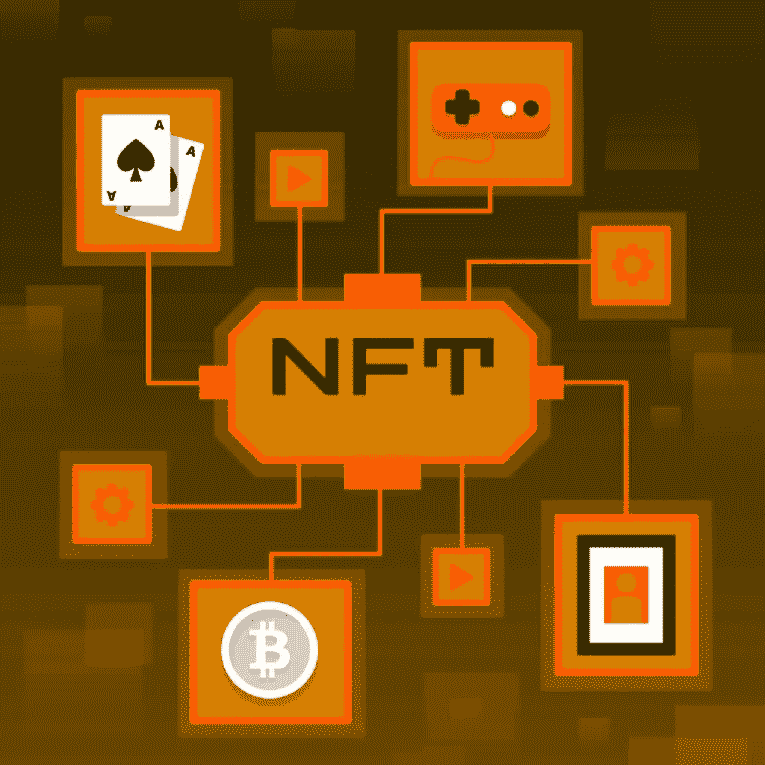

# 如何在合适的区块链网上创建自己的 NFT 平台？

> 原文：<https://medium.com/nerd-for-tech/how-to-create-your-own-nft-platform-on-the-right-blockchain-network-1bf47621e47b?source=collection_archive---------12----------------------->

创建您自己的 NFT 平台，在一个拥有无限财富的平台中嵌入所有独家功能。该平台将处理与 kitty 中最稀有形式的 NFT 的任何交易。什么是更好的投资机会？NFT 市场是一个明确的选择，人们愿意在最短的时间内获得风险投资。对于最有趣的 NFT 类别，这个平台总是一个安全的地方，每个类别都有自己的平台。这就是 [***为什么创建一个 NFT 平台***](https://bit.ly/3RBWBXo) 可以引领你的创业。

## **你从哪里得到这样一个实现梦想的平台？**

一个 NFT 平台是一个完美的商业投资，因为它拥有可以让数百万用户在线的所有功能和优势。他们在人们的选择中扮演着重要的角色，并在实现梦想的过程中重新定义他们的目标。你可以在提供这类服务的公司的帮助下获得一个 NFT 平台。

## **一个平台的成本是否起着至关重要的作用？**

是的，成本确实是平台开发的一部分。它们根据你选择的特征和你要开始的业务的要求而变化。如果你有一个合适的公司提供的负担得起的解决方案，那会很有帮助，所以一切都井井有条。当你接触到顶级公司时，他们有一定的计划来处理这里的一切。由于不同的客户有不同的规格，他们根据您的要求有不同的计划。

## **结论**

[创建你自己的 NFT 平台](https://bit.ly/3RBWBXo)从最好的公司和最成功的风险企业中挑选合适的一员。获得最佳服务，因此您可以根据自己的需求获得合适的平台。