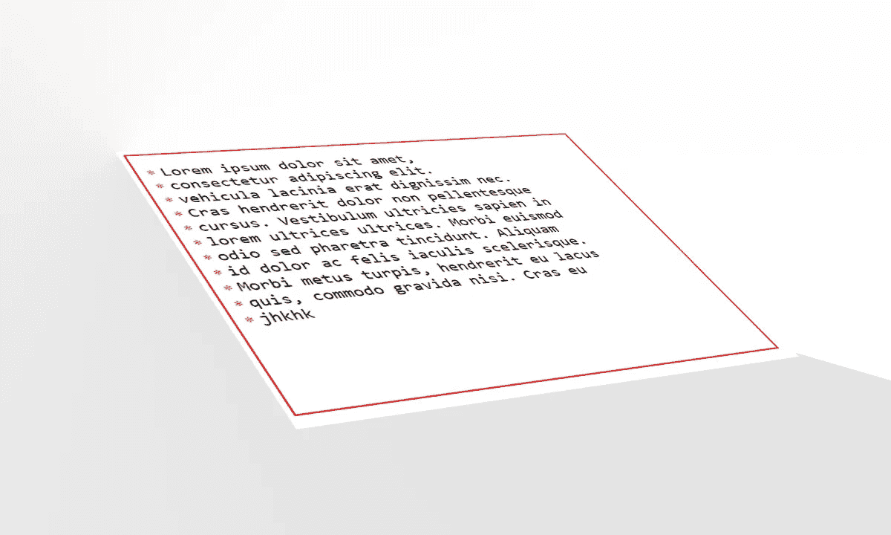

# 如何自定义 textarea

> 原文：<https://medium.com/nerd-for-tech/how-to-customize-textarea-22958ec73928?source=collection_archive---------0----------------------->

在今天的前端，我们经常使用诸如输入、按钮、下拉列表和文本区域等与用户交互的元素。我们都知道如何灵活地设计表单中几乎所有元素的样式。然而，开发人员经常遇到文本区域的问题。今天，我们将分解几个定制，使你的文本区域更加响应和用户友好。

# 如何在文本区域的每一行下面添加一行

想象一下，我们想在文本区做下划线。定制的主要问题是我们没有任何 CSS 选择器来帮助我们设置行的样式。所以我们必须让它在其他方面发挥作用。我们可以用什么？一个背景！使用颜色的组合，重复的渐变和正确的行高设置，我们可以得到下划线的效果。看一个这样的例子:

让我们更详细地看看这个例子。正如你所看到的，基本的想法是用一个(行高减 1 像素)的梯度步骤得到想要的颜色。在 CSS 规则背景-图像中:线性-渐变(透明，透明 27px，黑色 0px)；我们可以通过改变颜色值来改变下划线的颜色(在本例中是黑色)。我们也禁止用户调整和滚动文本区域。为什么？因为这样就打破了我们的定制:)线条开始和文字重叠，看起来很糟糕。

如果我们需要在 textarea 中添加一些填充，那么你也需要添加 background-position-y 并移动适当数量的像素。

我们如何使这种选择更加灵活？我们来看下面。

# 如何设置每个 textarea 行的样式

所以，但主要问题是，我们能定制每一行吗？答案是肯定的！为此我们需要一点小技巧，当然还有 JS。
我们还记得上一个例子，这种方法的主要问题是我们不能滚动或调整文本区域的大小。此外，我们从未真正定制行。在这种情况下，我们执行以下操作:

-我们创建一个父元素。当我们改变文本区域的大小时，它会滚动。我们还需要父元素来完成带有定制块的文本区域。
-在里面我们将有文本区本身和一个块来定制每一行。让我们看一个每行前面都有字符的例子。
-我们将在与文本区域交互时更改定制块，这将给我们带来每个字符串都是可定制的效果。

现在看看这个例子！

现在我将解释它是如何工作的。

我们的父元素实质上变成了一个 textarea。所以我们从文本区域本身移除了所有样式化。我们还移除了 textarea 本身的滚动，并将其添加到父元素中。当 textarea 获得焦点时，我们可以使用 focus-within 来样式化父元素。这里我称之为“点”的元素是我们的风格化元素。基本的想法是，它有立场:静态和一个大的负保证金。因此，如果在滚动整个父元素时它的位置正确，那么样式元素将与纹理区域一起滚动！这就是我们想要实现的目标。为了分隔样式化元素中的行，我们在元素内部使用了空白:前置行和 分隔符。在 JS 中，我们检查我们的 textarea 以查看 textarea 值包含多少内容。我们在风格化元素中需要相同的数量——就这么简单！而且 textarea 和 stylization 元素的行高必须相同，这一点非常重要。此外，如您所见，我们重新计算了文本区域本身的高度。这是为了让 textarea 自动扩展到其内容的高度，并且由于 overflow-y: scroll，父元素可以相应地滚动。

在 JS 中，当文本区域改变时，我们也根据需要改变内部行。在这种情况下，我们使用一个* ，即一个星号(*)和一个行分隔符( )。但是，我们可以将这个字符替换为任何其他字符！我们现在可以从文本区中单独定制它。因此，我们在不改变文本区域本身的情况下获得了文本区域行的单独定制。这使我们能够灵活地改变和设计我们需要的东西。例如，在此配置中，我们可以使用第一个示例中的代码行:

如你所见，我们现在可以非常灵活地定制 textarea 的定制。为了使我们的定制元素在滚动时不会丢失，我们需要记住相对于期望的高度来改变它的边距。

仅此而已！也别忘了看看我的 Linkedin 页面:[https://www.linkedin.com/in/kirill-shelipov-b8ab461a2/](https://www.linkedin.com/in/kirill-shelipov-b8ab461a2/)