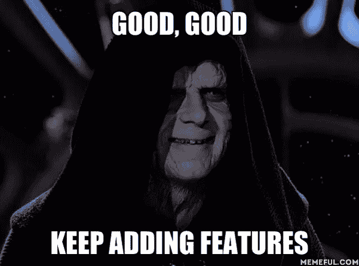
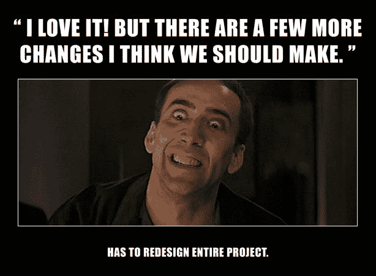

# 如何应对厨房水槽综合症

> 原文：<https://medium.com/nerd-for-tech/how-to-deal-with-the-kitchen-sink-syndrome-4f3d9429f509?source=collection_archive---------10----------------------->

Scott Umstattd 在 [Unsplash](https://unsplash.com?utm_source=medium&utm_medium=referral) 上拍摄的照片

## 但我是一个(范围)蠕变…我到底在这里做什么？

我敢肯定，每个团队或个人贡献者在职业生涯中都遇到过这种情况。您获得了定义明确的需求，审查它们，提出问题，与您的产品负责人一起调整它们，并准备了一大堆软件设计。不久之后，实现阶段开始了，在故事结束前的几个小时或几天，业务打电话来要求实现一个额外的特性(或变化)。什么？！

为什么是现在？— [src](https://media.giphy.com/media/dBCqkzZBxKn2zOt1U3/giphy-downsized-large.gif)

通常，项目经理\产品负责人负责过滤掉这些作为“必须”或“最好”的请求，但是也有一些情况，企业希望将所有这些特性都压缩到一个版本中。这就是**范围蠕变**——或者厨房水槽综合症**的情况。**

其根源来自于不良的变更控制，缺乏适当的初始项目目标，项目管理薄弱，沟通不畅，以及缺乏初始产品的通用性。这种情况在大多数项目中都是一种风险，通常会导致意想不到的成本(预算超支)，并通过在发布计划的后期引入复杂的变更和对受影响的区域强制进行重新测试，对团队的积极性和项目的时间表产生重大影响。

## 如何管理？

"控制范围蔓延是不可能的，所以要始终致力于最高优先级的功能."(布莱维斯、布普、约翰逊、梅斯特、墨菲、坦钦和奥德菲尔德出版社，2009 年)

话虽如此，我们还可以开展其他活动:

尝试在项目开始前建立一个**变更请求**流程。说一些大意为“这是我们要交付的东西。如果你想添加其他东西，你可以写下来，提交，然后我们会计算出你要花多少钱，你可以决定你是否真的想要它。”

确保每个人都理解在开始工作后请求额外变更的“成本”。对于每个请求，提供(每次)修改后的截止日期、时间估计成本，以及为了挤压这个最新的请求，什么将被延迟\丢弃。从根本上来说，确保这个请求有结果才是应该走的路。主题是**少做多做**。

请添加更多功能— [src](https://nats.io/img/blog/nats-good-gotchas-awesome-features/star-wars-meme.png)

投入到**需求收集**中，确保提出问题，提出任何顾虑，并尝试与所有利益相关者一起解决这些问题，达到明确定义的需求。请记住，你应该灵活应对变化，要知道在这个过程中会发现许多未知。

为了解决薄弱的项目管理，**让他们高度参与**。与他们一起定义项目范围，提供定期沟通。这可能是一封总结本周工作的短信，或者是一次每周例会。与他们分享足够的信息，让他们能够做出决定，但不要让他们不知所措。

你能添加一些变化吗？

关于交流，我以前写过一篇关于 it 的文章。参与这个项目的每个人都必须步调一致。期望和需要完成的工作必须**清楚地表达出来**，以便对责任、界限和时间表有一个共同的理解。

使用**工具**管理项目的进度、需求和记录的要求。它允许对每项任务进行清晰的定义、优先级划分和分配。为了保持跟踪，在符合团队偏好的节奏上定义一个检查会议。这非常有利于记录事情，提醒人们他们是团队的一部分，有着共同的愿景，相互支持。

## 把它包起来

对界限的尊重和清晰的沟通是你和你的团队需要的一些东西，以避免范围蔓延。提前做好这些优先事项将会节省你大量的时间、精力、金钱，同时也不会让你胃痛。