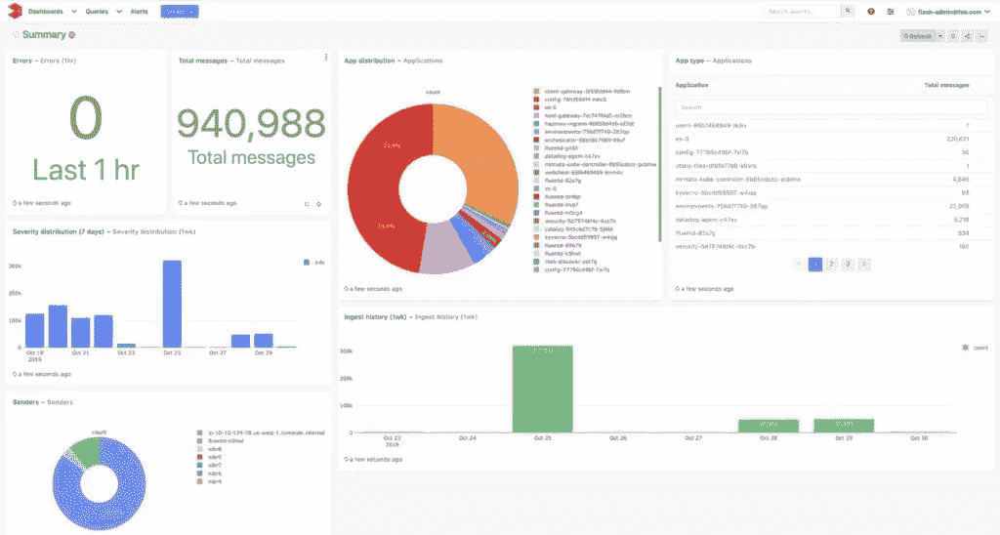

# 如何在云中调试微服务

> 原文：<https://medium.com/nerd-for-tech/how-to-debug-microservices-in-the-cloud-59aa10cd9653?source=collection_archive---------13----------------------->

> 信息架构的发展促使许多 IT 技术采用云服务并随着时间的推移而发展。微服务在这方面一直处于领先地位，并且在将不同的应用程序设计成可独立部署的服务方面，微服务的受欢迎程度呈指数级增长。

***琐事:在 O'Reilly 的一项调查中，超过 50%的受访者表示，他们组织中超过 50%的新开发利用了微服务。***

使用隔离的模块，云中的微服务偏离了使用单片系统，在单片系统中，整个应用程序可能由于模块中的单个错误而失败。这为开发人员编辑和部署可定制代码提供了更大的灵活性，而不用担心影响单独的模块。

然而，当意外引入错误时，这种方法带来了独特的挑战。由于信息架构的复杂性以及从开发阶段到生产阶段的过渡，在云中调试微服务可能是一项艰巨的任务。

让我们探讨一下这些挑战是什么，以及如何无缝应对它们。

# 调试微服务的挑战

# 追踪和可观察性不足

微服务需求的增长带来了复杂的基础设施。每个云组件、模块和无服务器调用通常隐藏了基础设施的实际复杂性，使得**开发人员**和运营团队[很难根据输出跟踪和观察](https://www.thundra.io/whitepaper/serverless-observability-the-ultimate-guide)微服务的内部状态。独立运行的微服务使得跟踪异步模块中存在的任何用户请求变得特别困难，这可能导致错误的连锁再现。这也意味着检测相互交互的服务也可能容易出现这些错误。这些因素使得查明任何错误或 bug 的根本原因成为开发人员的一项艰巨任务。

# 在复杂环境中监控状态

由于许多微服务聚集在一起构建一个系统，因此监控其状态变得很复杂。随着越来越多的微服务组件添加到系统中，一个复杂的服务网络发展起来，每个模块独立运行。这也带来了任何模块在任何时候发生故障而不影响其他模块的可能性。

开发人员会发现调试某些特定微服务中的错误极其困难。它们中的每一个都可以用不同的编程语言编写，具有独特的日志功能，并且大多独立于其他组件。

# 从开发到生产可能是不规则的

当将代码从开发阶段转移到生产阶段时，开发人员监视性能和状态错误也是不可预测的。我们无法预测代码在分布式服务器上处理数十万个请求时的表现，即使是在集成和单元测试之后。如果代码伸缩不充分，或者数据库无法处理请求，那么开发人员很难发现系统的底层错误。

# 调试云中微服务的方法

以下是一些特定于微服务的调试方法，可以帮助您应对下面提到的挑战:

# 非介入式调试选项

与传统的调试方法不同，第三方工具可以帮助 DevOps 团队设置断点，这些断点不会通过暂停服务来影响调试过程的执行。这些方法是非侵入性的，允许开发人员查看全局变量和堆栈跟踪，这有助于他们更有效地监控和检测错误。它还允许开发人员在不停止代码或重新部署他们的代码库的情况下测试关于问题可能出现在哪里的假设。

# 可观察性增强工具

任何具有大量微服务的系统都很难跟踪请求。虽然你可能认为为**可观察性**建立一个定制的平台可能是这个问题的答案，但它的开发会消耗大量的时间和资源。

幸运的是，许多现代的第三方工具被设计用来跟踪请求，并为微服务提供广泛的可观察性。这些工具还有许多其他好处，比如分布式和无服务器计算能力。

【LOGIQ 之类的工具可以让您的微服务具有完全的可观察性

例如，像桑德拉这样的工具可以帮助你在生产过程中监控通过你的基础设施的用户请求，帮助开发人员获得编码环境的整体概况，查明错误的来源，并快速调试。

# 自主异常跟踪

对于一个系统来说，首先意识到存在错误或缺陷是一场艰苦的战斗。系统必须自动跟踪发生的任何异常，从而帮助系统识别重复模式或破坏性行为，如闰年错误、特定版本浏览器中的错误、奇数堆栈溢出等。

然而，捕捉到这些错误只是成功的一半。系统还需要跟踪变量和日志，以确定错误发生的时间和条件。这有助于开发人员复制这种情况，并找到最有效的解决方案来消除错误。全面的监控可以大大简化生产中的调试过程。

# 在云中调试不一定很难。

对于现代微服务，调试对任何人来说都可能是一个非常复杂的过程。跟踪用户请求和预测代码可伸缩性的能力非常复杂。然而，现代工具可以使开发人员更容易监控、检测和解决错误。LOGIQ 是微服务监控和可观察性的一站式商店，允许您在单个平台上利用机器数据分析功能来分析基础架构和应用程序。

微服务架构被设计成可快速部署的，有了合适的工具，对开发人员来说，调试变得简单多了。