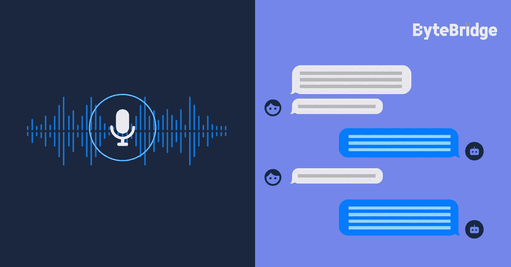

# 如何定义一个成功的 NLP？

> 原文：<https://medium.com/nerd-for-tech/how-to-define-a-successful-nlp-e29e43e81dc9?source=collection_archive---------1----------------------->

从最终用户的角度来看，成功的 NLP 非常简单:

*   知道自己想说什么，做什么——像个自然人一样。
*   做出正确的行动。
*   给出正确的回答。

所谓人工智能，其基准是人类，主要是指人机交互的某个领域。NLP 的真正难点在于分析过程——文本分析并不意味着简单地识别某些单词或句子的内容。**机器的目的是识别意图，然而，人类的意图是发散的。**

基于以上原因，客户在做 NLP 引擎或者应用的同时，往往会提前圈定一些应用场景，比如一些最常见的闹钟、日历、问答，或者一些分享的搜索内容，例如，点播视频或者餐厅搜索。通过这种方式，AI 可以理解、分析和响应相对场景中的共同意图。对于范围之外的内容，它会说:“对不起，我没听懂你说的话。”

# **语气问题**

语气是情感分析的一部分。是必不可少的方面，据说也是难点。如果你试图用不同的语气对语音助手说话，比如反问，很有可能给你一个错误的答案。

## **如何解决语气问题？**

一种解决方案是使用可扩展的训练数据，以便覆盖各种场景，例如具有不同音调的相似内容，以及由不同上下文表示的不同含义。然而，一开始很难得到这一切。

不同的阶段有不同的目标。毕竟最基础的阶段要夯实，然后才能逐步叠加各种复杂的维度。据我们所知，正常的谈话语调、平均语速都是普遍的内容。总之，**首先训练最常规的场景，逐渐追求更高的复杂度**是至关重要的。

# 对可扩展和定制数据集的高需求

目前，各行业对最优质的 AI 训练数据需求迫切。AI 在各个领域都有实现，比如教育、法律、智能驾驶、银行、金融等。每个领域都有细分和专业化的要求。

其中，尤其是智能转型的传统企业和科技企业，更需要有丰富项目经验的培训数据服务商的协助，帮助整理数据标注指令，获取更适合的数据。在特殊场景下使用高质量的数据，减少研发周期，加速实施过程，帮助企业更快更好地进行智能化转型。

在深入的产业落地过程中，人工智能技术与企业需求仍有差距。企业用户的核心目标是利用人工智能技术实现业务增长。实际上，人工智能技术本身并不能直接解决所有的业务需求。它需要创建可以基于特定业务场景和目标大规模实现的产品和服务。

我们需要明确的是，对于 AI 公司和整个行业来说，数据标注是实现人工智能的重要一环。标注数据的准确性和效率影响着人工智能算法模型的最终结果。

## NLP 案例研究— **韩语对话集**

项目描述:2 人 240 小时韩语会话集合

本公司负责收集韩语对白，并根据指南进行质量检查服务。每次对话持续 5-15 分钟。每个小组将录制 6 个小时的节目。

我们召集一定数量的以韩语为母语的人，以电话的形式记录对话。对话涉及多个话题，包括航空、农业、送货服务、金融、银行、卫生等。

## NLP 服务

我们在电子商务、零售、搜索引擎、社交媒体等领域提供不同类型的自然语言处理。我们的服务包括语音分类、情感分析、文本识别和文本分类(聊天机器人相关性)。

ByteBridge 与全球 30 多个不同的语言社区合作，现在提供[数据收集和文本注释服务](https://tinyurl.com/3cuhyn6b)，涵盖**英语、中文、西班牙语、韩语、孟加拉语、越南语、印度尼西亚语、土耳其语、阿拉伯语、俄语等语言**。

# 结束

将你的数据标注任务外包给 [ByteBridge](https://tinyurl.com/3cuhyn6b) ，你可以更便宜更快的获得高质量的 ML 训练数据集！

*   无需信用卡的免费试用:您可以快速获得样品结果，检查输出，并直接向我们的项目经理反馈。
*   100%人工验证
*   透明和标准定价:[有明确的定价](https://www.bytebridge.io/#/?module=price)(包括人工成本)

为什么不试一试？