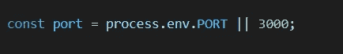
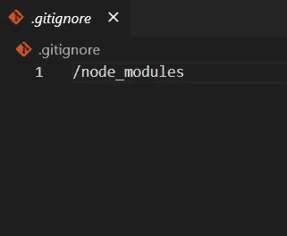
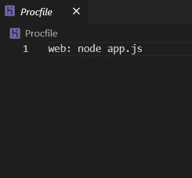
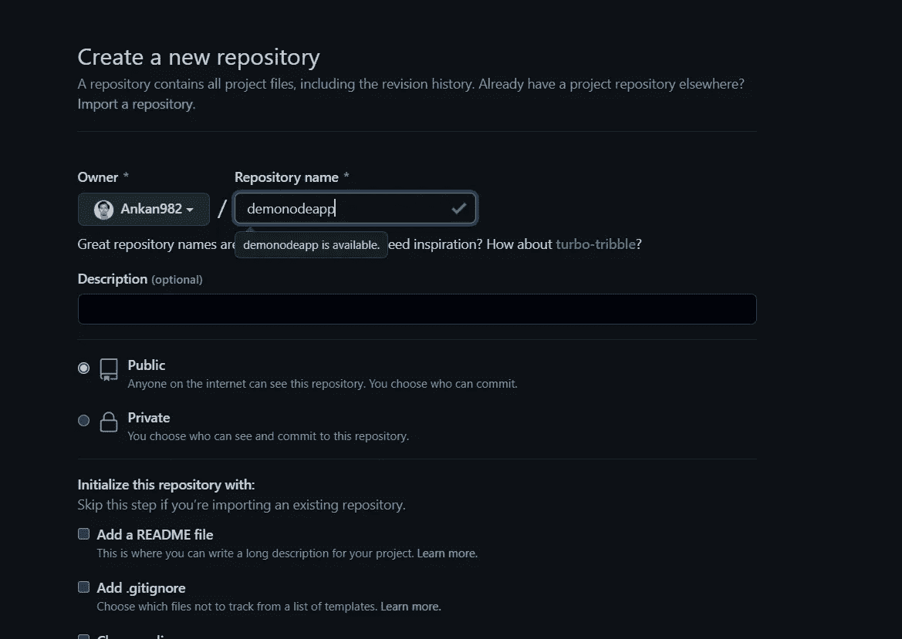
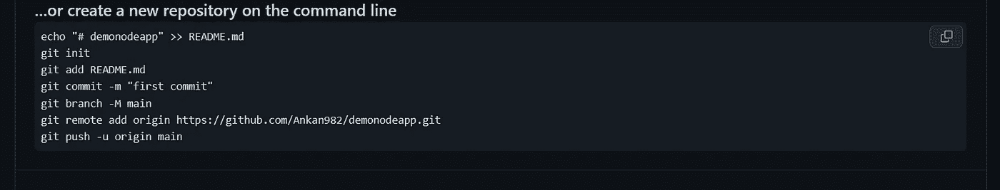
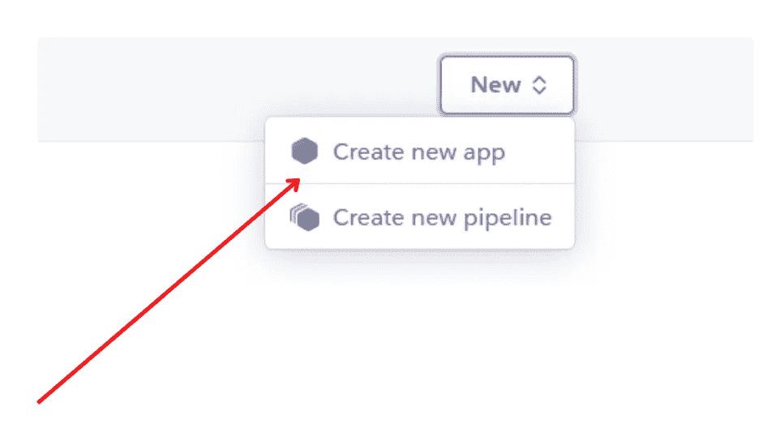
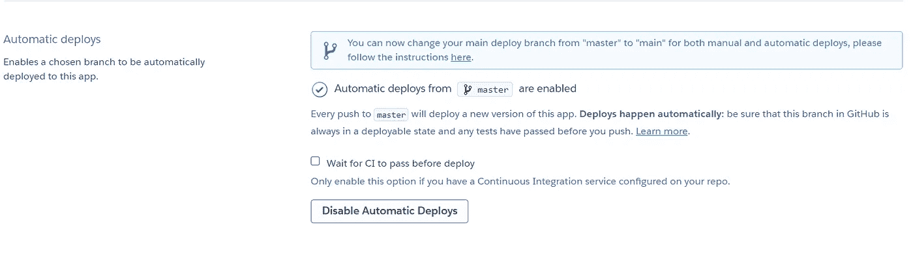
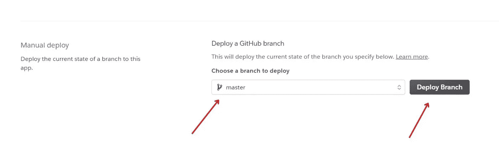

# 在 minutes✔✔5 区的 Heroku 上部署 Nodejs 应用程序

> 原文：<https://medium.com/nerd-for-tech/how-to-deploy-a-nodejs-application-on-heroku-in-5-minutes-270874c52c52?source=collection_archive---------1----------------------->

Heroku 是一个云平台即服务，支持多种编程语言。而 **Node.js** 是一个开源、跨平台、后端的 JavaScript 运行时环境，运行在 V8 引擎上，在网络浏览器外执行 **JavaScript 代码**。

所以我假设您已经创建了一个简单的 Nodejs 应用程序。

如果没有，那么我建议你去看看我的 [**这个博客**](https://ankandasx.medium.com/node-js-express-tutorial-for-web-dev-2021-getting-started-with-web-server-using-node-js-78a1f9008988) 。在我的 [GitHub](https://github.com/Ankan982/demonodeapp) 中有**项目源代码**链接。

# 步骤 1:环境设置

**(a)** 创建 NodeJS 应用程序后，您应该像这样更改您的**端口** &使其可用于 Heroku。

这意味着 nodejs 应用程序正在我的本地系统的端口 3000 上运行，process.env.PORT 将允许您的 NodeJS 应用程序在 Heroku 给定的端口上运行。

(b)不要忘记添加一个**。git 忽略项目中的**文件，将 **node_modules** 添加到其中，就像下面这样。

稍后当我们上传这些文件到 GitHub 时，你的节点模块将不会打扰。

# 步骤 2:创建 Procfile

为了让 Heroku 明白首先应该运行哪个文件，我们需要添加一个名为 **Procfile 的文件。像这样添加文件名，这样 Heroku 就能理解你的 NodeJS 应用程序的入口点在哪里。**

# 步骤 3:在 GitHub 中上传项目

确保您在 Github 中有一个帐户，并在那里上传您的 NodeJS 应用程序。

进入这个页面，点击**创建存储库。**

然后在你的终端上运行这个命令来上传文件到 GitHub，

该命令值将相应改变。

请按照上面的命令将您的文件上传到 GitHub。希望你已经上传了文件。

# 步骤 4 : Heroku 登录和连接存储库

前往[Heroku](https://id.heroku.com/login)创建账户。之后，根据 Heroku 的说法，进入你的仪表盘，创建一个新的应用程序，并给它起一个合适的名字。

创建应用程序后，您可以按照 Heroku 的说明部署您的应用程序，并且应该通过 Heroku CLI。但是我将使用 Github 来部署我的项目。

选择部署方法为 Github，并将您的 GitHub 帐户与您的 Heroku 帐户连接。

# 步骤 5:在 Heroku 上部署

之后，搜索我们需要部署的存储库并点击 connect。

然后启用自动部署，这样我们的开发变更就应该在 GitHub 中添加变更后体现出来。在此部分中，您可以选择要部署的分支。

然后单击部署分支。

最后你会看到你的发展状况。

在这里，我们可以看到这个应用程序使用 GitHub 库成功部署在 Heroku 上。现在点击查看，在浏览器中观看你的应用程序。

这是最终的输出，其中该网站是在 Heroku 平台与 Heroku 的网址直播。希望我们也能达到您期望的输出。

> 非常感谢你一直读到最后。如果你需要帮助，可以联系我。
> 
> ***Web:****[*https://ankandas . net lify . app*](https://ankandas.netlify.app/)***insta gram:****[*https://www.instagram.com/ankaninperson/*](https://www.instagram.com/ankaninperson/)***GitHub:*****