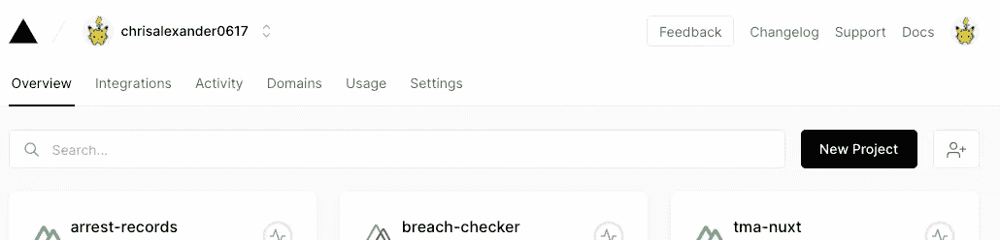
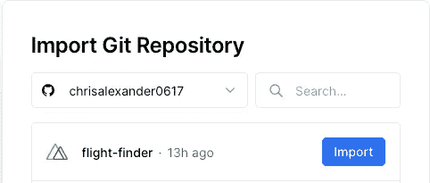
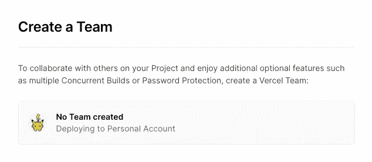
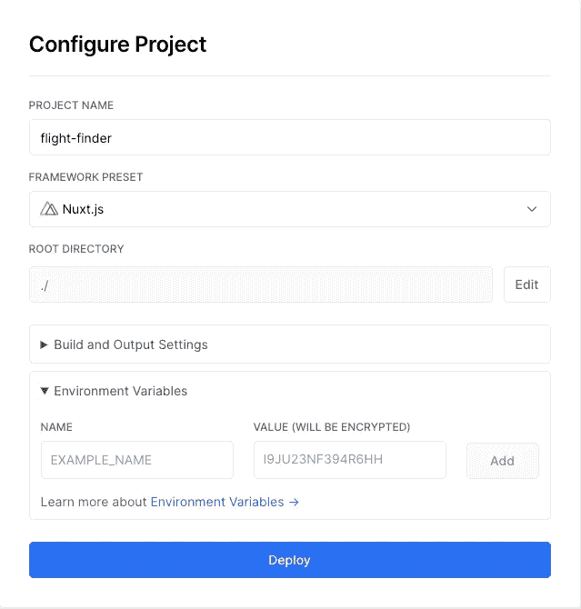
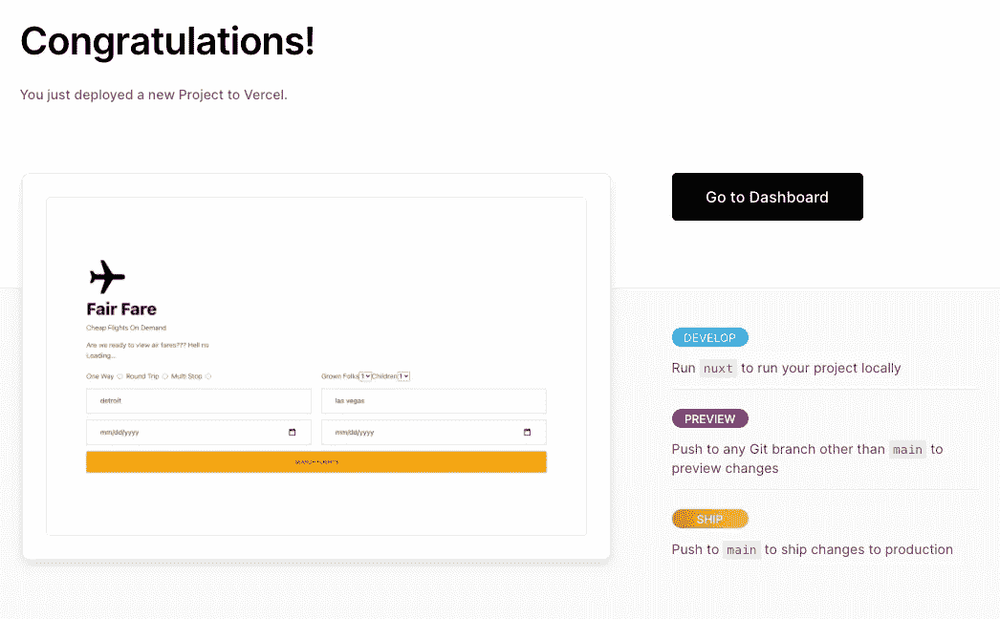

# 如何在 Github 的 Vercel 上部署 Nuxt 应用程序

> 原文：<https://medium.com/nerd-for-tech/how-to-deploy-a-nuxt-app-on-vercel-from-github-a7d4e9574ef2?source=collection_archive---------6----------------------->


今天，我将向您展示让您的 Nuxt 应用程序上线的最简单的方法。Vercel 是一个开放的无服务器平台，允许你免费托管你的 Nuxt 应用。有付费计划，但对于本教程，我将向您展示如何在尽可能短的时间内从 Github repo 设置您的应用程序。

我们开始吧。

# 设置

您可能会在部署阶段得到一个错误，显示缺少`public` 或`./dist`。这个问题可以通过在构建脚本中使用`nuxt generate`很容易地解决。Nuxt generate 将创建 Vercel 所需的目录。

```
"build": "nuxt generate --output public",
```

## 登录到 Vercel

如果你没有账户，你可以通过访问他们的[网站](https://vercel.com)创建一个免费账户。完成后，登录您的帐户以访问控制面板。您应该会看到类似这样的内容。



接下来，您需要通过单击搜索栏旁边的黑色按钮来创建一个新项目。

## 导入 Git Repo

我将使用我最近开发的一个应用程序来演示这是如何工作的。找到您想要使用的回购，然后单击导入按钮。



创建团队是可选的，你可以免费试用，但我们现在将跳过这一步。



配置是我们为应用程序添加选项和环境变量的地方。如果你没有，你可以使用默认设置。如果这样做，只需将键和变量名复制到环境变量设置中，如下所示。



完成后，单击 deploy 按钮，等待构建过程完成。

这是最终产品。您现在可以从任何设备在线查看它，或者使用自定义域指向此服务器。希望这有所帮助！



## 在网上和我联系！

*   [我的软件公司](https://digyt.co)
*   [个人博客](http://www.christopherclemmons.com)
*   电子邮件:christopher.clemmons2020@gmail.com