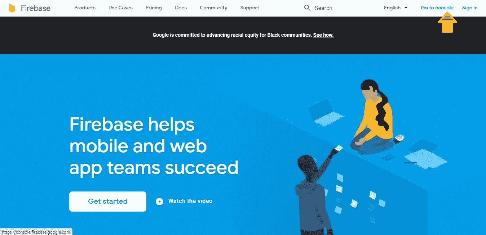
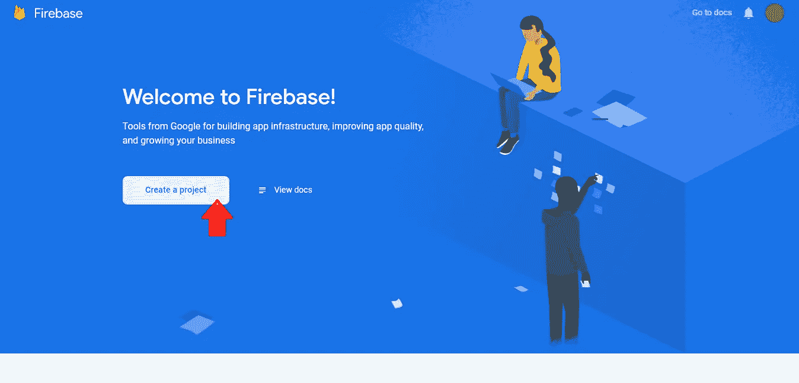
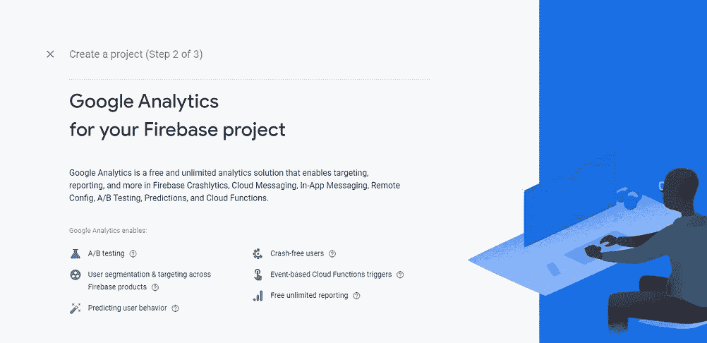
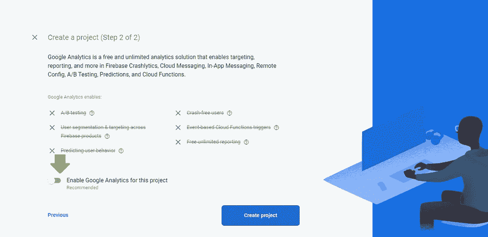
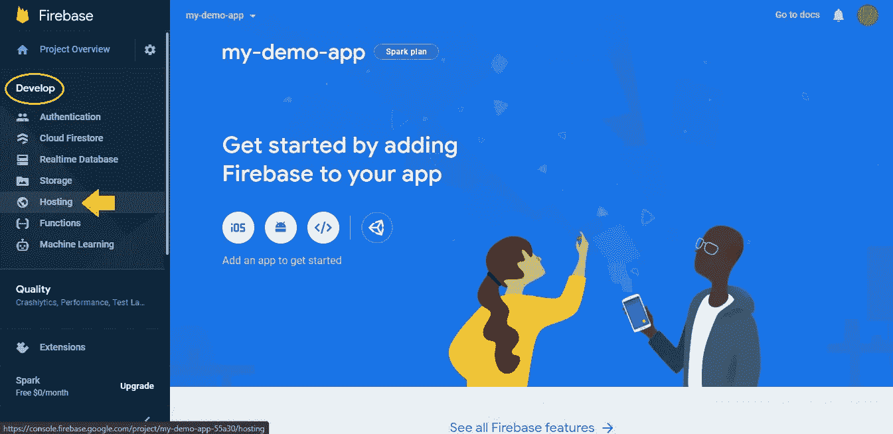

# 如何在 Google Firebase 上部署应用程序🔥

> 原文：<https://medium.com/nerd-for-tech/how-to-deploy-an-app-on-google-firebase-9185546cce20?source=collection_archive---------0----------------------->

[天一马](https://unsplash.com/@tma?utm_source=unsplash&utm_medium=referral&utm_content=creditCopyText)在 [Unsplash](https://unsplash.com/s/photos/computer?utm_source=unsplash&utm_medium=referral&utm_content=creditCopyText) 上拍照

在本教程中，我将解释如何在 [Firebase](https://firebase.google.com/) 上部署一个应用程序。那么，如果不清楚什么是 Firebase 呢？我建议通过下面的链接。

 [## 什么是 Firebase？

### Firebase 是一个后端即服务(BaaS ),从 YC11 初创公司开始，发展成为下一代…

howtofirebase.com](https://howtofirebase.com/what-is-firebase-fcb8614ba442) 

# 步骤 1:在 Firebase 上创建一个帐户

去 https://firebase.google.com/

点击`Go to console.`

登录您的 gmail 帐户后，您将被引导至主页。

在那里选择`Create a project.`

然后选择您的项目/应用程序名称，例如:my-demo-app。

然后你会被问到你是否想让谷歌分析你的 firebase 项目。

您可以启用或禁用该选项，如下图所示。点击`Create project.`

现在你已经在 firebase 中创建了你的项目，你将被引导到下面的页面。点击`continue.`

在`Develop` 选项下选择`Hosting`。

点击`Get Started`，您将被引导至新页面。

# 步骤 2:部署您的应用程序

现在，让我们将我们的应用程序与我们在此创建的项目连接起来。

在终端或命令提示符下打开您的项目应用程序目录，并运行以下命令:

`npm install -g firebase-tools` *//这将安装最新版本的 Firebase CLI。*

`firebase login` *//登录你的 Google firebase 账号。*

`firebase init` *//启动你的项目。*

通过导航到选项中的`Hosting` 并按下`space-bar`键，然后按下`enter`键，选择该选项。再次出现`choose from existing project list`。然后在询问公共目录时，写上`build`。然后是接下来问题的`yes`和`No`。

`firebase deploy`
*//这将给你一个你的应用程序的网址。(你也可以在****【firebase.google.com】****)中定制你开始命名项目的位置。)*

恭喜🎊，您的应用程序现已托管👏。