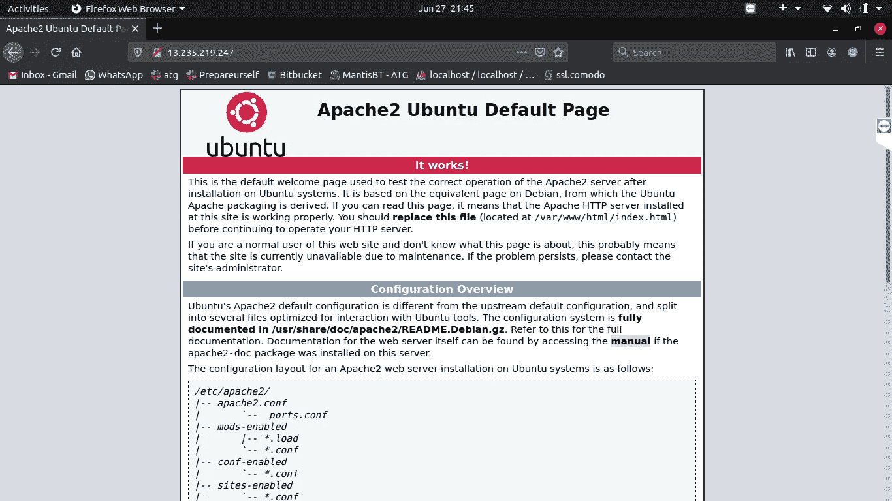
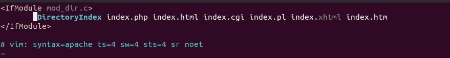

# 如何在 EC2 AWS 上部署 Laravel 项目？

> 原文：<https://medium.com/nerd-for-tech/how-to-deploy-laravel-project-on-ec2-aws-6d004a57bb1f?source=collection_archive---------0----------------------->

在本文中，我们将学习如何在 AWS EC2(弹性云计算)实例上部署 laravel 项目。

**先决条件**

在 AWS EC2 实例上创建一个 Ubuntu 服务器。
如果还没有创建？[**了解如何在 AWS EC2(弹性云计算)上创建 Ubuntu 20.04 服务器**](/@rahul26021999/how-to-create-a-ubuntu-20-04-server-on-aws-ec2-elastic-cloud-computing-5b423b5bf635)

# 在 EC2 上部署 Laravel 项目的步骤

使用您的私钥(密钥对)连接到 EC2 实例。
[了解如何连接到 EC2 实例](/@rahul26021999/how-to-connect-to-ec2-instance-aws-from-windows-ubuntu-da97c0cc9c8)。

## **更新您的库**

```
$ sudo apt-get update
```

## **安装 Apache2**

```
$ sudo apt-get install apache2
```

现在复制 EC2 实例的 IPv4 公共 IP 地址，并点击浏览器。如果你看到一个类似下面的屏幕，你就可以开始了。Apache 服务器正在工作！



## **安装 PHP 和有用的包**

```
$ sudo apt-get install php$ php --version$ sudo apt-get install php7.4-cli php7.4-common php7.4-curl php7.4-gd php7.4-json php7.4-mbstring php7.4-intl php7.4-mysql php7.4-xml php7.4-zip
```

通常，当用户从 web 服务器请求一个目录时，Apache 会首先寻找一个名为**index.html**的文件。如果你想改变 Apache 来服务 php 文件而不是其他文件，移动**index.php**到 **dir.conf** 文件的第一个位置，如下所示。

```
$ sudo vi /etc/apache2/mods-enabled/dir.conf
```



## 安装 MySQL 服务器

```
$ sudo apt-get install mysql-server
```

这将安装 mysql 服务器，但不会提示配置 mysql。

## 配置 MySQL

```
$ sudo mysql_secure_installation
```

这样，您可以对 MySQL 安装的安全选项进行一些更改。

请注意，尽管您已经为根用户设置了密码，但是这个用户在连接到 MySQL shell 时并没有被配置为使用密码进行验证，因为它默认使用的是 T0。

为了使用密码作为根用户**连接到 MySQL，您需要使用以下命令将其认证方法从`auth_socket`切换到`mysql_native_password` 。**

```
$ sudo mysql
```

要配置 **root** 帐户使用密码进行身份验证，请运行以下`ALTER USER`命令。请注意，该命令将更改您在 **mysql_secure_installation 中设置的 **root** 密码。**

```
mysql> ALTER USER 'root'@'localhost' IDENTIFIED WITH mysql_native_password BY 'yourpassword';
```

然后，运行`FLUSH PRIVILEGES`,它告诉服务器重新加载授权表并使您的新更改生效:

```
FLUSH PRIVILEGES;
```

现在您已经完成了在 EC2 上设置 mysql 服务器的工作。您可以在您的 laravel 项目中使用您的凭据。

## **安装作曲者**

```
$ php -r "copy('https://getcomposer.org/installer', 'composer-setup.php');"$ php -r "if (hash_file('sha384', 'composer-setup.php') === 'e0012edf3e80b6978849f5eff0d4b4e4c79ff1609dd1e613307e16318854d24ae64f26d17af3ef0bf7cfb710ca74755a') { echo 'Installer verified'; } else { echo 'Installer corrupt'; unlink('composer-setup.php'); } echo PHP_EOL;"$ php composer-setup.php$ php composer-setup.php --install-dir=bin --filename=composer$ php -r "unlink('composer-setup.php');"$ composer --version 
```

## **安装 Git**

```
$ sudo apt-get install git-core
```

## **克隆您的存储库**

切换到 **/var/www/html** 目录，使用下面的命令克隆您的 Laravel 项目。

```
$ cd /var/www/html$ sudo git clone [https://github.com/username/reponame.git](https://github.com/rahul26021999/Prepareurself.git)$ cd reponame
```

## **添加。将 env 文件添加到您的 Laravel 项目中**

```
$ sudo vi .env
```

## **在项目中安装库**

```
$ sudo composer install
```

## **项目的读写权限**

```
sudo chmod 777 -R storage/
sudo chmod 777 -R bootstrap/
```

## **阿帕奇配置**

默认情况下，Apache open `/var/www/html/index.html` 现在，当我们转到 EC2 的公共 IP 时，我们必须打开我们的 Laravel 项目。
转到`/etc/apache2/sites-available/000-default.conf` 并如下所示更改 DocumentRoot。

```
$ sudo vi /etc/apache2/sites-available/000-default.conf
```


## 重启你的 Apache

```
$ sudo systemctl restart apache2
```

现在您已经成功地在 AWS 上部署了您的 laravel 项目，
您可以通过您的公共 IPV4 IP 地址轻松地访问它。