# 如何在 AWS EC2 Ubuntu 服务器上部署 Python Django 项目？

> 原文：<https://medium.com/nerd-for-tech/how-to-deploy-python-django-project-on-aws-ec2-ubuntu-server-5c484fdb8f8c?source=collection_archive---------0----------------------->

在这里，我们将学习如何使用 Gunicorn 在 AWS EC2 Ubuntu 服务器上部署 Django 项目。


**先决条件**

1.  在 AWS EC2 实例上创建一个 Ubuntu 服务器。
    如果尚未创建？
    [**了解如何在 AWS EC2(弹性云计算)上创建 Ubuntu 20.04 服务器**](/@rahul26021999/how-to-create-a-ubuntu-20-04-server-on-aws-ec2-elastic-cloud-computing-5b423b5bf635)
2.  [**连接上一步创建的 Ubuntu 服务器。**](https://rahul26021999.medium.com/how-to-connect-to-ec2-instance-aws-from-windows-ubuntu-da97c0cc9c8)

# 在 EC2 实例上部署 Django 项目的步骤

## **安装所需的库**

```
**# Update the ubuntu libraries**$ sudo apt-get update **# Install Python, pip, Nginx, Postgresql**$ sudo apt-get install python3-pip python3-dev libpq-dev postgresql postgresql-contrib nginx**# Install Virtual Environement**$ sudo -H pip3 install --upgrade pip
$ sudo -H pip3 install virtualenv
```

## 为项目创建一个虚拟环境并激活它。

```
**# Create a project Directory**$ mkdir myproject**# Move inside Project Directory**$ cd myproject**# Create Virtual Environment for project**$ virtualenv **myprojectenv****# Activate virtual Environment**$ source **myprojectenv**/bin/activate
```

## 使用版本控制创建 Django 项目或克隆，并安装项目依赖项。

```
**#  Clone Existing Project in myproject Directory** $ git clone [https://github.com/YourUserName/](https://github.com/rahul26021999/TicTacToe.git)**djangoProject**[.git](https://github.com/rahul26021999/TicTacToe.git)$ cd **djangoProject**$ pip install -r requirements.txt **OR****# Create a new Django Project in myproject Directory**$ pip install django$ django-admin --version$ django-admin startproject **djangoProject**$cd **djangoProject**
```

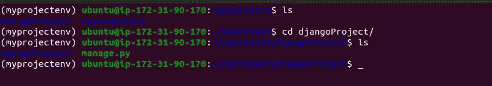

目录结构

到目前为止，我们已经在 myproject 目录中创建了或者克隆了一个项目。我们的目录结构应该是这样的。

## **更改项目设置**

```
(**myprojectenv**) $ sudo vi **djangoProject**/settings.py
```

a)通过添加**' * "**，在 Settings.py 中更改允许的主机，以接受来自服务器 IP 或任何地方的 HTTP 请求。

```
ALLOWED_HOSTS = ['*' ,'your_server_domain_or_IP', 'second_domain_or_IP']
```

b)更改数据库设置

我们已经在实例中安装了 Postgresql 数据库，您可以在 EC2 实例中创建新的数据库，也可以使用您想要的任何数据库。

您还可以使用 Django 项目默认附带的 SQLite 数据库。

```
DATABASES = {
    'default': {
        'ENGINE': 'django.db.backends.postgresql_psycopg2',
        'NAME': 'myproject',
        'USER': 'myprojectuser',
        'PASSWORD': 'password',
        'HOST': 'localhost',
        'PORT': '',
    }
}
```

**注意:**将数据库名“myproject”，数据库用户“myprojectuser”，数据库密码“Password”替换为您的。

c)指示静态文件放置位置的设置

```
**# Add on the top of setting.py file (Ignore if already there)**import os**# Add at the end of the setting.py File (Ignore if already there)**STATIC_URL = '/static/'
STATIC_ROOT = os.path.join(BASE_DIR, 'static/')
```

保存并退出 setting.py 文件。

## 完成初始项目设置

1.  将初始数据库模式迁移到我们已经创建的新数据库。

```
(**myprojectenv**) $ python manage.py makemigrations
(**myprojectenv**) $ python manage.py migrate
```

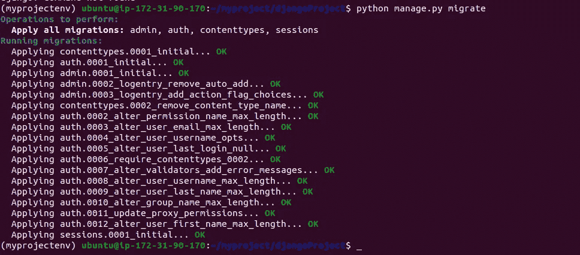

默认迁移后，您将看到如下结果。

2.创建超级用户

```
(**myprojectenv**) $ python manage.py createsuperuser
```

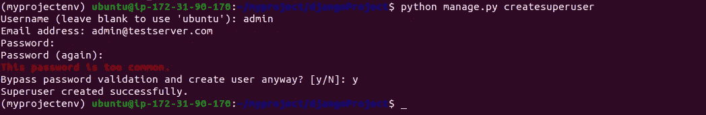

3.收集所有静态文件

```
(**myprojectenv**) $ python manage.py collectstatic
```

您可能需要确认操作。静态文件将被放在项目目录中的一个名为`static`的目录中。

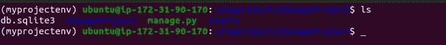

## 测试服务器

```
(**myprojectenv**) $ python manage.py runserver 0.0.0.0:8000
```

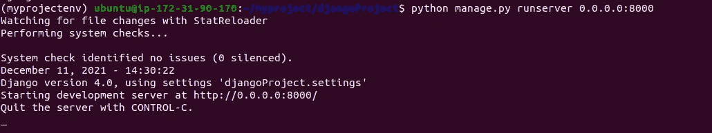

在 web 浏览器中，访问服务器的域名或 IP 地址，然后按`:8000`。您将看到新项目的 Django 默认主页或现有 repo 的自定义页面。

```
http://server_domain_or_IP:8000
```


使用`[http://server_domain_or_IP:8000](http://server_domain_or_IP:8000)/admin.`访问管理面板进行检查

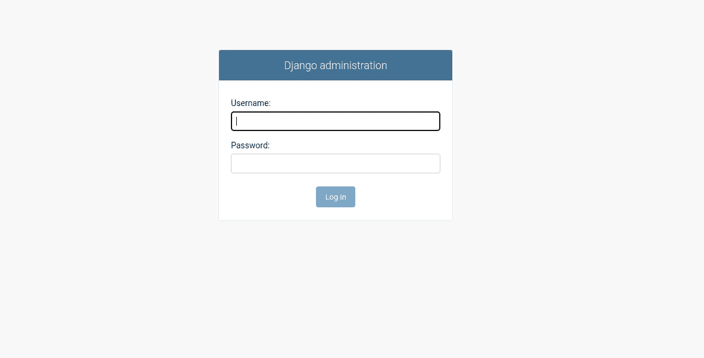

在终端中使用 CTRL-C 退出。我们将使用 Gunicorn 来主持这个项目，这只是为了探索和测试项目。

**注意:**确保在创建 EC2 实例时已经打开了安全组中的安全入站端口 8000，如果没有，现在就可以打开。

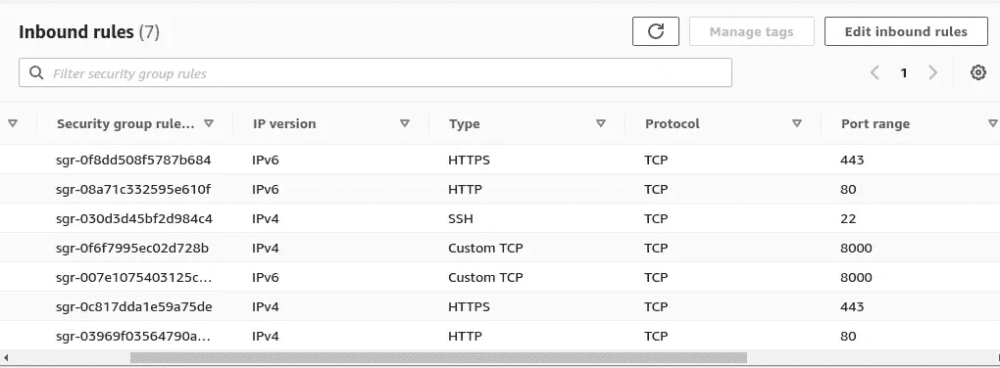

EC2 的安全入站设置

## 在虚拟环境中安装 Gunicorn 和 Postgres 适配器

激活虚拟环境，安装 Django、Gunicorn 和带有本地实例`pip`的`psycopg2` PostgreSQL 适配器

```
(**myprojectenv**) $ pip install django gunicorn psycopg2-binary
```

## 测试 Gunicorn 为项目服务的能力

这将在运行 Django 开发服务器的同一界面上启动 Gunicorn。您可以返回并再次测试该应用程序。

```
(**myprojectenv**) $ gunicorn --bind 0.0.0.0:8000 **djangoProject**.wsgi
```

使用`[http://server_domain_or_IP:8000](http://server_domain_or_IP:8000)/admin`访问管理面板进行检查

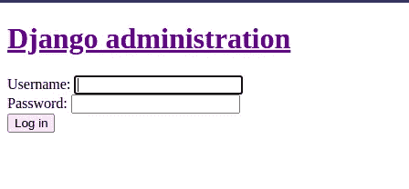

**注意:**管理界面不会应用任何样式，因为 Gunicorn 不知道负责这个的静态 CSS 内容。

使用 CTRL-C 退出。如果不是，那么试试 CTRL +SHFT + C

从虚拟环境中停用

```
(**myprojectenv**) $ deactivate
```

我们已经准备好使用 Gunicorn 托管了。

## 创建一个 Gunicorn systemd 服务文件

我们使用“djangoproject”作为服务名称，您可以在这里使用任何名称。

```
$ sudo vi /etc/systemd/system/djangoproject.service**# Add the below content to djangoproject service file and save it.**[Unit]
Description=gunicorn daemon
After=network.target[Service]
User=ubuntu
Group=www-data
WorkingDirectory=/home/ubuntu/myproject/**djangoProject**
ExecStart=/home/ubuntu/**myproject/myprojectenv**/bin/gunicorn --access-logfile - --workers 3 --bind unix:/home/ubuntu/**myproject**/**djangoProject**/**djangoProject**.sock **djangoProject**.wsgi:application[Install]
WantedBy=multi-user.target
```

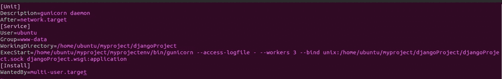

/etc/systemd/system/django project . service

保存并退出文件。

**注意:**确保这里的一切都是正确的。如果您使用不同的项目名称，请再次检查服务文件。

我们现在可以启动我们创建的 Gunicorn 服务并启用它，以便它在引导时启动:

```
$ sudo systemctl start djangoproject // start the service
$ sudo systemctl enable djangoproject // Enable the service
$ sudo systemctl status djangoproject // Check status
```

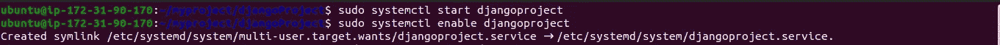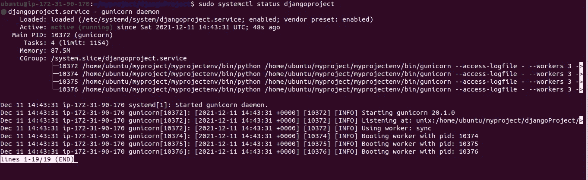

djangoproject.service 状态检查

用户 CTRL-C 退出状态。

**注意:**如果 djangoproject.service 的状态不是**“活动”**，请检查错误，这可能是 djangoproject.service 文件中的路径错误。您可以编辑服务文件并进行更正。

```
**# If there is any Error ( Run below commands after editing the .service file )**$ sudo systemctl daemon-reload
$ sudo systemctl restart djangoproject
```

在项目目录中检查 djangoproject 套接字文件。它一定在那里。


# 将 Nginx 配置为代理传递到 Gunicorn

既然 Gunicorn 已经设置好了，我们需要配置 Nginx 将流量传递给进程。

首先在 Nginx 的`sites-available`目录中创建和打开一个新的服务器块

```
$ sudo vi /etc/nginx/sites-available/**djangoproject****# Add the code below**server {
    listen 80;
    server_name server_domain_or_IP;

    location = /favicon.ico { access_log off; log_not_found off; }
    location /static/ {
        root /home/ubuntu/**myproject**/**djangoProject**;
    }

    location / {
        include proxy_params;
        proxy_pass http://unix:/home/ubuntu**/****myproject/djangoProject****/****djangoProject****.sock;**
    }
}**# save and exit**
```

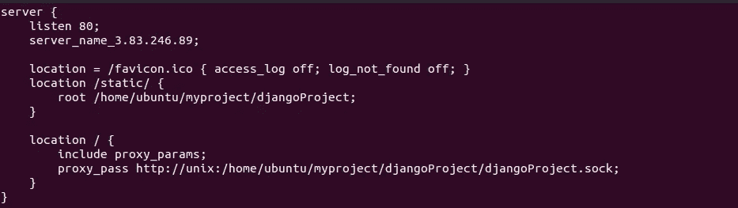

/etc/nginx/sites-available/ `**djangoproject**`

**注意:**用`"server_domain_or_IP"`替换你的 IP 地址。

现在，我们可以通过将文件链接到`sites-enabled`目录来启用它:

```
$ sudo ln -s /etc/nginx/sites-available/**djangoproject** /etc/nginx/sites-enabled**# Test your Nginx configuration for syntax errors by typing:**$ sudo nginx -t**# If no errors are reported, go ahead and restart Nginx by typing:**$ sudo systemctl restart nginx
```

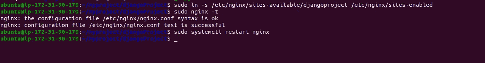

现在我们完成了，你可以通过使用你的 IP 地址在网络浏览器上访问你的项目来测试它。我们已经在端口 80 上托管了这个应用程序，所以您不必在 URL 中输入任何端口，因为 80 是默认端口。

```
http://server_domain_or_IP
```

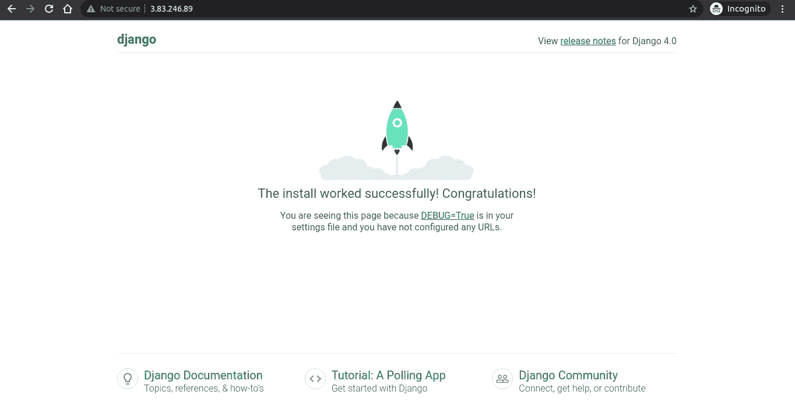

默认 Django 页面

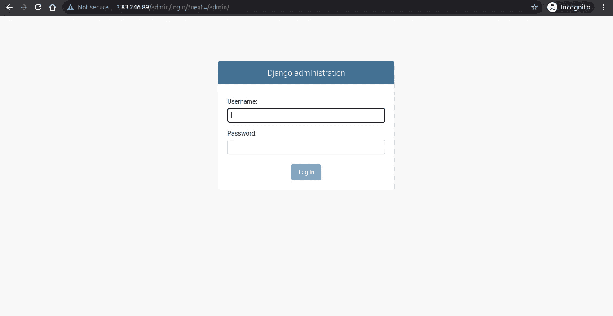

管理面板