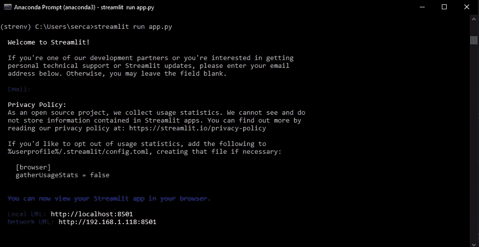
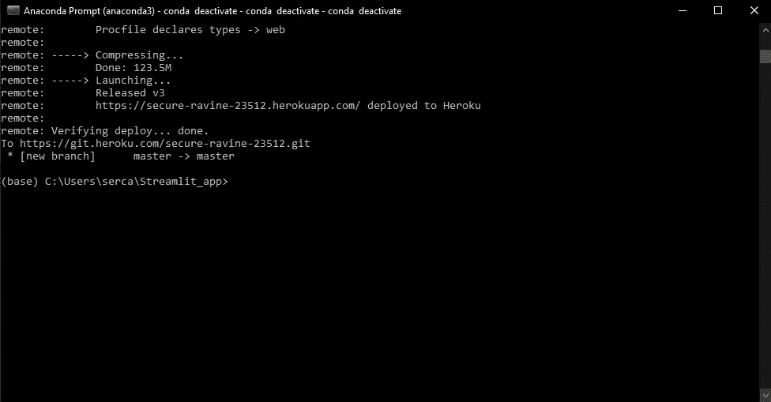

# 如何使用 Heroku 部署 Streamlit 应用程序

> 原文：<https://medium.com/nerd-for-tech/how-to-deploy-streamlit-dashboard-with-heroku-ca00064402e8?source=collection_archive---------2----------------------->


图片来源:streamlit.io

[Streamlit](http://streamlit.io) 是一个开源、免费、易学的 Python 框架，允许您为数据科学、机器学习或数据可视化项目生成仪表盘或交互式网站。

用 [Streamlit](http://streamlit.io) 生成一个 app 只需要 Python 的基础知识。不需要前端经验。开发者只需要一些 Python 使用的简单库就可以开始使用 [Streamlit](http://streamlit.io) 。在我看来，这是所有数据科学家或者数据工程师都应该使用的工具。有各种关于生成 [Streamlit](http://streamlit.io) 仪表盘的教程(请随意查看 [streamlit.io](http://streamlit.io) 获取它们的文档)。

然而，一旦开发了仪表板，您可能会希望与他人共享它，以便他们可以利用它、测试它或给你改进的建议。您可能正在开发一个仪表板来分析您公司使用的一些数据，并且您希望其他所有人都可以访问它，而无需在他们的计算机上安装 python 或运行脚本。

为了解决这个问题，我想解释如何使用 [Heroku](https://www.heroku.com/) 将 [Streamlit](http://streamlit.io) 程序部署到云中。Heroku 是一个平台即服务(PaaS ),允许人们在云上运行各种语言的应用程序。

我将用如下 5 个简单的步骤来解释这一过程:

1.  创建示例[简化](http://streamlit.io)应用程序
2.  生成其他所需文件
3.  创建一个 git 存储库和一个 Heroku 账户
4.  部署、测试和重命名应用程序
5.  对部署的应用程序进行更改

**第一步:创建示例**[**Streamlit**](http://streamlit.io)**应用**

使用您最喜欢的编辑器，创建一个包含以下代码的 app.py 文件。这是一个简单的滑块示例，带有 [Streamlit](http://streamlit.io) 。不管你的 [Streamlit](http://streamlit.io) 应用程序有多复杂，部署到 Heroku 的过程是一样的。让我们把这个 app.py 文件放到一个名为 Streamlit_app 的目录中。

一个简单的 streamlit 应用程序—名为 app.py

**第二步:生成其他需要的文件**

将 [Streamlit](http://streamlit.io) 应用程序部署到 Heroku 需要几个文件。第一个是 requirements.txt，输入以下命令进入放置 app.py 文件的目录。

```
$ cd Streamlit_app
```

通过运行以下命令，确保安装了 [Streamlit](http://streamlit.io)

```
$ pip install streamlit
```

在本地测试，看看你的应用程序是否工作正常。

```
$ streamlit run app.py
```



如果所有的库都安装正确，并且程序中没有错误，浏览器中应该会打开一个新窗口。对于我的浏览器中的示例程序，该应用程序如下所示:


***需求. txt***

一旦应用程序通过验证，运行以下命令来生成 requirements.txt 文件。这可以通过使用 pipreqs 来完成(如果没有安装 pipreqs，请使用 pip 安装它。[请参见此链接了解 conda 安装](https://anaconda.org/conda-forge/pipreqs)。):

```
$ pip install pipreqs$ pipreqs /Users/serca/Streamlit_app
```

为了让 Heroku 理解这是一个 streamlit 应用程序，我们需要在我们的目录中再创建两个文件，即 Procfile 和 setup.sh。这些文件如下所示:

***Procfile***

***setup.sh***

**第三步:创建一个 git 仓库和一个**[**Heroku**](https://www.heroku.com/)**账户**

一旦所有 4 个文件都在目录中(app.py，requirements.txt，setup.sh，Procfile)，就该在 Heroku 上部署它了。

让我们通过下面的命令在目录中创建一个 git 存储库。

```
$ git init
```

接下来，让我们去 Heroku.com 创建一个帐户。这是免费的。创建帐户后，[单击此链接下载 Heroku CLI。下载并安装 CLI 后，在终端中输入以下命令。](https://devcenter.heroku.com/articles/heroku-cli#download-and-install)

```
$ heroku login
```

您应该会看到一个新屏幕，要求输入登录凭证。登录后，您可以关闭此屏幕。


**步骤 4:部署、测试和重命名应用**

现在 pip 已经启动，Heroku CLI 也已安装，我们只差几个步骤来构建和部署我们的应用程序了。为此，输入以下命令(更多详情，请[访问此链接](https://devcenter.heroku.com/articles/git)):

```
$ git add .
$ git commit -m “My first commit”
$ heroku create
$ git remote -v
$ git push heroku master
```



Heroku 将自动为应用程序创建并分配一个随机名称。在本例中，访问仪表板的链接是 secure-ravine-23512.herokuapp.com。

要将应用程序重命名为“新名称”，请从应用程序的 Git 存储库中运行`heroku apps:rename`命令:

```
$ heroku apps:rename newname
```

现在，您可以从 newname.herokuapp.com 访问您的应用程序

**步骤 5:对已部署的应用程序进行更改**

一旦应用程序被部署，人们可能希望在程序中执行一些改进或更改。这个过程非常简单。首先，登录 Heroku:

```
$ heroku login
```

## 克隆存储库

使用 Git 将程序的源代码克隆到您的本地机器上(假设应用程序的名称是 newname)。

```
$ heroku git:clone -a newname
$ cd newname
```

## 部署您的更改

对刚刚克隆的代码进行一些修改，并使用 Git 将它们部署到 Heroku。

```
$ git add .
$ git commit -am "make it better"
$ git push heroku master
```

现在，当你回到 newname.herokuapp.com 时，你会在你的应用程序上看到这些变化。

在 GitHub 上关注我:[https://github.com/sercangul](https://github.com/sercangul)

**关注我，了解更多关于 Python、统计学和机器学习的信息！**