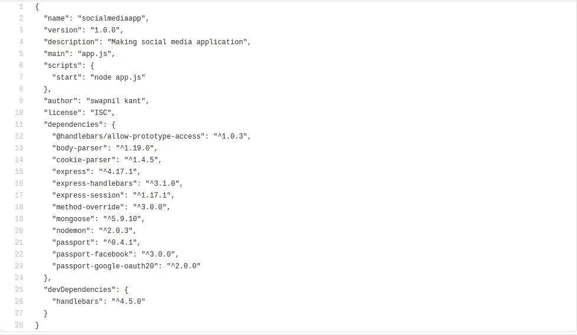

# 如何使用 Github 和 Git 在 Heroku 上免费部署你的网站！

> 原文：<https://medium.com/nerd-for-tech/how-to-deploy-your-website-on-heroku-for-free-using-github-and-git-f01cb6833aad?source=collection_archive---------0----------------------->


读者们好，

我带着我的下一篇文章回来了，关于**如何使用 Github 和 Git 在 Heroku 上免费部署你的网站！**你们每个人可能都使用 Nodejs 和 JavaScript 创建过这样或那样的网站应用程序，但是，你试过免费部署你的网站**吗？我们能做到！**

在今天的博客中，我们将更多地讨论 Heroku 上的**和如何在 Heroku 上免费托管我们创建的网站。**

# 什么是 Heroku？

Heroku 是一个云**平台即服务(PaaS)** 支持各种编程语言。它支持诸如 Ruby、Nodejs、Python、PHP、Go 等语言。Heroku 被认为是一个多语言平台，因为它为开发者提供了跨大多数语言以相似的方式构建、运行和扩展应用程序的功能。

# 安装 Heroku CLI

要在 windows 上安装 **Heroku CLI** ，请通过此 [**链接**](https://www.geeksforgeeks.org/introduction-and-installation-of-heroku-cli-on-windows-machine/) **。**

要在 mac 上安装 **Heroku CLI** ，请在终端中键入以下命令:

```
$ brew tap heroku/brew && brew install heroku
```

要在 ubuntu 上安装 **Heroku CLI** ，请在终端中键入以下命令:

```
$ sudo snap install --classic heroku
```

**臂和 BSD** 上的用户需要这种安装方法。您必须已经安装了`node`和`npm`:

```
$ npm install -g heroku
```

您可以通过输入以下命令来检查是否正确安装了 Heroku

```
$ heroku --version
```

# 先决条件

为了在 Heroku 上托管您的网站，您必须首先查看这些步骤，以确保您已经准备好将您的项目部署到 Heroku:

```
Make sure you have **git** installed in your system, check by running the command **git --version**. If you do not have git installed in your system, you can visit this website to install **git** [**Here**](https://github.com/git-guides/install-git)**.**
```

1.  在 Heroku 上托管任何网站，你都需要首先将你所有的项目代码推送到 **Github，**如果你不知道如何将你的代码推送到 **Github** 这里 **请自便。**
2.  接下来，您应该已经安装了 **Nodejs 和 npm**
3.  此外，你必须有一个现有的**节点. js 应用程序。**
4.  一个免费的 [**Heroku 账号**](https://signup.heroku.com/signup/dc) **。**
5.  Heroku CLI。

# 注意力

现在，为了在 **Heroku** 上托管你的网站，你需要检查你的项目的 **JSON 文件**，它应该包含以下代码:



在上面的代码中，你可以看到我写了一行

```
“scripts”: { “start”: “node app.js” },
```

这是非常重要的，如果你想主办你的网站，而且，在你的**脚本文件，你必须包括一行:**

```
const port = process.env.PORT || 3000;
```

包含上述代码非常重要，因为当您想要将应用程序部署到云中时。应用服务器在云上的一个随机端口上启动。**如果您对端口号进行硬编码，特定的端口号可能不可用。应用程序永远不会启动。**所以最好获取云实例分配的端口号，启动 HTTP 服务器。

# 在 Heroku 上部署网站的方法

基本上有两种方法可以让你在 Heroku 上免费部署你的网站，我们将逐一讨论这两种方法:

1.  **使用 Git 和 Heroku CLI:** 现在，为了托管您的网站，我假设您已经将所有代码推送到您的 **Github** 帐户，所以现在，您只需要在您的终端中一步一步地键入命令，如下所示:-
    在您可以将您的应用程序部署到 Heroku 之前，您需要初始化一个本地 Git 存储库，并将您的应用程序代码提交给它。

```
$ cd <name of your app directory>
$ git init
$ git add .
$ git commit -am "First commit"
```

现在，您的应用程序的代码现在在一个**本地 Git 存储库中被跟踪。它尚未被推送到任何远程服务器。**

现在，要创建一个 Heroku Remote 你必须键入以下命令，例如

```
$ heroku create
Creating app... done, ⬢ pure-pearl-3455
https://pure-pearl-3455.herokuapp.com/ | https://git.heroku.com/pure-pearl-3455.git
```

现在，**要部署您的应用程序，请在您的终端中键入以下命令**

```
$ git push heroku master
```

恭喜你！！您已经成功地在 **Heroku 上部署了您的静态应用程序。**

2.**使用 Heroku 网站:**现在为了托管你的网站，我会假设你已经把所有的代码都放到了你的 **Github** 账户里，所以现在你只需要在你的终端里一步一步地输入命令，如下所示

> 首先，登录你的 Heroku 账户。
> 
> 然后点击右上角的**新建**，选择**“新建 app”。**
> 
> 为您的**应用程序命名(这将包含在您应用程序的公共 URL 中)**并点击**创建应用程序**。
> 
> 此步骤将带您进入应用程序的仪表盘。打开**部署选项卡**并滚动到**“部署方法”**部分。
> 
> 接下来，选择 **GitHub** 作为方法。
> 
> 它将显示一个**“连接到 GitHub”**选项，在这里我们可以提供我们的 **GitHub 库**。**如果你是第一次这么做，Heroku 会要求允许你访问你的 GitHub 账户，接受它。**
> 
> 在这里，您可以**搜索您的 GitHub 库**并点击**连接**
> 
> 如果它能够找到并连接到 **GitHub 库**，部署部分将会出现，您可以在这里选择是需要**自动部署**还是**手动部署。**
> 
> **自动部署的优势在于，无论何时您在 Github 存储库中做出更改，这些更改都会自动推送到您的应用程序网站。**
> 
> 接下来，点击底部的**部署分支**，你的网站就托管好了！！！

以上是关于如何使用 **Heroku 和**Github 部署应用程序的两种方法，非常简单，去试试吧！！

继续学习，继续成长，继续探索！

祝一切顺利！

更多有趣和信息丰富的文章和提示，请关注我的 [**Medium**](https://swapnilkant11.medium.com/) **和**[**Linkedin**](https://www.linkedin.com/in/swapnil-kant-279a3b148/)