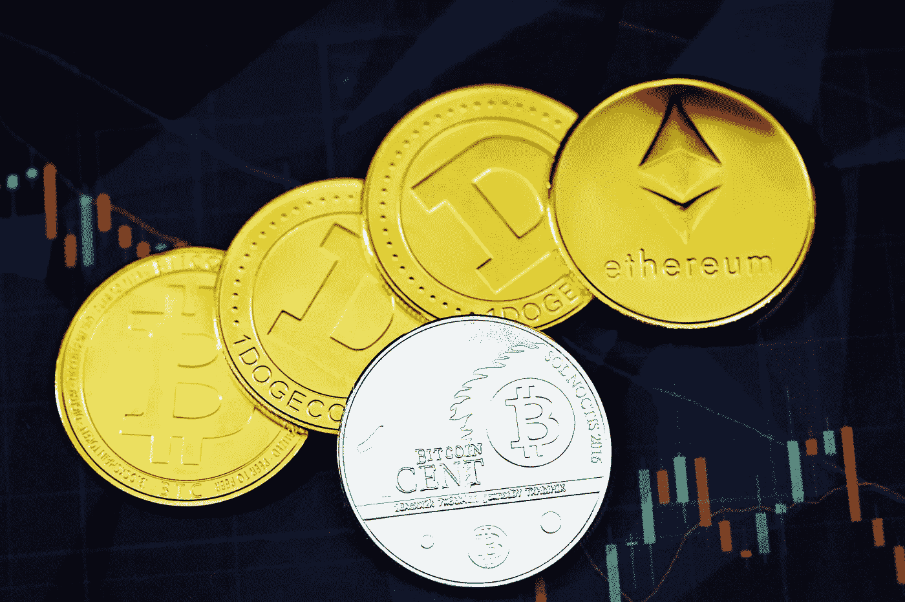

# 如何用向往金融克隆平台在以太坊上开发去中心化的交易所？

> 原文：<https://medium.com/nerd-for-tech/how-to-develop-a-decentralized-exchange-on-ethereum-with-a-yearn-finance-clone-platform-4e294514bfda?source=collection_archive---------10----------------------->

Emile Perron 在 [Unsplash](https://unsplash.com?utm_source=medium&utm_medium=referral) 上的照片

Web 3.0 是最近投资者的热门词汇。随着全球经济增长放缓，人们开始转向新一代金融资产。区块链网络和采用加密货币的结合导致了分散金融(DeFi)的巨大增长。类似地，渴望金融是一个受欢迎的平台，提供点对点(P2P)贷款、投资组合再平衡、金库资金存储和流动性池(LP)资产管理等服务。你是一个渴望推出分散交易所(DEX)的企业家吗？现在就创建一个渴望金融克隆。

照片由 [Shubham Dhage](https://unsplash.com/@theshubhamdhage?utm_source=medium&utm_medium=referral) 在 [Unsplash](https://unsplash.com?utm_source=medium&utm_medium=referral) 拍摄

# **渴望财务克隆脚本的主要特点是**

**曲线池—** 用户可以在像向往金融这样的去中心化协议上存放加密令牌。他们得到定期的利息和报酬。此外，储户可以修改策略，获得更多财富。因此，他们可以出售他们赚取的代币，并通过复利获得利润。

**提升乘数—** 毫无疑问，流动性提供者(LP)在 [**渴望金融克隆剧本**](https://www.appdupe.com/yearn-finance-clone) 中扮演着至关重要的角色。他们每年收取交易费，并因下注代币而获得奖励。一般来说，存款人在托管模块中锁定特定数量的虚拟资产。

过一段时间，他们会从乘数效应中获得更多的收益。这取决于托管中锁定的代币数量、流动性池(LP)中锁定的存款总额以及基于稳定币的交易对的表现。

**Zap —** 用户可以毫不费力地在渴望金融克隆平台上存放代币。一般来说，他们需要持有可以在流行的分散交易所(DEXes)进行交易的虚拟资产。投资者必须考虑滑点百分比和转换率等因素。

此外，他们可以在特定期限后提取他们的数字资产。后来，他们可以回到加密货币，如以太坊，包装代币，如包装以太坊(WETH)，稳定硬币，如戴(Dai)，系绳()和美元硬币()。

**价格甲骨文—** 最先进的价格源与投资者共享实时数据。重要的是，像金融这样的平台使用 Chainlink 提供的开源技术。因此，价格和交易量的变化等信息从链外来源转移到链内智能合约。

在钉住令牌和稳定硬币的情况下会发生什么？价格根据它们所关联的加密货币和法定货币而有所不同。

由 [Austin Distel](https://unsplash.com/@austindistel?utm_source=medium&utm_medium=referral) 在 [Unsplash](https://unsplash.com?utm_source=medium&utm_medium=referral) 上拍摄

# **为何退市标一个渴望金融克隆平台的亮点？**

投资者免受损失和极端市场波动的影响。供应非常少且抵押品价值可以忽略不计的代币会立即从类似于“渴望金融”的平台上移除。

因此，基于以太坊的 DeFi 协议的用户可以免受流动性不足的令牌和流动性高但缺乏杠杆作用的数字资产的影响。活跃的交易者和投机者不会亏钱。

新代币供应暂停。因此，投资者不能借用任何数字资产。此外，将修改预留资金的百分比。最终会有一个关于担保品因素变化的公告。因此，特定数量的令牌被移至已弃用类别。

照片由 [Shubham Dhage](https://unsplash.com/@theshubhamdhage?utm_source=medium&utm_medium=referral) 在 [Unsplash](https://unsplash.com?utm_source=medium&utm_medium=referral) 上拍摄

# **分析一个向往金融类平台的利率模型(IRM)？**

用一家在区块链网络上运营的银行来形容渴望中的金融克隆体再合适不过了。年百分比年(APY)函数与以太坊区块链上的区块数量和开采一个区块所需的时间密切相关。

因此，借款和支付给存款人的流动性提供者(LP)利率之间存在密切的相关性。借款人利率取决于乘数效应和利用率等因素。类似地，流动性提供者(LP)根据借款人每笔支付的总利息获得回报。

有 4 个选项，主要，稳定，马厩，和治理投资者。它包含一个参数列表，如包装令牌的名称、基本利率、乘数和跳跃乘数百分比，以及不同数字资产的资金分配。

由 [Kanchanara](https://unsplash.com/@kanchanara?utm_source=medium&utm_medium=referral) 在 [Unsplash](https://unsplash.com?utm_source=medium&utm_medium=referral) 上拍摄的照片

# **渴望金融克隆版上的跳马代币:投资者如何战略性地增加回报？**

向往金融(YFI)代币是为用户提供定期回报的原生数字资产。通常，投资者必须在分散金融(DeFi)协议的智能合约中锁定加密货币。

这些数字资产的持有者可以对影响平台未来增长的不同提案进行投票。因此，用户可以将 YFI 代币存入金库并获得收益。如果他们的金库产生利润，他们的代币价格会自动增加。

这是怎么发生的？是因为金库里有更多多余的代币可以兑换。一旦投资者从金库中提取他们的流动性份额，他们的代币份额就会被烧掉。之后，他们可以交易，也可以用分散交易所提供的资产转让 ERC-20 代币。

它基于输入输出机制运行。例如，像 Yearn Finance 这样的平台的用户可以借出由其他指数如 Aave、Compound、1Inch 和 Fulcrum 提供的代币。

# **代币如何在一个渴望金融克隆上获得白名单？**

*   **财务支持—** 借款人和贷款人可以防止债务偿还中的问题。一般来说，债务人会存放一定数量的代币作为财务支持。他们获得一定数量的信贷。
*   **保险—** 储户可以通过购买保险来保护自己免受黑客和网络钓鱼的攻击。此外，这适用于未经授权从流动性池中取走资金的情况。如果发生任何意外，投资者持有的代币会被自动冻结。随后，用户可以铸造更多的数字资产来补偿损失。除此之外，拥有 YFI 代币的抵押债务头寸(CDP)将保护虚拟资产。此外，投资者可以通过分享他们投资的项目数字身份证的细节来提交索赔。随后，他们会收到一定数量的美元、以太币和戴币。
*   **在抵押条件下—** 借款人需要先存入一定的金额，然后才能通过分散融资(DeFi)协议获得贷款。然而，他们可以在不存入大量抵押品的情况下获得信贷。一般来说，这适用于借款人和贷款人之间有共同协议的情况。当债务人不能按时还款时会发生什么？

存款人需要调用信用委托并接收剩余金额。因此，借款人可以通过维持等于贷款额减去先前信贷利息的抵押品来保护自己的权利。

# **结束**

总的来说，投资者已经锁定了令人难以置信的 39.6 亿美元。它还专注于多链覆盖，以满足借款人和贷款人的利益。你想成为去中心化金融(DeFi)时代的先锋吗？联系领先的白标解决方案提供商 [**尽快开发渴望金融克隆平台**](https://www.appdupe.com/yearn-finance-clone) 。