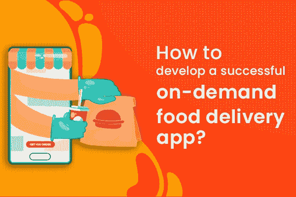

# 如何开发成功的按需送餐 app？

> 原文：<https://medium.com/nerd-for-tech/how-to-develop-a-successful-on-demand-food-delivery-app-ef7f501ab0cb?source=collection_archive---------14----------------------->

在这个智能手机和需要即时解决方案的世界里，每次去餐馆买食物都变得更加高效。人们在他们舒适的时间和空间里获得所有的食物。此外，它允许在食品配送应用程序的帮助下探索当地更多的新餐厅。一些按需服务在疫情兴起，其中最受欢迎的按需服务是按需送餐。疫情现在已经结束了，但是送餐 app 的使用并没有结束，而且随着送餐 app 用户数量的快速增加而矛盾。考虑到人民群众对送餐 app 的需求，商业爱好者都期待进入这个行业，让我来指导你按需送餐 app 开发的全过程。

按需送餐应用程序开发

# **食品配送应用开发的商业模式**

## **仅点餐 App**

仅食品订单应用程序模块是第一个食品交付应用程序模块，或传统模式，已经在市场上存在了很长一段时间。在这种方法中，餐馆有一个食品交付应用程序，通过它接收订单并将其交付给顾客。

## **订餐配送 App**

在这里，它是前一个模块的增强版本，食品配送公司充当餐厅和消费者之间的中介。用户可以选择他们喜欢的餐馆，餐馆收到订单，同时，送餐品牌的送餐服务员从餐馆挑选订单并将其交付给顾客。

## **云厨配送**

云厨房是市场上最新的模式之一，人们更欢迎它。这种模式节省了资源，并以低得多的价格提供食物，也被认为是一种健康的烹饪方式。

## **餐包交付**

送一个餐包是给那些想在家里做饭，但无法获得食谱所需原料的人。在这种方法中，将向顾客提供他们点的食物所需的所有项目，这些项目将是厨师的食谱。有时，这里还提供现成的饭菜，这为顾客节省了时间。

# **食品配送应用程序开发的步骤**

1.  市场研究是食品配送应用开发初始阶段的第一步，也是最重要的一步。分析趋势，并据此明智地开始你的事业
2.  第二，你选择的商业模式在开发过程和接触受众方面起着重要的作用。
3.  接下来，挑选一家适合你业务需求的 [**送餐 app 开发公司**](https://firecolours.com/food-delivery-app-development-company?utm_source=food-delivery-top&utm_medium=medium&utm_campaign=raga) ，确保他们在所需领域有足够的经验。
4.  一旦你联系到送餐 app 开发公司，传达你所有的需求，他们会提供端到端的开发。
5.  开发完成后，您可以立即启动您的送餐应用程序。通过营销，你可以向公众推广你的业务。

我们已经看到了食品配送业务的商业模式，以及开发食品配送应用程序的步骤。让我们看看食品交付应用程序开发的特点。

# **送餐 App 开发特点**

## **客户特征**

*   选择想要的餐馆
*   餐厅菜单
*   优惠券用法
*   应用内支付
*   评级和评论
*   社交媒体插件
*   弹出通知
*   跟踪订单
*   多种付款方式。

## **交货伙伴特征**

*   配置文件维护
*   实时跟踪
*   管理您的订单
*   订单历史
*   可用性设置
*   付款请求
*   预计收入仪表板。

## **餐厅特色**

*   实时交货合作伙伴跟踪
*   接受或取消订单
*   管理您的订单
*   管理优惠
*   支付历史
*   弹出通知。

## **管理功能**

*   管理仪表板
*   客户管理
*   餐厅管理
*   交付执行管理
*   促销代码
*   优惠券代码管理
*   分析和报告
*   佣金管理。

我们已经看到了您需要了解的关于食品交付应用程序开发的一切。最后一步是选择合适的送餐 app 开发公司。

# **如何选择一家靠谱的送餐 App 开发公司？**

当你已经为你的业务选择了一个合适的送餐 app 开发公司，那么大部分就已经排序了。要选择一个，你需要根据他们的评级、评论、投资组合和在该领域的经验来筛选他们。这就让你为你的送餐业务找出了 [**最好的送餐 app 开发公司**](https://firecolours.com/food-delivery-app-development-company?utm_source=food-delivery-bot&utm_medium=medium&utm_campaign=raga) 。

一旦你找到了他们，那么他们就会为你提供从基础开始的端到端开发，或者市场上各种流行的送餐 app 的克隆脚本。克隆脚本是完全可定制的，可以在一周内轻松部署，因为它是预先制作的。它的成本也很少。您可以选择适合您业务需求的选项，毫无障碍地立即启动您的送餐应用程序。