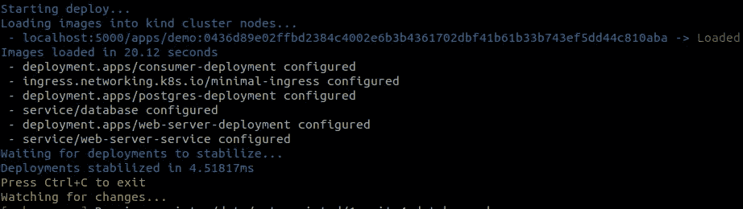

# 如何在本地 Kubernetes 上开发应用程序

> 原文：<https://medium.com/nerd-for-tech/how-to-develop-applications-on-local-kubernetes-cdf3afbad6b9?source=collection_archive---------4----------------------->

你的作品在 Kubernetes 上运行吗？也许你想在 Kubernetes 上运行你的应用程序？
或者测试一下，看看这个流行语是关于什么的？
无论如何，如果你对 K8S 感兴趣，你可能会从本地运营 Kubernetes 中受益。

# 本地机器上的 Kubernetes。为什么？

让我们开始为什么有本地 Kubernetes 首先是有益的。

> *1。在你当地的游乐场学习*

我们这些美国开发者需要实际、安全的体验，才能真正了解技术。有了本地 Kubernetes，我们可以在本地机器上舒适地设置、播放和调试问题。如果我们打破了某些东西，我们就打破了我们自己的环境，在出现错误的情况下，我们总是可以恢复到以前的状态，并轻松地再次尝试。

> *2。发布到生产前的测试*

所以你有 Kubernetes 产品，你想在配置上做些改变。你如何测试它？
我们可能需要推动变革，但我们甚至不确定变革是否有效，因为我们无法验证这一点。
我们可以将这种未经测试的变更推送到测试环境中。然而，如果我们破坏它，它会影响到使用这个环境的其他人。如果我们幸运的话，我们可以旋转我们自己的环境，但是每次我们做改变的时候都需要等待发布。

*在您的本地机器上测试配置会更快，并且会在最安全的环境中完成，这始终是您自己的环境。*
确认配置正确后，您可以推动更改，周围的每个人都可以继续工作。

> *3。在本地运行类似环境的生产*

您是否使用 docker-compose 在本地连接应用程序，并为生产编写 Kubernetes 配置？

Docker 让我们的生产和当地环境有了更多的相似之处。
在产品上运行 docker 之后，我们仍然有 gap，difference，这是我们的 Docker 容器的执行平台。Kubernetes 之类的执行平台可能与您在本地运行的平台完全不同。
在本地运行 Kubernetes，将间隙降至最小。
*现在，我们为本地配置编写的内容将在生产中重用。这为我们节省了大量时间，因为我们只需为所有环境编写一次配置。*

# 如何在本地建立 Kubernetes？

由于支持工具，在本地运行 Kubernetes 集群被简化了很多。例如，您可以使用 [MiniKube](https://minikube.sigs.k8s.io/docs/start/) 或[种类](https://kind.sigs.k8s.io/docs/user/quick-start/)。

我已经准备了一步一步的指导，根据[种类](https://kind.sigs.k8s.io/docs/user/quick-start/)和 [ctlptl](https://github.com/tilt-dev/ctlptl#how-do-i-install-it) 在本地构建你自己的 Kubernetes 集群。
你可以按照[这个链接](https://github.com/dgafka/local-kuberentes-cluster-over-https)来准备你当地的环境。

> *设置完成后，您将拥有 Kubernetes 集群，它将允许您
> -部署应用
> -使用自定义域访问应用
> -在本地 HTTPS 下工作。*

基本上，*你将经营自己的小制作*。

# 我想在我当地的 Kubernetes 上发展

我们需要区分两件事。
一是改 K8S 配置，二是做开发。

对于第一种情况，我们修改 Kubernetes 配置(清单)或 docker 映像，并将它们部署到集群中。只要我们不修改代码，这就没问题。

> *对于 PHP 开发或任何其他语言，我们希望更改代码并立即看到结果。*

由于部署应用程序需要一些时间，所以不会出现这种情况。幸运的是，我们有解决方案。

如果代码发生变化，我们可以将代码同步到正在运行的应用程序(Docker 容器),而不是重新部署整个应用程序。斯卡福德就是提供这种工作方式的工具之一。

> *如果我们更改 Dockerfile 或 Kubernetes 清单，Skaffold 将重新构建并重新部署应用程序，如果代码发生更改，Skaffold 将简化应用程序并使其与正在运行的应用程序同步*

# 给我看看演示

如果你想知道它们是如何完美地结合在一起，你可以查看演示项目。

你会在这个链接下找到[。](https://github.com/dgafka/spring-boot-kubernetes-inner-loop)