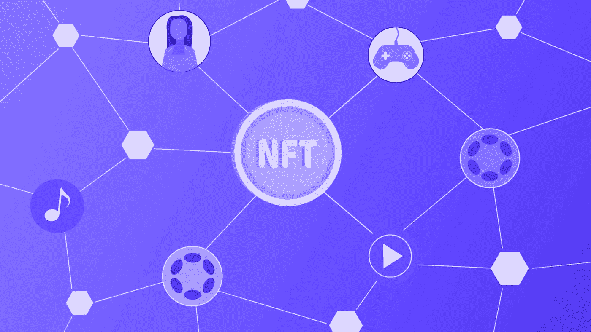
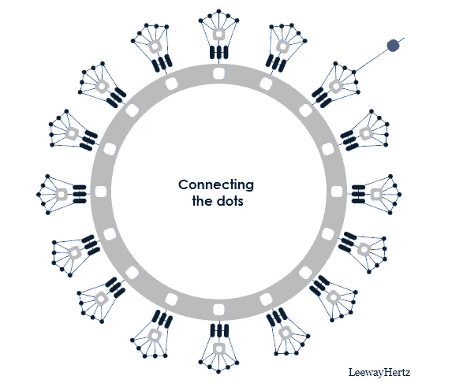

# 如何发展波尔卡多特上的 NFT 市场？

> 原文：<https://medium.com/nerd-for-tech/how-to-develop-nft-marketplace-on-polkadot-bdafab2b362c?source=collection_archive---------1----------------------->

基于 [Polkadot parachain](https://www.leewayhertz.com/build-parachain-on-polkadot/) 开发的 NFT 市场能够处理跨链交易。Polkadot 促进并增强了建立在其生态系统上的 NFT 市场的互操作性。它的目标是将开发者从依赖破碎的网络中解放出来，在这个网络中，各种各样的行业和交易者可以利用并违反市场规范。

Polkadot 允许开发人员使用基质网络构建仿链。这些建立在波尔卡多特生态系统及其中继链之上的副链可以彼此有机地互操作。这就是 Polkadot 网络如何帮助 parachains 促进彼此之间的无缝通信，无论他们是联盟、许可还是不许可。

# 为什么 Polkadot 是开发 NFT 市场的理想平台？

在 Polkadot 平台上开发的 NFT 市场有一些独特的功能，如下所述:

## 互用性

在 Polkadot 上，用户可以处理跨链交易，传输任意数据。波尔卡多特帮助在波尔卡多特网络上互连的各种副链之间进行交互。

## 经济可扩展性

Polkadot 通过促进一组基本验证器来验证和保护各种区块链，提供了不可预见的经济可伸缩性。通过在这些区块链上同时分布事务，Polkadot 提供了事务的可伸缩性。

## 易区块链创新

Polkadot 帮助人们开发定制的区块链解决方案、NFT 市场和不同的区块链用例。您可以将您的链连接到网络，并从初始阶段就利用互操作性和安全性。这种发展的便利性有助于 [NFT 市场](https://www.leewayhertz.com/nft-marketplace-development-company/)稳步增长。

## 无叉且适应性强

Polkadot 网络可以安装升级，而不需要硬分叉来解决错误或添加功能。由于这种特性，该协议可以轻松地经受住变化，并作为更健壮的区块链生态系统自行升级。

## 高度安全

Polkadot 独特的数据有效性计划和数据可用性有助于以有组织的方式进行链的交互。因此，这些链是独立的，但共同作用来维护安全性。

## 用户驱动的网络治理

Polkadot 提供了一个强大的治理系统，接受来自所有利益相关者的意见。波尔卡多特网络上的所有升级都是在链上记录并自主完成的。

# 如何在波尔卡多建立一个 NFT 市场？

要使用 Polkadot 平台创建一个 [NFT 市场](https://www.leewayhertz.com/nft-marketplace/)，您必须首先在本地安装原型市场，可以是在 PC 上，也可以是在运行 Ubuntu OS 的虚拟机上。此外，您必须建立一个框架(如域名、防火墙、主机、Nginx 和 SSL 证书)，使人们能够访问市场服务器。

**先决条件:**

*   谷歌 Chrome 浏览器
*   饭桶
*   Docker CE 20.10 或以上
*   Docker-Compose 1.25 或以上
*   操作系统:Ubuntu 18.04 或 20.4

## 第一步

## 安装 Polkadot(。js)扩展

前往 https://polkadot.js.org/extension/的，选择“下载 chrome”Chrome 将引导你完成剩下的不言自明的阶段。

## 第二步

## 创建管理地址

然后，点击代表 Polkadot.js 插件的符号，从菜单中选择“创建新帐户”。如果你想出一个 12 个单词的助记种子，那会很有帮助。避免与任何人讨论这个词，因为这是有人访问你的 NFTs 并在市场上放钱所需要的。

## 第三步

## 获取点

你将需要一些点，波尔卡多特的本地硬币，来管理市场。另一方面，Marketplace 可以在 TestNet 2.0 上免费使用。要收到您的钱，请导航到波尔卡多特(。js)扩展名，并复制您的帐户地址以传输到水龙头机器人。

## 第四步

## 为市场部署智能合同

使用 matcher、Wasm 和 metadata.json 文件部署您的智能合约。

## 第五步

## 市场克隆

克隆 GitHub 上的市场代码。

## 第六步

## 配置后端(。环境文件)

使用您的管理员域、种子地址和匹配协议地址设置市场后端。

## 第七步

## 配置前端(。环境文件)

我们现在将使用您的 matcher 合同地址和管理员设置市场的前端。从市场中选择您想要的集合，并选择本地主机上托管的域名(举个例子)。

## 第八步

## 构建并运行

您可以提前很长时间提取 Docker 图像。

## 第九步

*您可以提前很长时间提取 Docker 图像。*

# 结束步骤

启动 Chrome 并导航到 localhost。首次启动时，您会注意到 Polkadot.js 请求批准网站。选择“是”您的市场现在将重新连接到区块链生态系统，并显示空的市场页面，现在可以使用了。

区块链是一种去中心化和自治的技术，但它的缺点是它不能与具有不同共识协议的区块链通信。类似地，在孤立的区块链发展起来的 NFT 市场不允许交易者在 NFT 市场与不同的区块链交易他们的非关税壁垒。

波尔卡多 NFT 市场解决了基于不同区块链的市场之间的交互问题。它有助于在分散的网络上促进 NFT 交易的互操作市场。