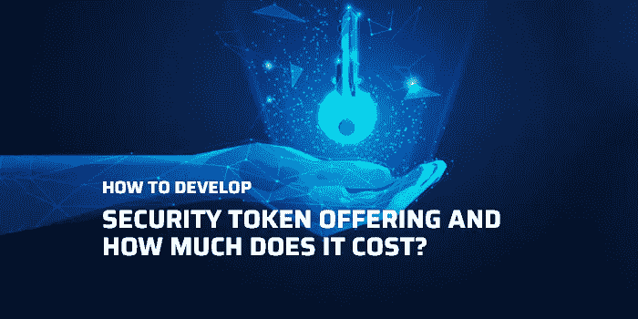

# 如何开发安全令牌产品，费用是多少？

> 原文：<https://medium.com/nerd-for-tech/how-to-develop-security-token-offering-and-how-much-does-it-cost-7db9e5b989e7?source=collection_archive---------7----------------------->

STO 成本

## **密码众筹:**

近几十年来，数字货币的兴起让筹款的前景变得更好。由于加密货币，越来越多的人对参与或投资众筹活动表现出兴趣。加密货币往往会吸引更多的投资者，因为它往往会根据投资量为投资者提供回报。加密货币众筹吸引用户和投资者的另一个主要因素是区块链技术的实施。

随着区块链技术和智能合约被纳入众筹活动的流程，投资者在事前获得了一定程度的安全保障。然而，随着事情的发展，人们对众筹的真实性略有担忧，因为数字货币往往更不稳定。因此，为了解决这个问题，众筹运动者以提供安全令牌的名义引入了一个完全受监管的筹款方面。

## **什么是安全令牌产品？**

安全代币发行被誉为所有数字筹款模式中最受欢迎的众筹方式之一。希望为自己的企业筹集资金的初创公司可以通过安全代币筹集资金。证券代币主要是在区块链的授权下发行的，它代表股份、资产或实体。这些资产可以是真实世界资产的复制品，如股票、债券、大宗商品，如黄金、白银、原油和其他股票。

为了发行安全令牌，必须遵守并按照 SEC 法规进行操作。这样做将为发行者提供完全的所有权，并且令牌将是高度安全的。除此之外，安全令牌是通过在智能合约中集成所有特殊功能来创建的。一旦智能合约得到验证，SEC 将批准分发安全令牌。尽管如此，根据地理位置的不同，规则、规定以及指导方针也会发生相应的变化。除了安全性之外，实现安全令牌还有几种用途。

## **安全令牌的使用:**

一些愿意向潜在投资者发行股票的初创公司和老牌公司会以证券代币的形式发行股票。他们使用安全令牌主要是因为他们得到了区块链的帮助。除此之外，一些重要的用途如下:

**透明:**

通过使用 public ledger，您可以获得完全透明的好处，即使大多数参与是匿名的。也就是说，每一个细节都可以在任何给定时间使用公共分类账进行访问。任何人都可以查看被覆盖的智能合约，这些合约管理代币以及持有和发行。

**可分:**

一些像艺术品和房地产这样的高价值资产可以提供给投资者。这是可能的，因为通过令牌化，这些资产可以变得前所未有地更具吸引力和可负担性。这是由于可分性的特点，使资产比其正常的性质更负担得起。

**快速安顿:**

在将资产从一个地方转移到另一个地方时，清算和结算通常会花费更多时间。然而，当该过程涉及区块链技术时，整个过程是自动化的。这确保了所有权的重新分配可以即时完成。

**无停机:**

传统的金融市场一定会有一个固定的周期来进行有规律的交易。在这方面，这些市场通常在工作日开放，周末关闭。相反，数字令牌可以全天候访问和提供服务。

考虑到所有这些用途，开展筹款活动是它在新兴企业家中受欢迎的主要原因。此外，确保您了解开发流程也很重要。

## **如何开发 STO？**

开发一个全面运作的安全令牌活动并不是一件难事。显然，在以完全无障碍的方式发布 STO 之前，必须遵循几个步骤。STO 开发步骤是:

*   首先，想出一个完美的商业计划，它可以在你的项目取得巨大成功的过程中发挥关键作用。确保想出一个能够吸引整个加密生态系统的大量投资者的想法。
*   确保遵守当地政府的所有规章制度。除此之外，您还应该披露当地政府以无缝方式推出您的 STO 的法律合规性。
*   事先准备一份详细的白皮书，供投资者浏览。白皮书可以被解释为一个技术文档，它概括了 STO 项目的所有细节。一份完美的 STO 白皮书应该包括项目的愿景和使命、路线图、令牌的功能和细节以及 STO 项目的条款和条件。
*   确保雇佣一个法律顾问团队来处理与筹款项目相关的所有法律实体。
*   为了开发一个成功的 s to 平台，一定要把控制权交给一个来自一家声誉很高的 STO 开发公司的专业开发人员团队。通过雇佣一群经验丰富的开发人员，你可以在每一个小细节上获得帮助，从而在没有任何障碍的情况下推出一个高效的 s to 平台。
*   创建 STO 营销活动时，需要考虑的另一个重要方面是确定您的令牌的令牌标准。有几个范围的令牌可用于使用著名的区块链创建安全令牌，如以太坊、创、币安智能链等。ERC1400 可能是用于创建安全令牌的最流行的令牌标准之一。安全令牌有多种类型，如债务令牌、股权令牌和资产令牌。
*   为了吸引大量投资者，你需要一个精心制作的 STO 网站。确保有一个专业设计的项目成功的 STO 网站。
*   营销和促销是这个项目的一个非常重要的部分，可以接触到广泛的受众。确保通过社交媒体营销、电子邮件营销等多种营销策略来推广你的 STO 活动。

开发一个 STO 脚本需要详细说明，直到开发的最后阶段。当谈到一步一步的发展，最重要的事情可能会出现的是与发展相关的 STO 成本。基于开发类型，STO 成本会受到多种因素的影响。

## **决定 STO 发展成本的因素:**

当谈到建立一个 s to 战役时，开始之前要考虑的主要方面是预测开发 STO 的成本。在这方面，下面列出了一些能够在确定 STO 成本中发挥重要作用的因素。

**白皮书:**就像传统的 ICO 一样，白皮书是 STO 项目不可或缺的一部分。你需要确保它是由一个技术过硬的作者或团队起草的。确保白皮书以独特的方式描述你的项目，让每个人都信服。它还提供了关于开发 STO 成本的见解。

**代币标准:**确定一个代币标准，让你的项目更具融资可行性，这一点非常重要。时间的开始揭示了 ERC20 作为默认标准，它仍然是最受欢迎的令牌标准。也就是说，最近还引入了一些其他的协议，这些协议受到了许多项目所有者的青睐。

**智能合约:**尽管智能合约不会在很大程度上影响报价，但它的集成对于正确的交易执行非常重要。智能合同会使业务变得更好，并且它被设计成没有 bug 是非常重要的。

**用户管理板:**为了运营一个优秀的企业，拥有一个功能丰富的管理板是非常必要的。通过更好的安全管理，您几乎可以维护与您的业务相关的所有方面。在这种情况下，代表贡献者转移代币并通过它们赚钱变得相对容易。

**法律方面:**在与 STO 打交道时，很明显你应该进行适当的法律咨询，因为它直接涉及大量的金融资产。除了考虑合法性，你还需要确保从营销的角度来看，这个项目做得很好。确保验证每一个程序，如 KYC 和反洗钱程序的真实性。

**安全和测试:**每一个平台在上线前都需要完成审查。它也适用于安全令牌提供项目。这是提前发现故障和编码问题的重要过程。多重测试只能确保问题完全没有 bug，并且足够健壮以抵消任何技术上的小故障。

上面提到的是一些重要的因素，这些因素可以决定你希望你的 STO 竞选如何成功。既然你已经看到了决定 sto 成本的因素，决定由谁来完成开发这种盈利商业模式的最终工作也是非常关键的。

## **最终想法:**

开展一场全面的 STO 竞选绝不是在公园散步，如果你想从中获得回报，你需要拿出你的最佳水平。你需要有一个紧密结合的策略，并确保坚持到项目发布。一定要有一群专家在你身边处理不同的事情。将控制权移交给专业专家是项目成功的必要条件。在这方面，我强烈推荐您从加密生态系统中获得最好的 [**STO 开发公司**](https://www.zabtechnologies.net/sto-development-company?utm_source=prk&utm_medium=Guestblog&utm_campaign=STOCost) 的服务。拥有一个精英专家团队的支持会让你在技术上领先于你的同龄人。