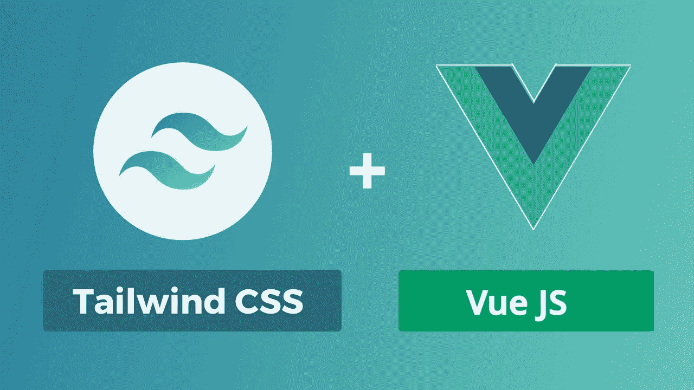

# 如何用 TailwindCSS 和 Vue.js 禁用一个按钮

> 原文：<https://medium.com/nerd-for-tech/how-to-disable-a-button-with-tailwindcss-and-vue-js-ca788a2fc7bc?source=collection_archive---------6----------------------->

你从谷歌那里听说过如何做到这一点吗？嗯，我有，我的同事也有。我最近有一个同事做了这个查询。然后我想，为什么不跟全世界分享一下我是怎么解决这个问题的。我是知识的倡导者。

首先，你可能会问，什么是[尾巴？为什么要学或者想了解它。嗯，这是一个自由的世界；你不需要这么做。然而，如果你是一个前端开发人员(*最重要的是*)，或者是全栈开发人员，你应该知道一点。](https://tailwindcss.com/)

首先，我假设你知道 [TailwindCSS](https://tailwindcss.com/) 和 [VueJS](https://vuejs.org/) 或者有一个使用 [TailwindCSS](https://tailwindcss.com/) 的 [Vue](https://vuejs.org/) 应用。我不会在这里讨论如何开始使用 [TailwindCSS](https://tailwindcss.com/) 。假设你想了解更多。请读一下这个。

*   [VueJS](https://vuejs.org/) ( *在编写*时使用 Vue 2)
*   [尾翼 CSS](https://tailwindcss.com/)

那不碍事。让我们开始吧。

你可以在 Github 上查看这个[帖子来了解更多。干杯。](https://github.com/tailwindlabs/tailwindcss-custom-forms/issues/25#issuecomment-706175480)