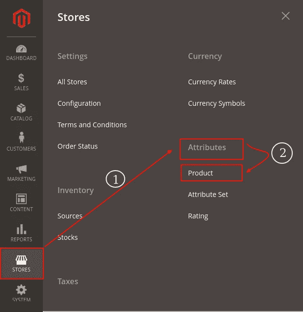
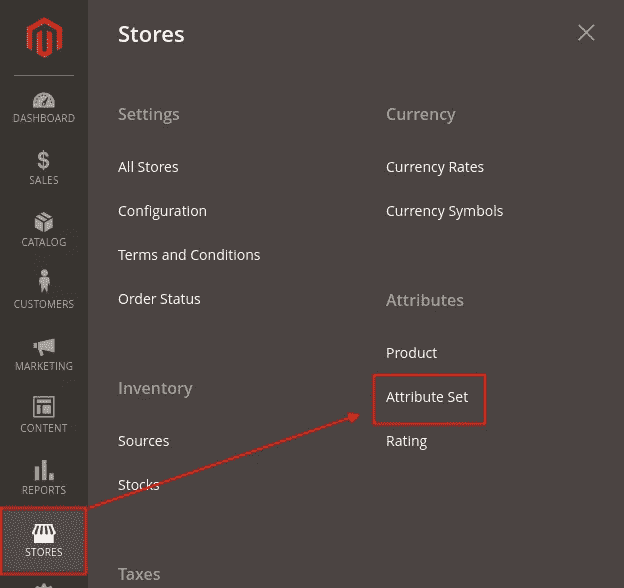
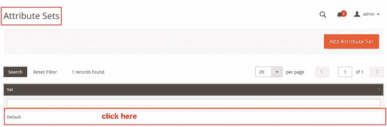
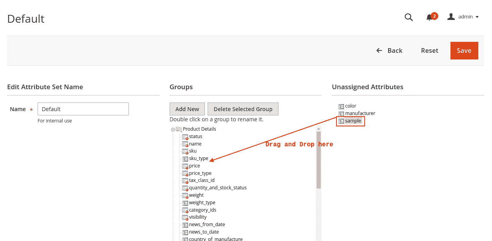
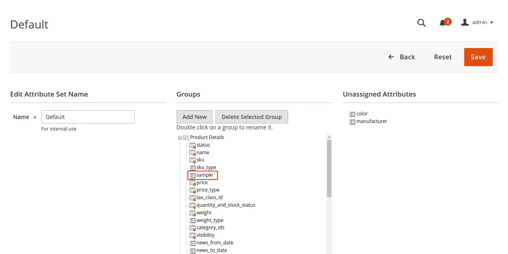

# 如何在 Magento 2 中按自定义属性显示产品？

> 原文：<https://medium.com/nerd-for-tech/how-to-display-products-by-custom-attribute-in-magento-2-dc7d88de41f?source=collection_archive---------5----------------------->


如何在 Magento 2 中按自定义属性显示产品？

在本教程中，我将解释如何在 Magento 2 中使用自定义属性查看产品。有时，当有人要求过滤产品时，这就成了一个挑战。不过，这并不像听起来那么难。

**您可能也对:**感兴趣

1.  [在 Magento 2](https://desssigner.in/add-and-customize-custom-tab-on-product-page-magento-2/) 产品页面上添加并定制自定义标签

# 如何在 Magento 2 中创建自定义属性？

## 步骤 1:在 Admin 中创建一个新的属性“sample”

**登录 Magento Admin** > **商店** > **属性** > **产品**



登录 Magento 管理>商店>属性>产品

在产品属性页面，你可以看到默认情况下 Magento 给了我们预定义的属性。

让我创建一个新属性。

点击**添加新属性**


添加新属性

现在我们需要在**新产品属性**中填写详细信息，然后**保存**。

让我们解释一下这些字段:

**默认标签:**标签识别属性的文本属性。

**店主**的目录输入类型:确定用于管理来自管理商店的产品的数据和输入控制的种类。例如，文本字段、文本区域、是/否、日期、下拉列表等。

**必需值:**要请求在保存记录之前在该字段中输入值，请将“必需值”设置为“是”。

对于高级属性特性:

**属性编码:**内部使用的唯一标识。

**范围:**将属性的使用限制在特定的商店视图或网站。选项:商店视图/网站/全局。

**默认值:**为属性“数据输入的简易性”分配一个初始值。

**在过滤器选项中使用:**确定属性是否用作网格中列顶部的过滤器控件。选项:是/否

> *过滤器控件仅在“添加到列选项”打开时显示。*

有关更多详细信息，请参见商务用户指南。

## 第二步:给 Magento 中的属性集分配产品属性？

**登录管理员** > **店铺** > **属性** > **属性设置**



登录管理>商店>属性>属性集

**属性设置页面** > **从** > **列表中选择设置拖拽未分配的属性到组**



属性集页面>从列表中选择集>将未分配的属性拖放到组中

**注意:**默认情况下，Magento 给了我们一组默认的属性，但是我们也可以添加一组新的属性。



拖动前

**一旦你拖放它:**



拖放后

这里，我们已经成功地创建了一个定制属性，并将其分配给属性集。我希望你能理解。

# 如何为样品产品创建静态块？

以下是几个步骤:

1.  登录管理>内容
2.  元素>块
3.  添加新块
4.  填写新块页面的必填字段。
5.  在编辑部分>点击插入部件>从下拉列表中选择部件类型**(目录产品列表)**
6.  在标题字段中填充小部件的标题
7.  在 conditions 字段中，找到您的属性(在我的例子中，它是 Sample)，选择它，并将其设置为 yes。
8.  点击插入部件>保存块

如何为样品产品创建静态块？

# 调用 CMS 页面中的静态块:

```
{{block class="Magento\Cms\Block\Block" block_id="your_block_identifier"}}
```

在我的例子中，标识符是 ***样本 _ 产品***

```
{{block class="Magento\Cms\Block\Block" block_id="sample_products"}}
```

# 调用模板中的静态块(。phtml)文件:

```
<?php echo $this->getLayout() ->createBlock('Magento\Cms\Block\Block') ->setBlockId('your_block_identifier') ->toHtml(); ?>
```

# 在布局(XML)文件中调用静态块:

```
<referenceContainer name="content"> <block class="Magento\Cms\Block\Block" name="block_identifier"> <arguments> <argument name="block_id" xsi:type="string">block_identifier</argument> </arguments> </referenceContainer>
```

希望这篇文章能帮助你理解如何创建一个自定义属性并显示产品。如果您有任何疑问，您可以直接发邮件至[**aryansrivastavadesssigner@gmail.com**](mailto:aryansrivastavadesssigner@gmail.com)询问我，或点击 联系我 [**。**](https://desssigner.in/contact/)

如果你想要一个现场会议，请直接在 LinkedIn 上联系我，我会在周末安排一个在线会议。

如果你喜欢这篇文章，你可以给我买杯咖啡[给我买杯咖啡](https://www.buymeacoffee.com/aryansrivastava)。

*原载于 2021 年 7 月 3 日*[*https://desssigner . in*](https://desssigner.in/how-to-display-products-by-custom-attribute-in-magento-2/)*。*