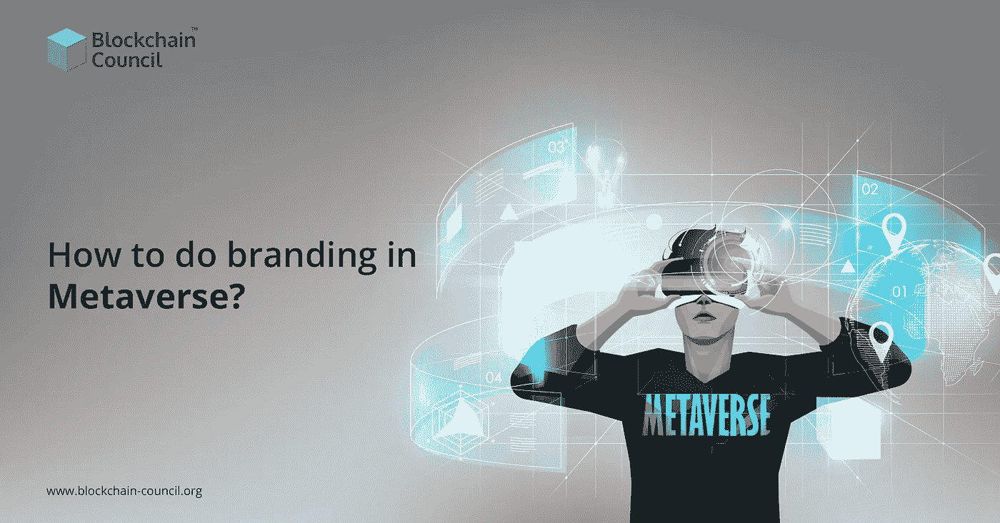

# 如何在元宇宙做品牌推广？

> 原文：<https://medium.com/nerd-for-tech/how-to-do-branding-in-metaverse-16f072bad563?source=collection_archive---------3----------------------->

元宇宙的商业用例一直吸引着顾客和零售商。由于围绕产品/服务的购买和销售新开发的行为，这个概念越来越受欢迎。今天，在社交商务时代，人们喜欢直接通过社交体验来享受电子商务解决方案。进一步说，受过 [**区块链教育**](https://www.blockchain-council.org/blockchain/why-blockchain-education-should-be-incorporated-into-colleges/) 的人都知道这种变化对世界意味着什么。

当涉及到使用任何**区块链** **平台**的品牌时，他们应该始终遵循测试&试用模式。这是因为该技术相对较新，只有定期实验才能显示其潜力，零售的注意事项。区块链和人工智能/虚拟现实平台元宇宙是新一代的互联网。此外，品牌应该已经知道如何在平台上留下自己的印记。此外，专家称元宇宙将是零售业的一个革命性的出现。

让我们看看品牌如何有效地在元宇宙营销他们的业务。

# 找到你的目标受众

像传统商业一样，找到并了解你的目标受众是非常重要的。在这种情况下，品牌应该专注于找出他们的目标受众在元宇宙逗留的时间。此外，有了这些信息，他们可以在合适的时间在潜在客户面前展示他们的业务。

[**元宇宙培训**](https://www.blockchain-council.org/certifications/certified-metaverse-expert/) 是学习如何在目标受众离开讲台前调整自己的速度以达到目标受众所必需的。除此之外，品牌还需要跟上最新的消费者行为和趋势，以塑造更具吸引力的品牌策略。

# 分析竞赛

确保定期探索其他公司在元宇宙平台上做了什么和如何做——例如，领导会议，与执行团队的合作，等等。对于大多数零售公司来说，NFTs、加密和区块链的概念可能令人生畏。但是，这些将是元宇宙不可分割的一部分。因此，品牌应该加强他们的区块链教育，尤其是在零售方面。然而，与从里到外了解区块链平台、AI 和 ML 运作的人合作总是更好。这是因为大多数零售商可能不太懂技术，或者觉得学习元宇宙的概念很有挑战性。

# 利用可用的应用程序

元宇宙可能会为你提供机会，加速业务增长，保持行业的可持续性。目前，大多数营销领导者都倾向于与可持续发展相关的 ESG。

在这里，品牌必须考虑他们可以使用哪些元宇宙应用程序来为客户提供可持续的营销方法。有足够的**区块链教育**和适当的**元宇宙培训**可以非常有利于品牌更好地抓住新的营销理念。

# 关注你品牌的入口

确保你的营销团队对你的品牌进入元宇宙市场有一个清晰的认识。也是做这件事的适当时机。此外，独立的营销机构一直在仔细观察新兴趋势和大众媒体行为。因此，你可以通过探索不同品牌的产品组合来获得他们的帮助，以确定你可以做得独特和更好。此外，营销机构可以帮助你学习在元宇宙地区展示你的品牌的最佳方式。

确保你雇佣的营销代理公司将适当的**元宇宙培训**作为他们的资格之一。当然，一个完全熟悉平台的团队可以进行更好的测试，以了解什么对你的品牌有效。

# 保持适当的平衡

在你进入元宇宙营销之前，要知道这个平台伴随着风险和回报。因此，你需要让你的品牌为意想不到的变化做好准备。接受**元宇宙训练**可以帮助你认定一些可能出现的情况。但是，完全预测情况可能是不可能的。要知道，你可能会忍受有时行不通的实验。但是，坚持定期监测、分析和试验可以给你带来一个正确的策略。如果元宇宙市场发生任何变化，你可能需要重新构建你的方法。

# 结束语

除了以上几点，品牌和营销领导者必须注重创意。由于元宇宙营销空间将是开放和虚拟的，吸引买家可能需要你释放你的独特性。此外，买方旅程、购后参与、收购和交易等因素应同时考虑。然而，元宇宙品牌需要在这些营销领域加倍努力。

在[区块链委员会查看**区块链认证印度**项目。](https://www.blockchain-council.org/)更进一步；一旦你熟悉了区块链的基础和高级工作方式，你也可以参加**元宇宙培训**。