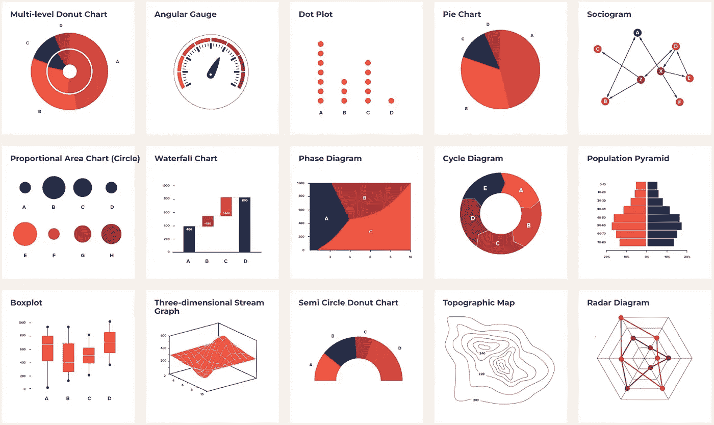
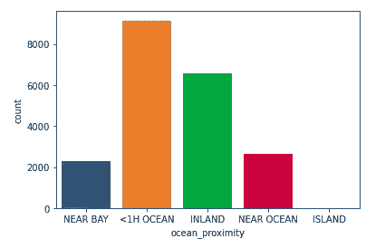
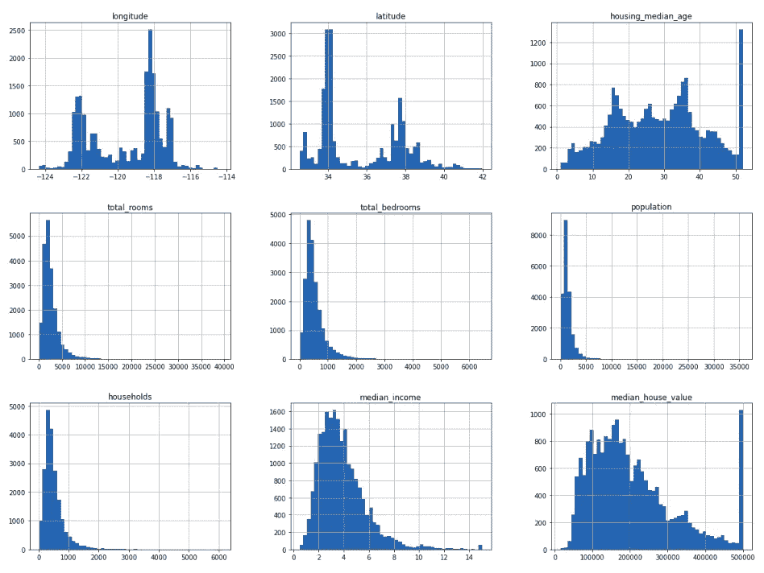
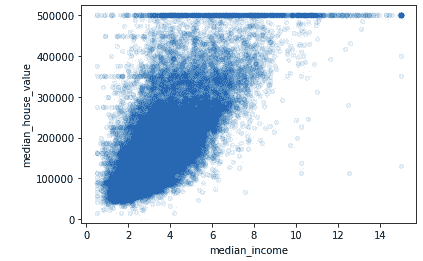
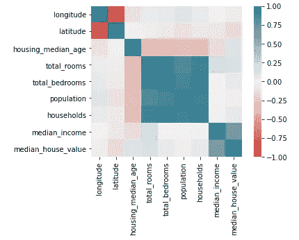

# 如何做一些基本的 EDA-傻瓜指南

> 原文：<https://medium.com/nerd-for-tech/how-to-do-some-basic-eda-a-guide-for-dummies-d76d9a82242c?source=collection_archive---------5----------------------->



> “一张照片的最大价值是当它迫使我们注意到我们从来没有期望看到的东西”——约翰·图基

**简介**

做任何类型的数据相关任务之前的第一步，无论是机器学习、数据分析等等。是查看和分析包含在您拥有的数据集中的数据。对其行为和趋势有一个很好的了解将使您能够做出更明智的决策，以便您在数据相关任务结束时的解决方案是最优的。例如，如果你对机器学习模型中哪些输入变量最影响响应变量有很强的认识，这不仅会简化你的模型，还会节省训练模型的计算成本。

你如何分析数据来做出如此重要的决定？这是通过在数据集中的各种变量之间绘制各种图形/图表/曲线图或其他数据可视化方法，并从中得出推论来实现的。这个过程被称为*探索性数据分析*或 *EDA。*然而，对于开始数据科学之旅的人来说，EDA 似乎是一项艰巨的任务。你真的不确定从哪里开始，选择哪些图表，以及如何解释你得到的可视化。EDA 更像是一门艺术，就像写作或者构建机器学习模型。没有唯一的方法，每个分析师都有自己喜欢遵循的方法。但好的一面是，就像任何艺术形式一样，你越是练习和发展自己的启发法，你就会变得越好。

**数据类型**

在做任何 EDA 之前，你应该知道你可能遇到的数据的种类。数据可以分类如下:


数据类别

*   **二分变量:**二分变量是在测量时只取两个可能值之一的变量。性别:男性/女性。
*   **多元变量:**多元变量是指有多个值可供选择的变量。教育资格:未受教育/本科/研究生/博士等。
*   **离散变量:**离散变量是可数变量，但可以取大范围的值。例如，您的银行存款余额、组织中的员工人数等。
*   **连续变量:**连续变量是一个有无限个可能值的变量。任何一种测度都是一个连续变量。温度是一个连续的变量。特定区域的温度可以描述为 30℃、30.1℃、30.22℃、30.221 ℃,等等。

通过对数据进行分类，您可以从众多的数据可视化工具中筛选出最适合您需求的图表。

为了演示 EDA 过程，我选择了来自 StatLib 存储库的加利福尼亚房价数据集。在这里，我正在做一个 EDA，作为建立一个机器学习模型来预测中值房价的过程的一部分。

**EDA 分析的类型**

EDA 可以大致分为两种类型的分析:

1.  **单变量分析:**只考虑一个变量就可以完成各种可视化。一些最常见的单变量数据可视化工具有:

(a) **条形图:**条形图用于了解分类/定性变量在数据集中的分布情况。

```
#Count-plot (Bar-plots) for the categorical variable
sns.countplot(housing.ocean_proximity)
```



分类变量的分布——海洋邻近度

Ocean_proximity 告诉我们房屋的位置，这些房屋被归类为它们来自海洋的位置。这个条形图告诉我们，数据集中的大多数房屋都位于离海边不到一小时车程的地方。而几乎没有位于岛上的房屋。

(b) **直方图:**数据集中的所有输入，除了 ocean_proximity，本质上都是定量的。直方图是可视化这些数据的非常有用的工具。直方图可以告诉您输入是如何分布的，是居中还是偏斜，数据的范围，分布是单峰还是多峰，等等。如果您需要在将给定变量应用于机器学习算法之前对其进行一些转换，直方图分布可以给你一个强有力的指示。

```
#Plot histograms of numerical data
%matplotlib inline
import matplotlib.pyplot as plt
housing.hist(bins = 50, figsize = (20,15))
plt.show
```



所有连续输入的直方图

可以看出:

*   经度、纬度和住房 _ 中位数 _ 年龄是多模态分布。
*   总房间数、总卧室数、人口数、家庭数和中值收入是单峰的，但向左倾斜。
*   中位数 _ 房子 _ 价值是双峰的。

2.**多变量分析:**通过考虑两个或更多变量来完成各种可视化。一些最常见的多元数据可视化工具有:

(a) **散点图:**散点图是在两个变量之间绘制的，用于观察趋势是否存在，以及观察现有的趋势。

```
housing.plot(kind = "scatter", x = "median_income", y = "median_house_value", alpha = 0.1)
```



中位数房价和中位数收入散点图

中值房价和中值收入之间的散点图显示，这两个数量之间存在正趋势。可以看出，随着收入中值的上升，房价中值也在上升。这强烈表明，在开发我们的机器学习模型时，中值收入将是一个重要的变量。

(b) **相关热图:**相关图或热图告诉我们任何一对变量之间是否存在相关性。相关性由皮尔逊的 r 因子量化，也称为相关系数。该系数的值从-1 到 1 不等。如果相关系数接近 1 或-1，我们说相关性是高度正的或高度负的。正相关意味着这一对变量高度相关，当一个变量增加时，另一个变量也增加。另一方面，负相关意味着变量对高度相关，但趋势相反。即一个增加，另一个减少。如果相关系数的值在 0 左右，我们说没有相关性。变量之间的相关程度分别取决于正方向或负方向上 0 到 1 或 0 到-1 之间的范围。

相关图有助于简化模型。假设您有一对高度相关的输入。通过移除这些变量中的一个，整个数据集中的信息不会丢失太多。这在确定机器学习模型需要考虑的输入变量时非常有用。

与响应高度相关的输入告诉我们，特定的输入变量对响应变量有很大的影响，因此非常重要。这些是我们希望为我们的机器学习模型保留的变量。

```
corr_matrix = housing.corr()
ax = sns.heatmap(
    corr_matrix, 
    vmin=-1, vmax=1, center=0,
    cmap=sns.diverging_palette(20, 220, n=200),
    square=True
)
```



数据集不同字段之间的关联热图

这张相关热图告诉我们纬度和经度是密切相关的。因此，在我们的机器学习模型中，只考虑其中一个作为输入就足够了。

我们还可以看到，我们的反应变量——中值房价——与中值收入密切相关。因此，中等收入已经成为一个重要的决策变量。这一观察结果可以被早先画的散点图所证实。

**结论**

这些只是在几乎所有与数据相关的任务中完成的基本可视化。这仅仅是皮毛。我希望你对 EDA 过程有所了解。我建议拿起一个数据集，做你自己的 EDA。快乐学习！

我的 jupyter 笔记本包含了在博客中演示的完整 EDA，可以在 https://github.com/sharma2409/EDA_blog/blob/main/EDA.ipynb[找到](https://github.com/sharma2409/EDA_blog/blob/main/EDA.ipynb)

**参考文献**

*   Shivaprasad，Prateesh。《探索性数据分析初学者指南》。*[*www.medium.com，*](http://www.medium.com,)*[https://towardsdatascience . com/explorative-data-analysis-dcb5 e 7189 c4e](https://towardsdatascience.com/exploratory-data-analysis-dcb5e7189c4e)**
*   **【探索性数据分析】，*[*www.devopedia.org*](http://www.devopedia.org,)*，*[https://devopedia.org/exploratory-data-analysis](https://devopedia.org/exploratory-data-analysis)***
*   **R.凯利·佩斯和罗纳德·巴里，“稀疏空间自回归”，*统计&概率字母* 33，第 3 期(1997):291–297**
*   **盖伦，奥雷连恩。*使用 Scikit-Learn、Keras 和 TensorFlow 进行机器实践学习:构建智能系统的概念、工具和技术*。奥莱利媒体，2019。**