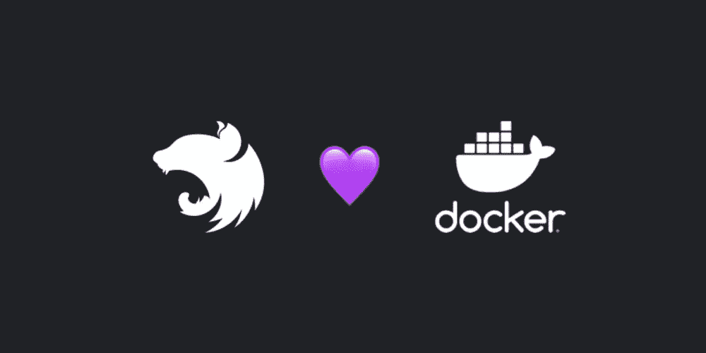

# 如何对 NestJs 项目进行分类

> 原文：<https://medium.com/nerd-for-tech/how-to-dockerize-a-nestjs-project-e80774d2459b?source=collection_archive---------1----------------------->

本文逐步简化并解释了 NestJs 应用程序的 docker 化过程。



为了创建并连接到 NestJs 项目的数据库和/或部署它，我们必须对它进行 dockerize。这篇文章将以最简单的方式带你完成这个过程

首先，你必须确保你的系统上有 docker。然后，要对项目进行归档，只需遵循以下步骤:

*   在项目文件夹下创建一个名为 Dockerfile 的文件。将以下内容粘贴到:

```
FROM node:16 //edit the version to yoursWORKDIR /computer_username/src/app  //edit the username to yoursCOPY package*.json ./RUN npm installCOPY . .RUN npm run buildEXPOSE 8080
CMD ["node", "dist/main"]
```

*   创建一个名为。dockerignore 就在项目文件夹下，将下面的内容粘贴在:

```
node_modules
npm-debug.log
```

*   要构建 docker 映像，请转到项目外的一个目录并运行:

> docker 构建 my-project-t computer _ username/my-project

*   该过程完成后，通过运行以下命令验证您已经成功:

> docker 图像

*   要运行映像，请运行以下命令:

> docker run -p 3000:8080 -d 计算机 _ 用户名/我的项目

**注意:**上面的 3000 是 NestJs 应用程序的默认端口，您应该将其更改为您的项目使用的任何端口。另一方面，8080 是我们分配给 Dockerfile 上的映像的端口。您可以随意更改，但要确保 docker 文件中的内容与命令中的内容相匹配。

从那时起，如果您试图通过 3000 端口访问您的项目，它将不会返回任何内容，因为项目现在将在端口 8080 上运行。

您可以使用以下命令查看正在运行的容器:

> docker ps

这将为您提供一个带有自动分配的“名称”的 docker 容器列表。如果你的容器的名字是，比如说，眼花缭乱 _ hopper 您可以使用以下命令停止该特定容器:

> 码头工人停止眼花缭乱 _ 料斗

瞧啊。我们准备好了。