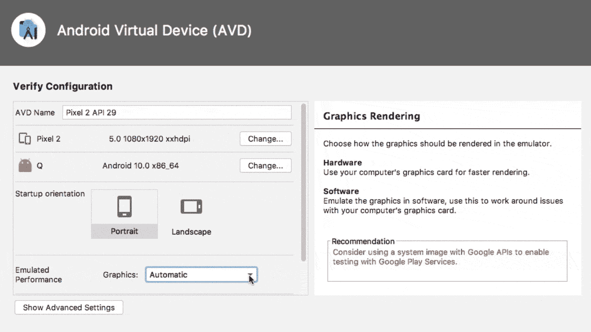
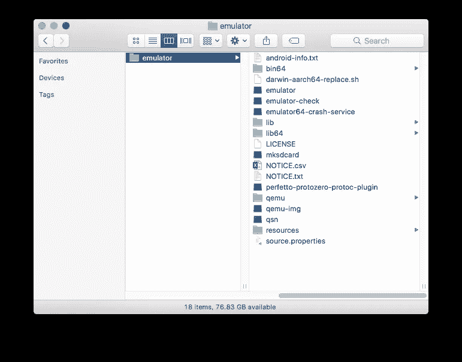

# 如何在 macOS 上降级 Android 模拟器

> 原文：<https://medium.com/nerd-for-tech/how-to-downgrade-android-emulator-on-macos-6e611d2d2bcb?source=collection_archive---------2----------------------->

# 问题

在最近将 Android Studio 升级到 4.1.3 之后，我在尝试启动 Android 虚拟设备时遇到了一个问题。错误消息如下: *AVD 管理器 AVD Pixel _ 2 _ API _ 29 的仿真器进程被终止。*


AVD 在一天前测试 React 原生项目时工作得非常好，所以我知道升级很可能是错误的原因。在这篇文章中，我将介绍我解决这个问题的步骤，并提供我发现的解决方案，其中包括将 Android 模拟器降级到以前的版本。

# 解决纷争

我尝试的第一件事是创建一个新的 AVD，使用与前一天工作的相同的设置。我尝试使用 API 29 和 30 来查看它是否与 API 版本相关，但这并没有修复错误。

在堆栈溢出和其他论坛上搜索解决方案后，我偶然看到一个[帖子](https://stackoverflow.com/a/64981574)建议将图形模式设置为*软件*而不是*自动/硬件*。虽然这似乎对一些人有用，但对我没用。



[另一位用户解释说](https://stackoverflow.com/a/66136694)在 SDK 工具菜单中卸载然后重新安装*英特尔 x86 模拟器加速器(HAXM 安装程序)*已经解决了他们的问题，但不幸的是这对我也不起作用。

## 越来越接近解决方案…

我采取的最后一个调试步骤是尝试从命令行手动启动模拟器。我使用这个命令列出了每个 AVD 的名称，并确保仿真器首先能够访问它们。

```
emulator -list-avds
```

一旦我得到了返回的模拟器列表，我就试着运行其中一个。

```
emulator -avd Pixel_2_API_29
```

这给了我一个新的错误，至少更具描述性。上面写着:

```
emulator: Android emulator version 30.5.3.0 (build_id 7196367) (CL:N/A)
dyld: Library not loaded: /System/Library/Frameworks/IOUSBHost.framework/Versions/A/IOUSBHost
```

在使用这个新错误进行了更多搜索后，我发现了一个[帖子](https://stackoverflow.com/questions/66697645/cannot-start-android-emulator-library-not-loaded)解释说苹果已经在 macOS 10.15 中引入了 *IOUSBHost* ，看起来最好的解决办法就是简单地降级到不需要这个框架的旧版本 Android 模拟器，至少在我可以升级我的操作系统之前。

在寻找了很多降级的方法后，我看到了这篇解释降级过程的文章。很难找到我试图安装的 android 模拟器旧版本的正确网址，但经过一些搜索后，我找到了[以前稳定版本 3.4.5](https://developer.android.com/studio/releases/emulator#30-4-5) 的网址。

我在下面概述了下载和降级 Android 模拟器的步骤。

# 解决方案

你会在这里找到 Android Emulator 3.4.5 的网址:[https://dl . Google . com/Android/repository/Emulator-Darwin _ x64-7140946 . zip](https://dl.google.com/android/repository/emulator-darwin_x64-7140946.zip)

一旦下载了这个文件，解压缩它，您应该会看到以下内容。



当前安装在您计算机上的模拟器文件夹的位置应该在:

```
~/Library/Android/sdk/emulator
```

但是，您可以在终端中键入以下内容，仔细检查您的终端可能安装在哪里:

```
which emulator
```

下一步是用下载的模拟器文件夹中的文件替换当前安装的模拟器文件夹中的文件。我建议备份当前安装的模拟器，以防您需要快速恢复您的更改。

我通过简单的复制和粘贴做到了这一点，我可以覆盖任何名称匹配的文件。这很重要，因为您实际上希望将 *package.xml* 文件保留在当前安装的模拟器文件夹中。这个文件会欺骗 Android Studio，让它认为你已经安装了最新版本。

如果你不保留这个文件，你将无法使用 Android Studio UI 启动你的 AVD，相反，它会尝试自动将你升级到最初导致错误的那个版本。然而，从技术上讲，您仍然可以在没有 *package.xml* 文件的情况下，通过使用命令行运行仿真器来启动 AVD，但这并不理想。

一旦你做到了这一点，你应该能够成功地再次启动你的 AVD！如果你现在查看 Android Studio 中的 SDK 工具菜单，它仍然会认为你安装了最新版本的 Android 模拟器，在我的例子中是 3.5.3。为了避免这个问题，我可以在 *package.xml* 文件的第 141 行编辑 *revision* 标签:

```
<revision><major>30</major><minor>4</minor><micro>5</micro></revision>
```

这个错误很难弄清楚，但我希望这些步骤可以帮助任何有类似问题的人。如果有人找到了另一个修复方法，请告诉我！