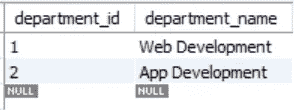
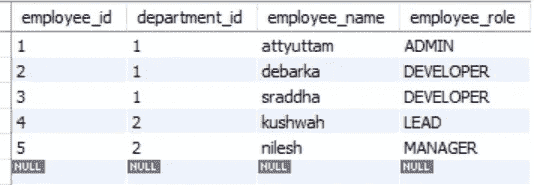

# 当存在延迟加载时，如何快速加载

> 原文：<https://medium.com/nerd-for-tech/how-to-eager-load-when-theres-lazy-loading-involved-57753644834e?source=collection_archive---------1----------------------->

迈克·范·登博斯在 [Unsplash](https://unsplash.com?utm_source=medium&utm_medium=referral) 上的照片

我们经常会遇到这样的情况，虽然我们的实体有另一个实体的映射，但是我们需要使用那个实体，并通过快速加载获得所有相关的映射。这些情况大多发生在我们有大量数据库调用，并且我们需要减少调用次数，从而减少总时间的时候。不要烦恼！ ***加入接取*** 救援！

所以，让我们先看看数据。

对于这个例子，我创建了两个表 ***department*** 和 ***employee*** ，其中一个部门可以有许多雇员，但是一个雇员只能属于一个部门。

让我们看一看这些数据。

部门表

员工表

现在让我们来看看 ***部门*** 和 ***员工*** 的 java 类。

我希望您关注的主要内容是映射和获取类型。正如我们在 ***Department*** 类中看到的，在一对多的双向映射中，使用一个列表来映射雇员。这是使用 employeeList 列表上的 ***@OneToMany*** 注释完成的，注意获取类型是惰性的也很重要。同样，在 ***Employee*** 类中，我们在 department 变量上添加了一个 ***@ManyToOne*** 注释，将一个雇员与他们的部门关联起来。

所以，在我深入到 ***JOIN FETCH*** 之前，我只想接触一个 JOIN 的例子，从控制台输出中，我们可以找出正在进行的调用的数量。

当我们使用 JPA 提供的 ***JOIN*** 或[***find all()***](https://docs.spring.io/spring-data/jpa/docs/current/api/org/springframework/data/jpa/repository/JpaRepository.html#findAll--)方法来获取所有部门及其相关用户时，我们使用以下方式:

使用 JPA 提供的 findAll()方法

通过使用 join

对于所使用的两种风格，都会生成下面提到的 Hibernate 查询。

我们可以看到，首先运行一个 SQL 查询来获取所有部门，然后对每个部门运行一个 SQL 查询来获取该部门中相应的雇员。

最后，如果使用控制器显示，结果应该如下所示:

那么，如何对此进行优化呢？

嗯通过使用 ***加入取*** ！

因此， ***JOIN FETCH*** 基本上删除了所有额外的调用来获取特定部门的所有雇员，但这是在一个 DB 调用中完成的！

# 结论

因此，很明显 ***JOIN FETCH*** 加速了您的 DB 调用，在关联类型为 ***LAZY*** 但我们需要以*方式获取数据的情况下，我们可以利用 ***JOIN FETCH*** 的这一属性。*

*整个例子写的是用弹簧开机检查 [***这个***](https://github.com/Attyuttam/join-fetch-example) 出来的！*