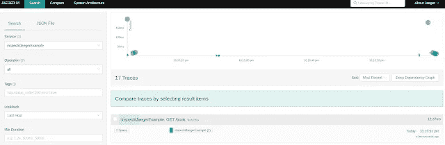
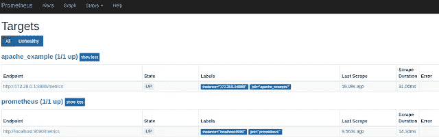
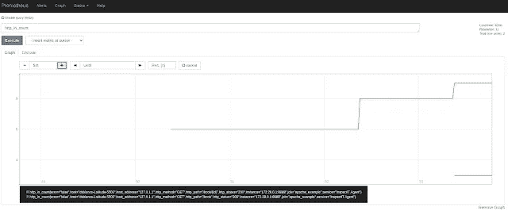

# 如何通过 InspectIT 轻松应用绩效管理

> 原文：<https://medium.com/nerd-for-tech/how-to-easily-apply-performance-management-with-inspectit-7692e5c43d20?source=collection_archive---------5----------------------->


今天，我们将看到一个精彩的开源工具来执行不同类型的任务，从跟踪，监控，或仪器:InspectIT。这个工具是一个 Java 代理，从上一篇文章中我们已经对它有所了解，你可以在这里看到。

这个软件试图减少两件事。一方面，使用其他应用性能管理(APM)工具所需的配置时间。如耶格、普罗米修斯、齐普金或千分尺。另一方面，如果我们想执行检测任务，就要减少对应用程序的修改。

InspectIT 基于 OpenCensus，这是一套用不同语言制作的开放软件库，允许我们获得分布式指标和跟踪。这种软件已经有了广泛的出口，允许发送信息到其他监测工具。InspectIT 支持这些出口商中的大多数。

由于所有这些原因，InspectIT 是一个很好的工具。因为它是一个 Java 代理，所以我们不需要修改我们的应用程序来获取性能信息。通过预配置的导出器，我们可以自动获取指标和跟踪，并将它们发送到不同的目的地。

通过示例，我们将能够看到如何从我们的应用程序中获取这些信息。不同示例中的操作是相似的。为了让它发挥作用，我们必须遵循以下两个步骤:

*   通过 JVM 参数'-java agent:/full/path/to/library '关联存储在库中的 Java 代理。
*   通过 JVM 参数关联要使用的导出器属性。我们可以关联一个或多个属性，每个属性都有相应的参数。

对于第一个例子，我们将使用一个 Jaeger 导出器，通过它我们将能够获得应用程序跟踪。它的基础将是我们在以前的帖子中做过的一个例子，基于 Apache Camel，你可以在这里看到。请记住，Jaeger 是一个工具或追踪器，它允许我们收集应用程序的痕迹信息，并在自己的图形界面中可视化它们。

步骤如下:

*   一方面，我们必须下载包含 java 代理的库，我们可以从[这里](https://github.com/inspectIT/inspectit-ocelot/releases)下载。我们将它放在一个路径中，我们将在稍后启动应用程序时指明该路径。
*   启动 Jaeger，例如用一个 docker-compose 像下面这样。

```
version: '2.4'
networks:
  sandbox-apache-net:
    ipam:
      driver: default
      config:
        - subnet: 172.24.0.0/16services:
  mysql:
    image: mysql:5.7.26
    mem_limit: 2G
    container_name: sandbox-apache-mysql
    hostname: sandbox-apache-mysql
    networks:
      sandbox-apache-net:
        ipv4_address: 172.24.1.1
    environment:
      MYSQL_HOST: sandbox-apache-mysql
      MYSQL_ROOT_PASSWORD: root
    ports:
      - 3306:3306
    volumes:
      - ./configs/mysql/conf.d/custom.cnf:/etc/mysql/conf.d/custom.cnf
      - ./configs/mysql/scripts:/docker-entrypoint-initdb.d jaeger:
    image: jaegertracing/all-in-one:latest
    ports:
      - 16686:16686
      - 14268:14268
```

*   最后，启动 JVM，传递允许我们配置所需导出器的参数。对于 Jaeger，我们将使用以下方法:

```
-javaagent:/home/deesebc/Downloads/inspectit-ocelot-agent-1.8.1.jar -Dinspectit.exporters.tracing.jaeger.url=http://127.0.0.1:14268/api/traces 
-Dinspectit.exporters.tracing.jaeger.service-name=inspectitJaegerExample
```

在 URL 属性中，我们指出 Jaeger 所在的地址，使用 *service-name* 我们可以指出我们将注册 Jaeger 跟踪的名称。

作为了解 Jaeger 如何工作的前一步，我们将对我们的应用程序进行几个查询。以便通过检查进行登记。如果使用我的应用程序的代码，会是一个类似于这样的调用:[*http://localhost:9090/book/1*](http://localhost:9090/book/1)。

如果我们访问 URL[*http://localhost:16686/search*](http://localhost:16686/search)，我们将能够访问跟踪浏览器并搜索我们的应用程序的跟踪。



在下一个例子中，为了了解 InspectIT 的更多潜力，并了解它如何获取指标，我们将使用 Prometheus 的导出器。我们将基于的例子将是这个[一个](https://danielblancocuadrado.medium.com/apache-camel-create-your-own-metric-with-micrometer-b10d2db09b4f)。

我们再次开始准备一个 docker-compose，允许我们部署 Prometheus。我们可以基于上一个示例，它将类似于以下内容:

```
version: '2.4'
networks:
  sandbox-apache-net:
    ipam:
      driver: default
      config:
        - subnet: 172.24.0.0/16services:
  mysql:
    image: mysql:5.7.26
    mem_limit: 2G
    container_name: sandbox-apache-mysql
    hostname: sandbox-apache-mysql
    networks:
      sandbox-apache-net:
        ipv4_address: 172.24.1.1
    environment:
      MYSQL_HOST: sandbox-apache-mysql
      MYSQL_ROOT_PASSWORD: root
    ports:
      - 3306:3306
    volumes:
      - ./configs/mysql/conf.d/custom.cnf:/etc/mysql/conf.d/custom.cnf
      - ./configs/mysql/scripts:/docker-entrypoint-initdb.d

  prometheus:
    image: prom/prometheus:v2.6.1
    ports:
      - 9091:9090
    volumes:
      - ./configs/prometheus.yml:/etc/prometheus/prometheus.yml
    networks:
      sandbox-apache-net:
        ipv4_address: 172.24.1.2
    extra_hosts:
      docker.host: 172.28.0.1
```

> 172.28.0.1 是 docker 网桥接口的 IP。

下一点将是从允许我们将信息导出到 Prometheus 的参数开始我们的应用程序。

```
-javaagent:/home/deesebc/Downloads/inspectit-ocelot-agent-1.8.1.jar -Dinspectit.exporters.metrics.prometheus.host=172.28.0.1 
-Dinspectit.exporters.metrics.prometheus.port=8888
```

让我们记住，为了让 Prometheus 工作，它必须从一个特定的 URL 读取关于应用程序的信息。因此，一方面，我们必须配置普罗米修斯从一个特定的点读取。我们将通过 Prometheus 配置文件(docker-compose 的一部分)来实现这一点:

```
scrape_configs:
  - job_name: 'prometheus'
    scrape_interval: 1m
    static_configs:
      - targets: ['localhost:9090']
  - job_name: 'apache_example'
    scrape_interval: 1m
    metrics_path: '/metrics'
    static_configs:
      - targets: ['172.28.0.1:8888']
```

通过 JVM 参数，我们将向 InspectIT 表明，我们希望在指示的 IP 和端口中公开我们的应用程序的信息。在我们所基于的例子中，是由弹簧致动器完成的。

一旦一切启动，我们将如上所述进行几次调用。现在我们可以访问普罗米修斯，看到已经完成的监测。

如果我们访问路由[*http://localhost:8888/metrics*](http://localhost:8888/metrics)，我们将能够看到我们从应用程序生成的不同指标。如果我们访问 Prometheus URL[*http://localhost:9091/targets*](http://localhost:9091/targets)我们可以看到我们的端点是否被 Prometheus 正确读取。



下一步将访问[*http://localhost:9091/graph*](http://localhost:9091/graph)并根据获得的指标制作图表。例如，一个通过参数 *http_in_count* 计算我们对应用程序端点的调用次数的函数。



如你所见，这真的很简单。使用 InspectIT 执行应用程序性能管理任务不再是借口。这只是几个例子，但你可以通过不同的出口商做得更多。