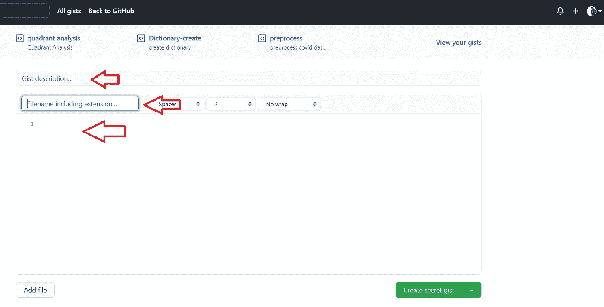
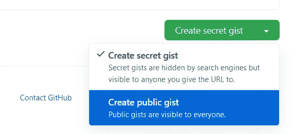
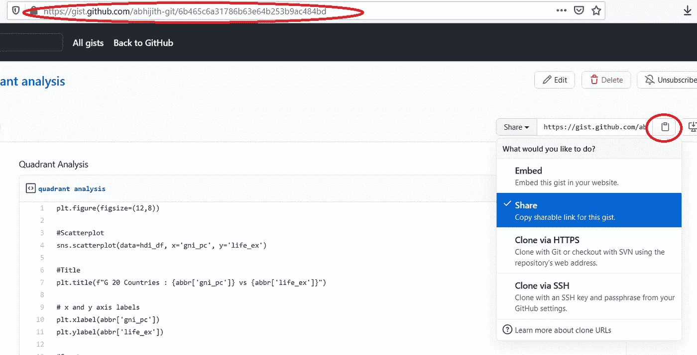

# 如何在媒体中嵌入代码

> 原文：<https://medium.com/nerd-for-tech/how-to-embed-code-in-medium-4bd380c8102d?source=collection_archive---------3----------------------->

## 在你的媒体文章中嵌入代码的两种简单方法。

当写一篇关于编码的文章时，作者经常发现很难向文章中添加代码。普通文本中的代码破坏了格式，并且不能区分文本和代码。一些作者通过上传代码截图来克服这个问题。

在这篇文章中，我将解释两种简单的方法来把代码嵌入到你的文章中。

## 方法 1:直接嵌入介质

要在媒体中直接嵌入代码，请使用以下快捷键:

*   **Mac :** 命令+选项+6
*   **Windows** : Control + Alt + 6
*   **Linux** : Control + Alt + 6

当你按下这些键时，会出现一个如下的灰色框，你可以在里面写你的代码。

```
<Enter your code here>
```

检查如何保留代码格式。借助打字机字体和突出显示，代码非常突出。

```
#Title                        
plt.title(f"G 20 Countries : {abbr['gni_pc']} vs {abbr['life_ex']}") # x and y axis labels                       plt.xlabel(abbr['gni_pc'])                       plt.ylabel(abbr['life_ex']) #Country names                       
for i in range(hdi_df.shape[0]):    
   plt.text(df.gni_pc[i], y=df.life_ex[i], s=df.Country[i]))
```

## 方法 2:使用 Github Gist 嵌入

与使用 Medium 直接嵌入相比，Github Gist 是一个更有吸引力和可读性的选择。

首先，你必须注册 [Github gist](https://gist.github.com) 并登录你的账户。

在 Github gist 页面的左上方，你可以找到一个“+”号，你可以点击它来创建一个新的 gist。


作者图片

您将进入下一页，在这里您必须输入以下详细信息:
i .要点描述
ii。您的代码片段的标题或文件名
iii。要共享的代码片段



作者图片

您可以将其保存为公开或秘密的要点。如果你想在媒体上发表，那么你应该把你的要点公开保存。



作者图片

**将链接复制到您的要点(url)** 或**获取可共享的链接。** 通过简单的**粘贴到新的一行**或者**使用嵌入链接选项**可以嵌入到媒体文章中。



作者图片

这就是你的要点在媒体上的样子。

这段代码是为象限分析的一篇文章编写的。

[](https://abhijithchandradas.medium.com/how-to-perform-a-quadrant-analysis-in-python-9f84d36f8a24) [## 如何在 Python 中执行象限分析

### 什么是象限分析？为什么用？使用 pandas，matplotlib 和 seaborn 库在 python 中如何实现？

abhijithchandradas.medium.com](https://abhijithchandradas.medium.com/how-to-perform-a-quadrant-analysis-in-python-9f84d36f8a24) 

使用 Git Gist 的好处是，当在 Gist 中编辑代码时，所做的更改将会反映在 Medium 文章中和代码共享的任何地方。

## 视频格式

如果你喜欢视频格式的内容，你可以看看下面的 YouTube 视频。

## 成为会员

我希望你喜欢这篇文章，我强烈推荐 [**注册*中级会员***](https://abhijithchandradas.medium.com/membership) 来阅读更多我写的文章或成千上万其他作者写的各种主题的故事。
[你的会员费直接支持我和你看的其他作家。你还可以在 Medium](https://abhijithchandradas.medium.com/membership) 上看到所有的故事。

## 您可能喜欢的其他文章:

[](/mlearning-ai/stock-market-data-visualization-using-mplfinance-1d35a8d48e4) [## 使用 Mplfinance 的股票市场数据可视化

### 如何获得股票市场数据和创建可视化(烛台，OHLC，PnF 等)。)在 Python 中使用 mplfinance…

medium.com](/mlearning-ai/stock-market-data-visualization-using-mplfinance-1d35a8d48e4) [](/geekculture/10-most-popular-terms-in-the-millennial-trading-lingo-23e97a880096) [## 千年交易行话中最流行的 10 个术语

### 探索由新一代交易员、秘密投资者和技术人员推广的金融新俚语

medium.com](/geekculture/10-most-popular-terms-in-the-millennial-trading-lingo-23e97a880096) [](https://towardsdatascience.com/5-methods-to-check-for-nan-values-in-in-python-3f21ddd17eed) [## Python 中检查 NaN 值的 5 种方法

### python 中如何检查单个值是否为 NaN？有一些方法正在使用图书馆(熊猫，数学和 numpy)和…

towardsdatascience.com](https://towardsdatascience.com/5-methods-to-check-for-nan-values-in-in-python-3f21ddd17eed) 

马库斯·斯皮斯克在 [Unsplash](https://unsplash.com?utm_source=medium&utm_medium=referral) 上拍摄的照片