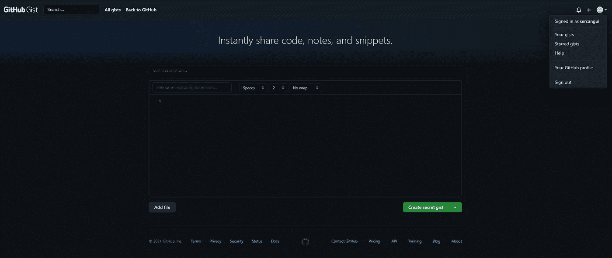
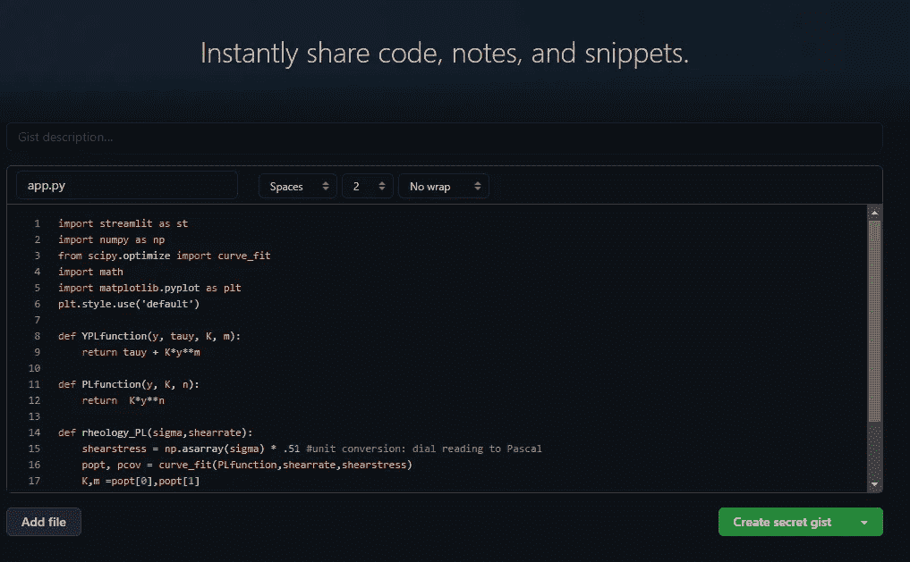
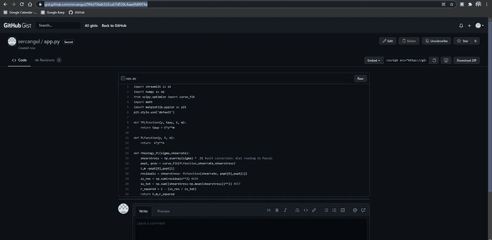

# 如何在带有 Gist 的媒体文章中嵌入代码

> 原文：<https://medium.com/nerd-for-tech/how-to-embed-code-in-medium-article-with-gist-f463726a1aff?source=collection_archive---------25----------------------->

学会丰富多彩地嵌入代码！

编程是媒体中最常阅读的内容之一。大多数生成的内容都提供了教程和操作方法文章。他们中的每一个人都在使用代码块。

在这篇文章中，我将使用 Gist 解释一种非常简单但有效且丰富多彩的方法来在中型文章中呈现代码。

第一步:去 github.com，用你的账户登录(如果你还没有，注册一个账户——这是免费的！).

**第二步**:前往 https://gist.github.com/

您应该会看到类似下面的屏幕。

**第三步**:在文件名框中输入文件名(及其扩展名，例如 app.py)，在下面较大的区域输入代码。

对于 Python 示例，您将看到您的代码已经用 Gist 着色。下面的例子:

**第四步**:根据你的喜好，点击“创建秘密要点”或“创建公开要点”(两者都适用于中等职位)。您的屏幕现在应该看起来类似于这个:

**第五步**:从你的要点页面的浏览器中复制并粘贴网址到你的中帖。图片中使用的示例代码在您的博文中将如下所示:

有几种其他方法可用于此目的。Gist 是我的最爱！

在 GitHub 上关注我:[https://github.com/sercangul](https://github.com/sercangul)

**关注我，了解更多关于 Python、统计学和机器学习的信息！**