# 如何在邮件中嵌入 HTML 而不被你的邮件客户端搞砸

> 原文：<https://medium.com/nerd-for-tech/how-to-embed-html-in-an-email-without-your-mail-client-screwing-it-up-e4cb1bef0e2f?source=collection_archive---------0----------------------->

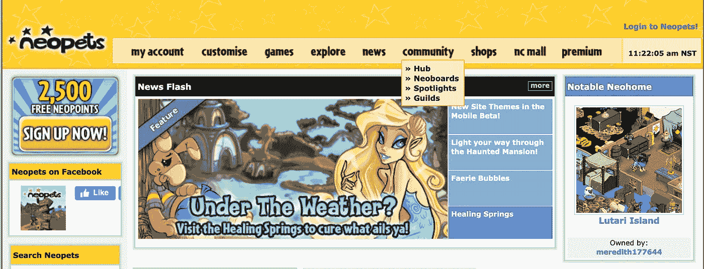

它仍然存在！(尼奥宠物网站截图摄于 2020 年 10 月 27 日)

## 作者是一个通过 Neopets 和 MySpace 学习如何编写 HTML 的人

*剧透警告:不要依赖样式表，即使它是你的 HTML 主体的一部分*

我远不是一个网站开发人员，也不是一个擅长建立网站的人。我可以弄乱模板并找出一些东西，但是任何超越 HTML 和 CSS 的东西都超出了我的能力。

最近，在工作中，我开始运行两个不同的简讯，我想直接嵌入到电子邮件中。

## 为什么不直接使用时事通讯服务或者把它作为 PDF 文件附在上面呢？

那就太简单了😅

不，这是因为我希望电子邮件直接来自我，而不是我的读者不熟悉的外部发件人。我也觉得人们不想多花一步去打开一个 PDF。

显然，我也有点受虐狂。

## 编写你的时事通讯代码

所有这些的第一步是为你的时事通讯准备 HTML！我们公司使用[钎焊](https://www.braze.com/)进行营销活动，所以我从那里拿了一个 HTML 模板，然后编辑成我喜欢的样子。

如果你比我聪明，你可以从头开始！

我在代码编辑器中测试了所有这些，并通过打开。我的浏览器中的 html 文件。

## 将 HTML 直接放入电子邮件中

如果不是因为我的同事詹妮弗，她和我一起做办公室时事通讯，我根本不会想到要这么做。

一旦你得到了你喜欢的时事通讯，打开一个新的电子邮件。

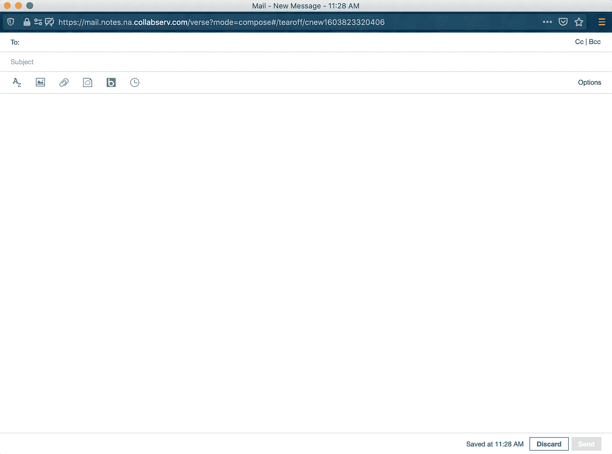

我们在 IBM 使用一个叫做 Verse 的内部电子邮件系统，所以这就是为什么我要分享这个令人愉快的解决方法。

接下来，我用鼠标右键单击浏览器来检查元素。

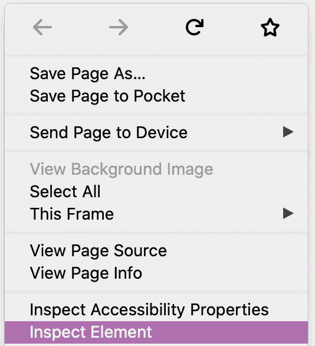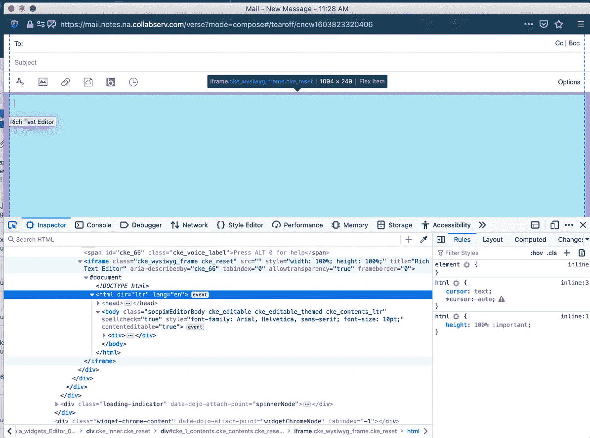

我将鼠标悬停在您可以开始输入电子邮件内容的地方。看哪里写着 *<！DOCTYPE html>？您可以将 HTML 粘贴到它开始的 *< html >* 文本的正下方。*

为此，右键单击所需的行，然后选择“编辑为 HTML”

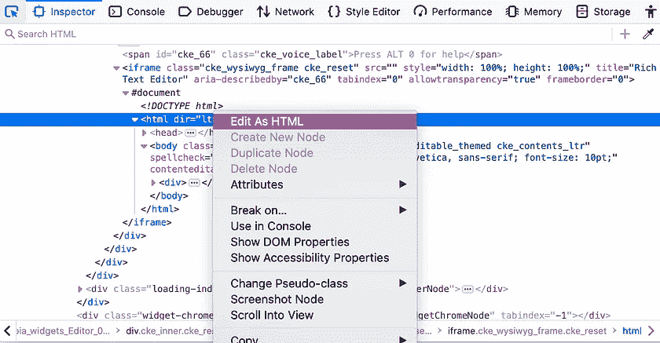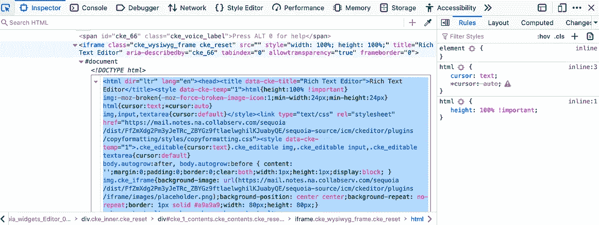

粘贴您的 HTML 代码，然后在编辑器区域之外单击。

瞧啊。你的邮件里有 HTML。

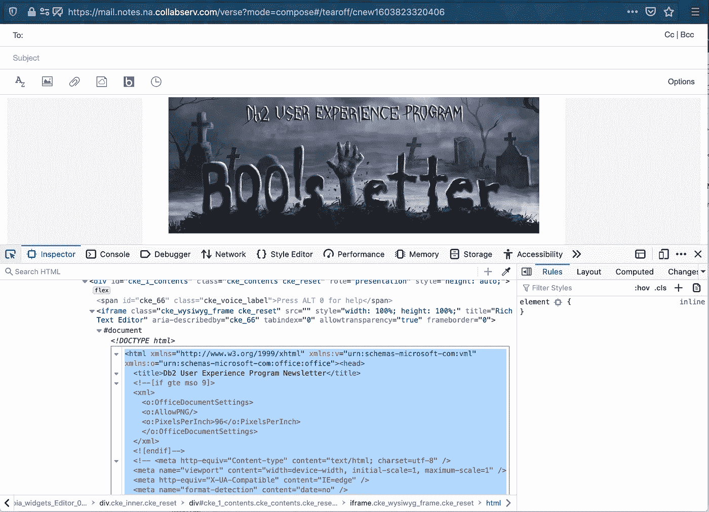

如果你已经在邮件正文中完成了所有的设计，你应该没有问题！

唉，我想入非非，遇到了一个问题，我将与你分享。

## 发现关键问题

最近一次我这样做的时候，它不像以前那样对我有效。

我的电子邮件里有所有这些漂亮的书面内容，但是当我发送我的测试电子邮件时，最终经历的是一大堆图像。

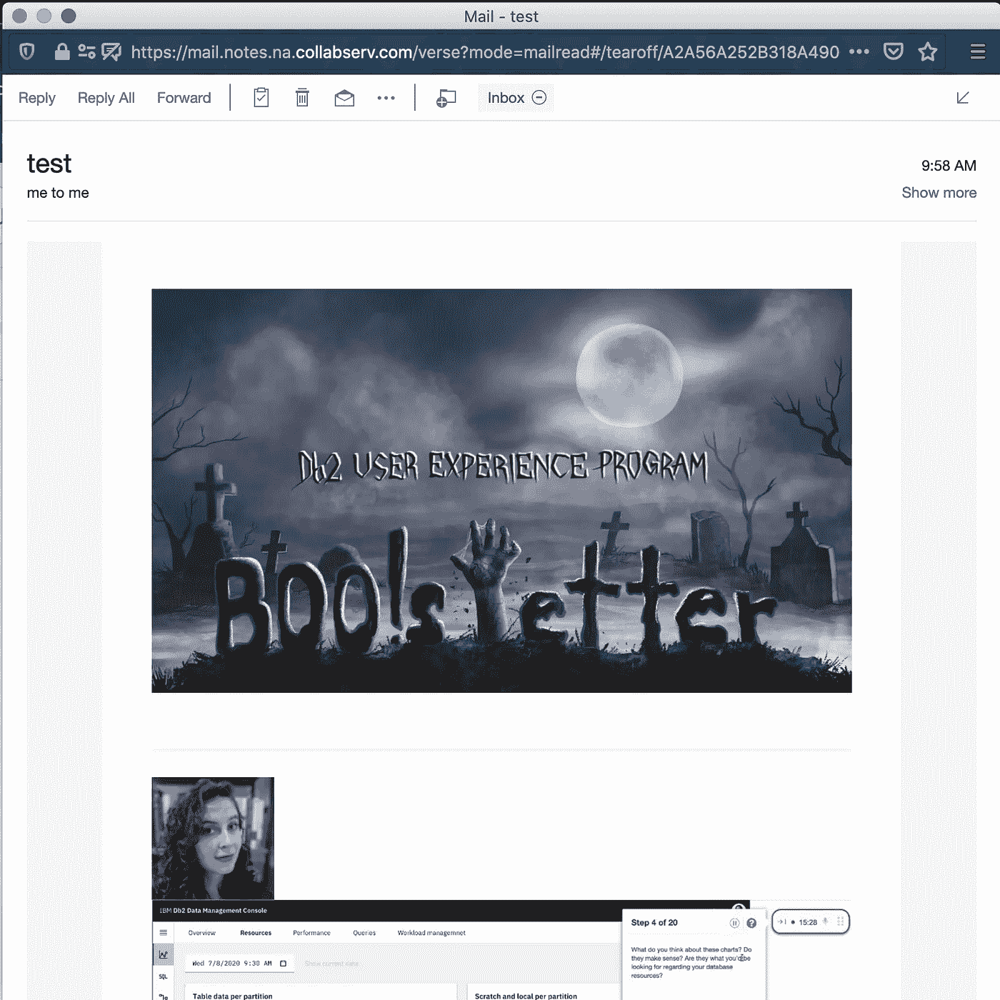

视觉上不吸引人或者不值得一读。

> 提示:总是发送一封测试邮件！当你处理代码时，最小的变化都可能是灾难性的。

这个方法对我来说已经奏效很多次了。我不明白哪里出了问题。

我试着看看是不是在 *<头>* 代码中的什么东西或者是与*文档类型*有关的什么东西。我当时没有意识到，但是我已经接近问题了。

我从我的电子邮件客户端复制了 HTML 代码，以便与代码进行比较。当然，它们非常不同，有不同的样式表。

## 排除故障

我想通了。

作为一名设计师，我想优化我的代码，这样我就可以在 CSS 中改变填充和间距，而不必手动逐行进行。

在我的电子邮件模板中，所有的样式都被定义为 HTML 标签中的独立元素。

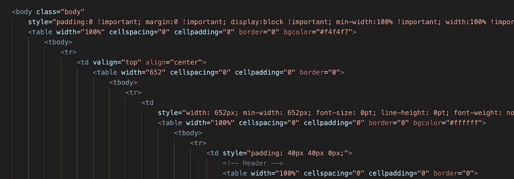

应用于每一行代码的 CSS 样式

我花了一个星期五下午重写代码，这样我就可以调用一个类，样式就会自动应用。

如果你在发邮件，不要这样做！(至少以我写电子邮件的方式)

## 围绕我的电子邮件客户端工作

在我的将 HTML 放入电子邮件的演练示例中，我检查了元素，并将整个 HTML 文本放入电子邮件中。

我意识到我的电子邮件客户端 ***覆盖了我的< head >定义，因此删除了我的 CSS。***

我试着变得更聪明，优化我的代码，但是它对我的邮件客户端不起作用。

> 经验教训:不要依赖头部 CSS 样式。让你的风格出现在你的 HTML 代码中。

如果你使用电子邮件模板，不要弄乱样式。如果你是从零开始，不要在顶部定义 CSS 类。单独做。

因为我已经完成了所有的工作，而且对 GitHub 不够了解，无法恢复我的更改，所以我做了一点变通，用我得到模板的地方(Braze)给自己发了一封测试邮件。它又一次优化了我的代码。

## 优化电子邮件

现在我知道我的电子邮件的网络客户端将会覆盖我的 CSS，我意识到没有必要插入整个 HTML 文件。事实上，那只会让我头疼。

相反，我应该直接去看 *<正文>* 的邮件。

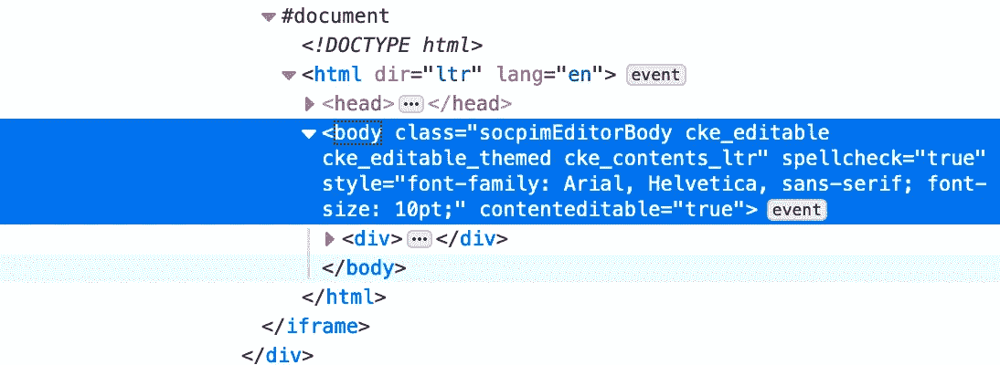

我注意到我的电子邮件客户端的一个便利之处。它有一个名为 where 的标签，使您能够编辑内容( *contenteditable="true"* )。

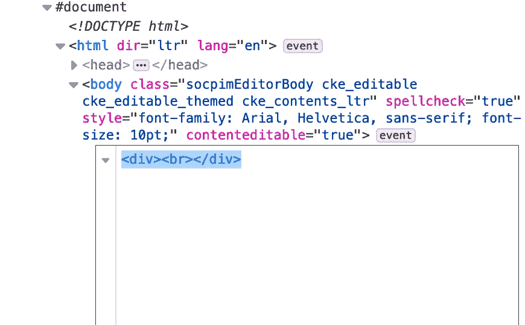

所以我把的定义放在一边，然后按照我上面提到的步骤，把我的时事通讯模板代码中正文下面的所有内容粘贴到邮件中。

我发出了我的测试邮件，万岁，问题解决了！

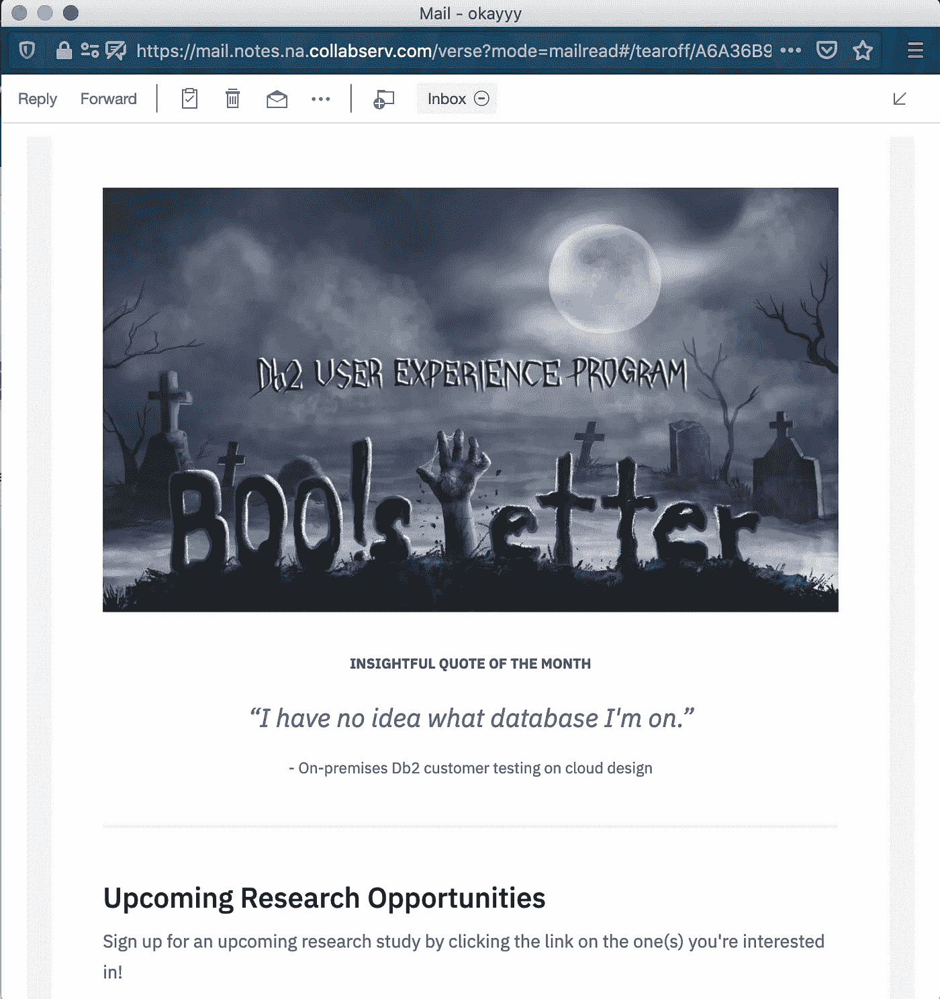

我的内容回来了！

我确实遇到了一些需要手动解决的间距问题，但总的来说我的问题已经解决了。

## 规划未来

我想继续发送这份简讯。我希望我已经尽可能地解决了问题。对我来说，戴一顶和平时不同的帽子是一个有趣的挑战。

这只是我想出的方法。我肯定这绝不是最好的。

希望这能帮助像我一样想从自己的电子邮件地址发送自定义电子邮件的人！

[*瑞秋*](https://www.linkedin.com/in/rachelmiles/) *是 IBM 云数据和人工智能业务部门混合数据管理产品组合中 Db2 产品套件的用户体验研究员。*

*以上文章是个人观点，不代表 IBM 的立场、策略或观点。*