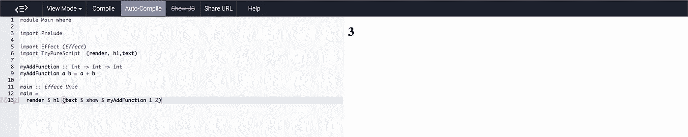

# 在 TryPurescript 在线编辑器中试验 Puresript 代码

> 原文：<https://medium.com/nerd-for-tech/how-to-experiment-with-purescript-code-in-trypurescript-online-editor-4a074659b2aa?source=collection_archive---------8----------------------->

这是一篇关于如何使用 https://try.purescript.org/的 T2 快速测试你在 purescript 中学到的概念的短文。


由 [Diana Polekhina](https://unsplash.com/@diana_pole?utm_source=unsplash&utm_medium=referral&utm_content=creditCopyText) 在 [Unsplash](https://unsplash.com/s/photos/experiment?utm_source=unsplash&utm_medium=referral&utm_content=creditCopyText) 上拍摄

我是一个尝试将我学到的任何新东西尽快付诸实践的人，在线 IDEs &编译器在编程方面给了我很大帮助。

当我学习 Purescript 时，我想在一个在线 IDE 中试验这些概念，这时我发现了 Purescript 的官方在线代码编辑器，[试试 Purescript](https://try.purescript.org/) 。

尽管它是一个非常好的平台，并且捆绑了许多模块，但我遇到的许多人并没有使用它，当我问及原因时，他们告诉我他们不知道如何使用它来试验他们的代码。

这很有意义，因为许多人习惯于[控制台记录](https://pursuit.purescript.org/packages/purescript-console/6.0.0/docs/Effect.Class.Console#v:log)或[窥探](https://pursuit.purescript.org/packages/purescript-debug/6.0.2/docs/Debug#v:spy)他们的输出。但是用 Purescript 代码编辑器是不可能的，因为它只能显示 HTML。

我将告诉你一个快速的方法或技巧，让代码编辑器像控制台一样工作。

## 1.转到[https://try.purescript.org/](https://try.purescript.org/)

## 2.去掉多余的东西，

到了在线编辑器，整个编辑器充斥着大量代码。

```
module Main whereimport Prelude.......main :: Effect Unit
main =
  render $ fold
    [ h1 (text "Try PureScript!")
    , ...
    , ...
    ]
   where 
     .... 
```

**去掉所有东西**，只保留最少的导入和主要功能

```
module Main whereimport Preludeimport Effect (Effect)
import TryPureScript  (render, h1, text)main :: Effect Unit
main =
  render $ h1 (text "Try PureScript!") 
```

## 3.创建一个函数，并将您的实验代码放入其中。

```
myAddFunction :: Int -> Int -> Int 
myAddFunction a b = a + b
```

## 4.从 main 调用该函数

```
main :: Effect Unit
main =
  render $ h1 (text $ **show** $ **myAddFunction 1 2**)
```

你好。！



使用**try.purescript.org**作为控制台

> 注意:在 main 中调用函数之前，一定要确保使用`show`,因为`text`函数需要一个字符串

尽管上面的步骤很小很傻，我还是写了它，希望它能帮助新加入漂亮的 purescript 社区的开发者。

祝你愉快😇，如果您有任何不熟悉 purescript 的朋友，请通过分享这篇文章来帮助他们。