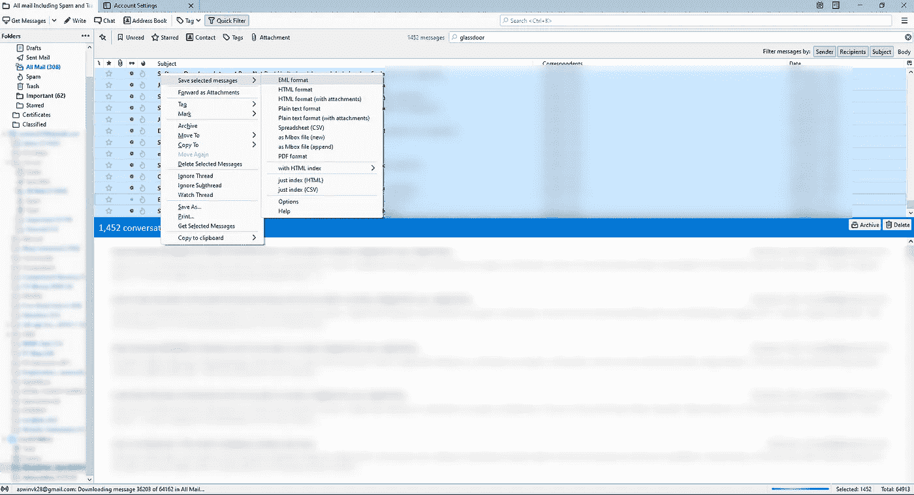
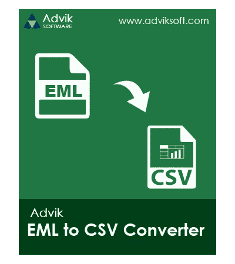
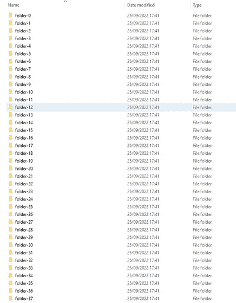

# 如何出口。eml 文件到。csv 文件

> 原文：<https://medium.com/nerd-for-tech/how-to-export-eml-files-to-csv-files-565e20916ca6?source=collection_archive---------0----------------------->

***将您的电子邮件导出为 CSV 文件***

## 1.邮件帐户

例如，你从 GMail 账户发来的邮件可以转换成 mbox 文件格式。mbox 是 outlook 和 yahoo 支持的文件格式。

## 2.Mozilla 雷鸟

您的 mbox 文件格式可以加载到 Mozilla thunderbird 中。这使您能够根据关键字搜索电子邮件。

## 3.mbox 到 EML 文件

*将雷鸟格式的 mbox 导入邮件导出为 EML 格式*

## 4.下载免费试用的广告 EML CSV 导出

下载 Advik EML CSV 转换器(免费！)

## 5.将文件夹分成 10 个文件夹。每个 eml 文件

分成 m 个文件夹，每个文件夹 10 个。eml 文件

*感谢您的阅读！查看这篇文章的评论，获取将大量文件批量转换为每个 10 个文件夹的链接。*