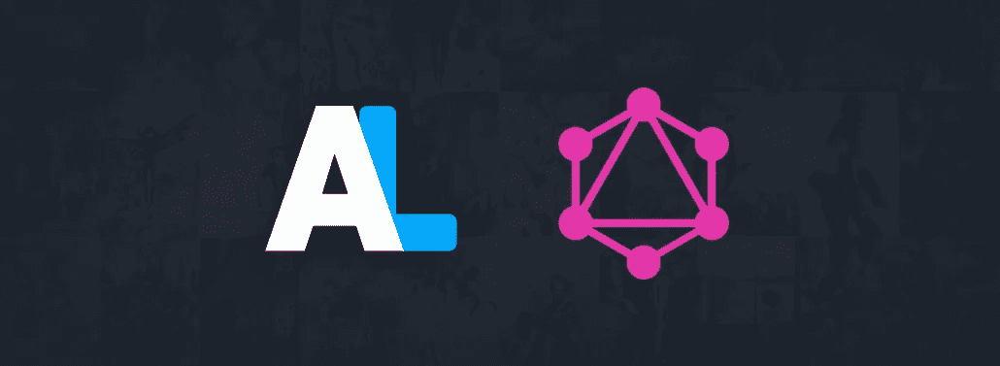

# 如何使用 Axios 从 Anilist API (GraphQL)获取数据

> 原文：<https://medium.com/nerd-for-tech/how-to-fetch-data-from-the-anilist-api-graphql-using-axios-77527efc8a89?source=collection_archive---------7----------------------->



Anilist GraphQL API

现在我不会过多地谈论 graph QL[](https://graphql.org/)***到底是什么*，但是你应该知道的是，它是一种面向你的 API 的查询语言，与好的 ol RESTful API 有着本质的不同。在 GQL 中，我们向 API 发出一个 **post 请求**，而不是向不同的端点发出不同的请求。**

**为了获取不同的数据，我们可以向 API 的单个端点发出 post 请求，指定我们在传入的查询中需要什么数据。**

```
https://graphql.anilist.co
```

**由于这将是一个非常简单的教程，我将只从 API 中获取少量数据，但是如果你想在你的项目中增加数据，你可以增加数据。**

**让我们首先安装 **axios** 并在我们的代码中实例化它。**

```
const axios = require("axios");
```

**现在让我们开始构建我们的查询，在这里我们指定**我们想要什么**和**多少**数据。**

**现在我们来分解一下。`query`是我们查询的开始，在这里我们必须初始化我们想要使用的变量。默认情况下，API 返回单个结果对象，所以如果我们想要多个结果，我们必须将我们的`media`查询包装在一个`Page`查询中。页面查询还提供了`pageInfo`字段，该字段提供了关于当前页面和总结果计数的信息。**

**`media`查询是奇迹发生的地方。在这里，我们只需传入在`parent query`中传递的变量，就可以得到由搜索字符串过滤的相应结果。在我的例子中，我只是根据用户评级和搜索查询(在撰写本文时)获取前 3 名动画的 id、标题、类型和流派，但是您可以获取不同类型的数据并应用多种类型的排序。这就是 GraphQL 提供的灵活性，它使得 API 调用变得更加容易。你可以在这里查看 Anilist GraphQL 参考指南**

**我们现在可以在一个单独的`variables`对象中传递我们在查询中初始化的变量值。在这里，我只是得到了只有 3 个项目的结果单页。**

**我们代码的主要部分已经完成。现在，我们可以将所有这些代码块与异步函数中的 axios api 调用结合起来，这样就完成了。**

**如果我搜索“shingeki ”,结果数据会是这样的。**

**那是…差不多了。现在你知道如何用几行代码获得你最喜欢的动漫的数据了。我在自己的项目中也用这个: [AniKo](https://ani-ko.netlify.app) 。
如果你喜欢这个教程，你可以鼓掌并分享这个帖子，甚至[请我喝杯咖啡！](https://www.buymeacoffee.com/synxc)赞赏；)**