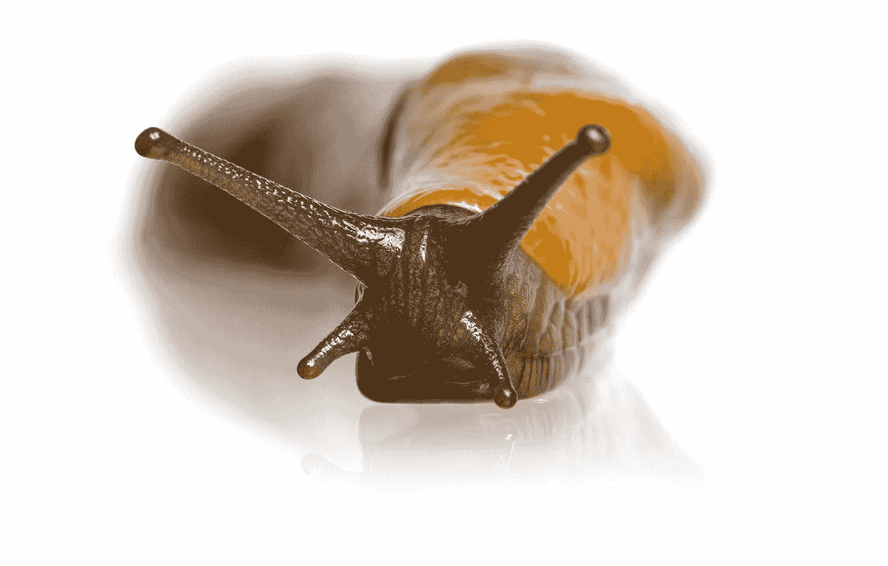

# 如何在《盖茨比》中生成鼻涕虫？射流研究…

> 原文：<https://medium.com/nerd-for-tech/how-to-generate-a-slug-in-gatsby-js-4c3e0ed4dc20?source=collection_archive---------7----------------------->

蛞蝓图片——海湾自然

你没看错标题！在本文中，我们将讨论 slug，以及如何使用 Gatsby.js 为博客组件中的帖子生成 slug。

## 什么是鼻涕虫？

根据编程定义， **Slug** 是一个网址的唯一标识符，通常出现在 URL 的末尾。当在父文档下创建新文档时，它也可能是最终组件；对于…