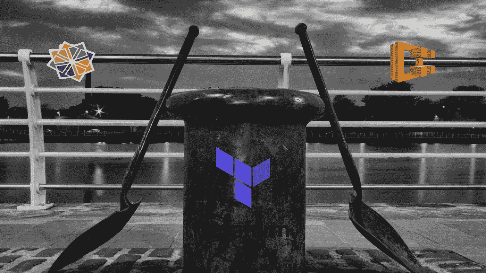
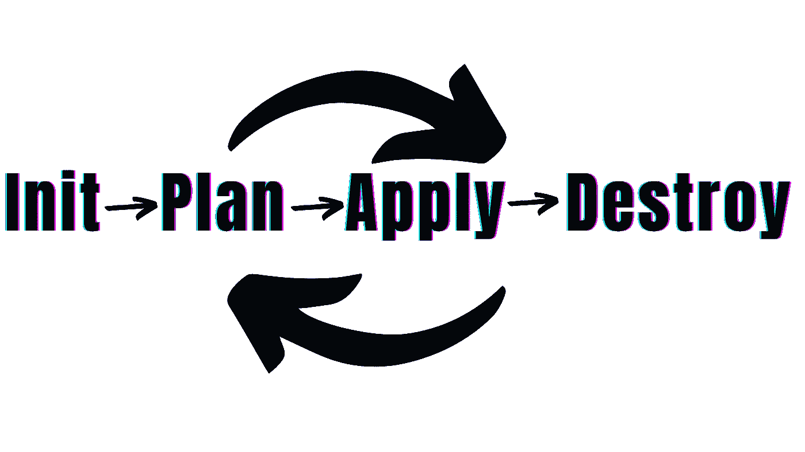
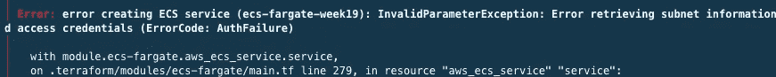
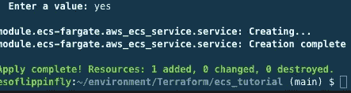
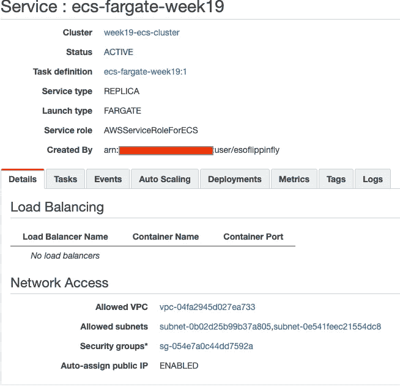
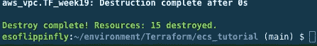

# 如何使用 Docker Image 和 Terraform 生成 Amazon ECS 集群

> 原文：<https://medium.com/nerd-for-tech/how-to-generate-an-amazon-ecs-cluster-using-docker-image-with-terraform-23396b7fc4f7?source=collection_archive---------2----------------------->

简要介绍如何从 Docker 注册表中提取 CentOS 映像，并使用 Docker 映像和 Terraform 创建 ECS 集群。

**目标:**使用 CentOS 映像部署 Docker 容器。

**先决条件:** Terraform & Docker 安装，AWS 账号，AWS CLI，Cloud9。

**资源**:演练所需的一切都可以在[这里](https://www.terraform.io/docs)找到。偶尔，当我遇到错误时，我会在[堆栈溢出](https://stackoverflow.com/)中结束。一定要将 Stack Overflow 加入书签，因为它将是你在谷歌之外的最好的朋友之一。

*现在来说说好东西……*

首先，创建目录和。tf 文件。我创建了一个新目录，在这个目录中，你将拥有这个项目的所有地形文件。使用`mkdir`创建目录，并使用`cd`导航至目录。然后我创建了我所有的文件`main.tf, variables.tf, vpc.tf, subnets.tf, keys.tvars`。然后，我使用`touch`命令，将 Docker 和 AWS 作为提供者，并将 AWS ECS 集群资源和 Fargate 模块添加到`main.tf`文件中。

`variables.tf`文件由 VPC、访问密钥和秘密访问密钥组成。`vpc.tf`由 VPC 标签名组成。这同样适用于`subnet.tf`,除了它是子网的标记名、VPC 名称，以及附加的可用性区域等。最后,`keys.tvars`持有*秘方，*你永远不会分享这些信息，那就是访问密钥和秘密密钥。

接下来，我用`terraform init`初始化 Terraform。然后我使用了`terraform plan`来检查 Terraform 将用来修改基础设施的动作的预览，最后我使用了`terraform fmt and terraform validate`，它用于重写 Terraform 配置文件并验证目录中的配置文件。

在我的第一次尝试中，我遇到了一个错误，并立即转换到调查模式，使用了本文开头提到的资源。

根据我的研究，在授权过程中出现了问题，但是一旦问题得到纠正，我会再次重新执行`terraform plan, fmt, and validate`。一旦我确认配置是正确的，我就使用`Terraform apply` **。**此使用相关基础设施提供商的 API 对每个资源执行计划的更改，并通过让您键入`yes`进行确认来进行验证。要`terraform apply`改变而不必键入‘是’，你可以试试`terraform apply -auto-approve`。我还没有尝试过，但在自动化领域会很有用。

然后，我检查以确保所有资源在我的 AWS 控制台上都正常工作。

没有什么比成功的甜蜜味道更好的了！

最后，我用`terraform destroy`结束所有资源。对于使用该命令的其他方式，`destroy`点击[此处](https://www.terraform.io/cli/commands/destroy)。

感谢您的阅读！！