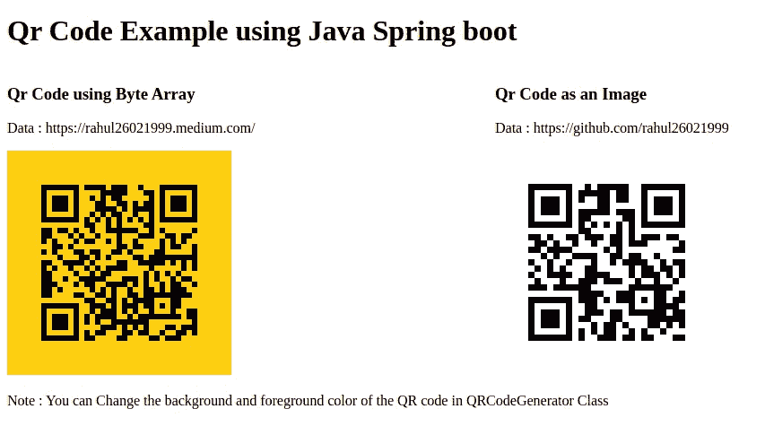

# 如何在 Java Spring Boot 中生成二维码

> 原文：<https://medium.com/nerd-for-tech/how-to-generate-qr-code-in-java-spring-boot-134adb81f10d?source=collection_archive---------0----------------------->

众所周知，二维码正成为全球最受认可的 2D 条形码。二维码的最大好处是我们可以在有限的空间里存储大量数据。

在本文中，我们将学习如何使用 Java Spring boot 生成 QR 码。



[http://localhost:8080](http://localhost:8080)

# 创建一个 Java spring Boot 项目，并在 pom.xml 中添加 spring web starter 依赖项

1.  Spring Boot web starter
2.  是一个基于 Java 的库，用于创建一个 web 应用程序。它为在 web 应用程序中提供 XHTML/HTML5 提供了很好的支持。

```
<dependency>
    <groupId>org.springframework.boot</groupId>
    <artifactId>spring-boot-starter-web</artifactId>
</dependency><dependency>
    <groupId>org.springframework.boot</groupId>
    <artifactId>spring-boot-starter-thymeleaf</artifactId>
</dependency>
```

# **添加 ZXing 库生成 pom.xml 中的二维码**

我们使用 ZXing 库来生成二维码，所以需要在如下所示的 **pom.xml** 文件中再添加两个依赖项。

1.  **核心映像依赖关系**

```
<dependency>
    <groupId>com.google.zxing</groupId>
    <artifactId>core</artifactId>
    <version>3.4.0</version>
</dependency>
```

**2。Java 客户端依赖性。**

```
<dependency>
    <groupId>com.google.zxing</groupId>
    <artifactId>javase</artifactId>
    <version>3.4.0</version>
</dependency>
```

至此，您的 pom.xml 文件应该如下所示:

# 为**二维码生成器名称 QRCodeGenerator.java**创建一个类

在 QRCodeGenerator 类中添加两个静态函数。

1.  **生成二维码图像**
    该功能用于生成图像形式的二维码，并将图像保存在指定路径。
2.  **生成二维码 ByteArray**
    该函数将以字节数组的形式生成二维码。

我们可以通过提及 MatrixToImageConfig 对象中的颜色来更改 QR 码的颜色。

```
MatrixToImageConfig con = new MatrixToImageConfig( foregroundColor , backgroundColor) ;
```

# 创建一个名为 MainController.java 的控制器类

在这个类中，我们将用 get mapping(“/”)创建一个方法“**get QR code”**。该方法将调用我们在 QRCodeGenerator 类中创建的函数来获取 QR 码的图像或字节数组。

我们已经返回了一个名为 qrcode.html 的文件名，它将显示二维码。该 qrcode.html 位于 resources/templates/QR code . html 中

# 运行应用程序

1.  进入浏览器点击:[*http://localhost:8080*](http://localhost:8080)
2.  进入“*src/main/resources/static/img/*”文件夹查看二维码图片。

# 完整参考 Github 知识库

[https://github.com/rahul26021999/QrCode-JavaSpringBoot](https://github.com/rahul26021999/QrCode-JavaSpringBoot)