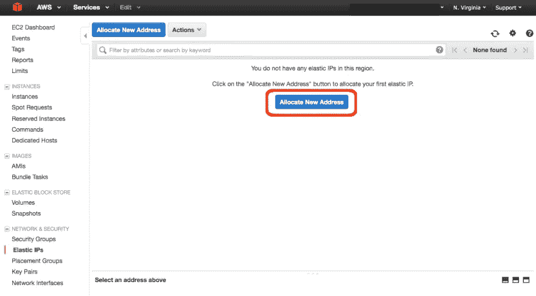
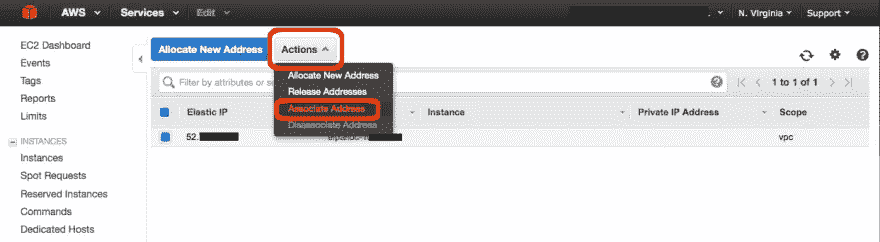
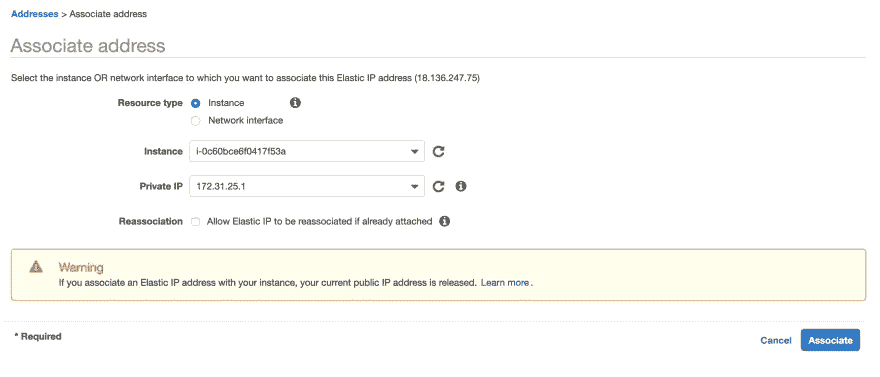
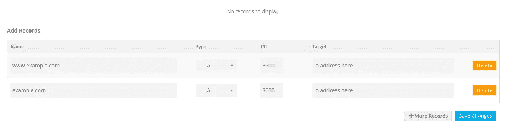

# 如何获得 AWS 虚拟主机的免费域名

> 原文：<https://medium.com/nerd-for-tech/how-to-get-a-free-domain-name-for-aws-web-hosting-512471e24af3?source=collection_archive---------5----------------------->

在这里，我们将学习如何为 AWS EC2 实例设置自由域名。考虑到您已经在 AWS 上创建了一个 EC2 实例。
并且您已经配置了 EC2 实例来处理来自世界各地的 HTTPS 或 HTTP 请求。**如果不是，请参考给定的链接。**

1.  [如何在 AWS EC2 中创建 Ubuntu 20.04 LTS 服务器。](/@rahul26021999/how-to-create-a-ubuntu-20-04-server-on-aws-ec2-elastic-cloud-computing-5b423b5bf635)
2.  [如何在 EC2 AWS 上部署 Laravel 项目](/@rahul26021999/how-to-deploy-laravel-project-on-ec2-aws-6d004a57bb1f)。(创建 Apache 服务器、MySQL 服务器和部署 Laravel 项目的完整参考)

# 为您的 EC2 实例分配一个弹性 IP 地址

您可以使用域名系统的 EC2 实例公共 IP 地址，但是如果您重新启动、停止、启动 EC2 实例，EC2 IP 地址将会更改，您必须在域名系统中也进行更改，这就是为什么您应该使用弹性 IP 将 EC2 映射到域名系统。

1.  转到 AWS 服务中的 EC2 实例>网络和安全>弹性 IP。
2.  点击分配新地址
3.  AWS 只为 AWS 免费层提供一个免费的弹性 IP。

4.选择上面创建的弹性 IP 地址，并将该 IP 与 AWS EC2 实例相关联。

5.现在，您可以在您的域名系统中使用这个公共弹性 IP 地址。

# 获得一个免费域名

1.  可以从 F [reenom](https://www.freenom.com/en/index.html?lang=en) 获得一个免费域名。它提供了。ml，。tk，。cf 等免费。
2.  转到“管理 DNS”部分，添加两个“A”记录，以使用 EC2 的公共 IP 地址映射域。

3.用 EC2 映射您的域可能需要 10-30 分钟。