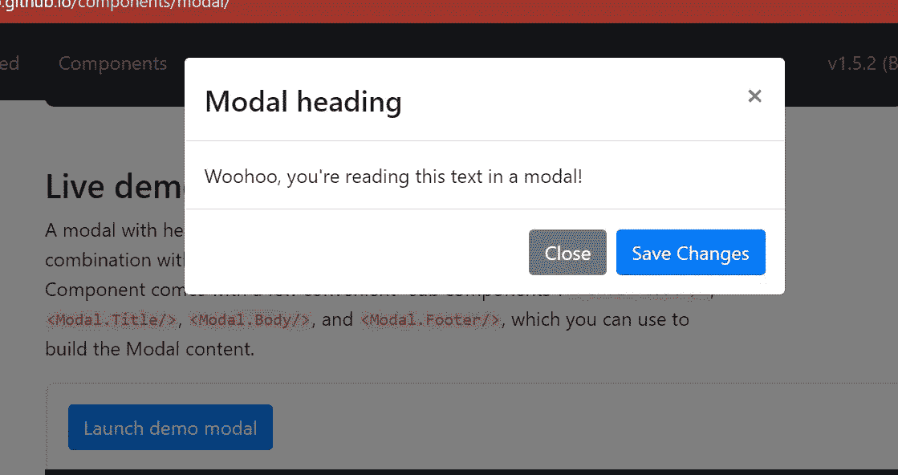
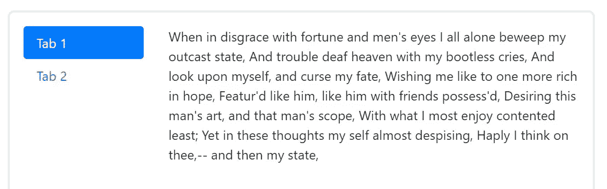

# 如何在父组件中使用您选择的按钮打开和关闭 React 引导模式

> 原文：<https://medium.com/nerd-for-tech/how-to-get-a-react-bootstrap-modal-to-open-and-close-using-a-button-of-your-choice-in-a-p-cde3ef6c0d4c?source=collection_archive---------0----------------------->

上周我和一些朋友在一个网站上工作。我们使用 React-Bootstrap 作为开箱即用 UI 组件的解决方案。我们都喜欢在弹出菜单中使用模态的想法，并且我们希望使用侧标签来导航。按照 React-Bootstrap 模式组件的编写方式，打开模式的按钮包含在组件本身中。如果您试图找出如何放置组件，这会使事情变得混乱。如果你熟悉 React-Bootstrap，而你只是在匆忙地寻找解决方案，请跳到停车标志的图片，看看我对这个问题的解决方案。如果你想进一步了解这个问题，请继续阅读。

迷茫？让我们打开这个！

## 如果您不了解 React-Bootstrap，请从这里开始

React-Bootstrap 是 React 组件的前端框架。如果您使用 React 并且还没有检查过 React-Bootstrap，那么有必要了解一下它。这很容易实现，你可以在[他们的网站](https://react-bootstrap.github.io/getting-started/introduction)上浏览。我从来没有遇到任何问题得到反应-引导工作与我的应用程序。

要安装 React-Bootstrap，请使用 npm:

```
npm install react-bootstrap bootstrap
```

[从他们的网站](https://react-bootstrap.github.io/components/alerts/)选择你想要使用的组件，然后在你的代码中，导入你打算单独使用的每个组件。在模态的情况下:

```
import Modal from 'react-bootstrap/Modal'
```

或者

```
import { Modal } from 'react-bootstrap';
```

在每个组件的文档中，您将看到组件的示例实现代码。这些工具接受导入库，并构建了许多功能供您使用。我认为这是 React-Bootstrap 如此流行和强大的原因。选择与您想要的组件功能最接近的代码，并将其用作组件实现的起点。出于本文的目的，让我们使用*现场演示模式的代码:*



如图，现场演示模型。“启动演示模态”按钮，也是代码的一部分，打开它

```
import Modal from 'react-bootstrap/Modal'function Example() {
  const [show, setShow] = useState(false);
  const handleClose = () => setShow(false);
  const handleShow = () => setShow(true);return (
    <>
      <Button variant="primary" onClick={handleShow}>
        Launch demo modal
      </Button><Modal show={show} onHide={handleClose}>
        <Modal.Header closeButton>
          <Modal.Title>Modal heading</Modal.Title>
        </Modal.Header>
        <Modal.Body>Woohoo, you're reading this text in a modal!</Modal.Body>
        <Modal.Footer>
          <Button variant="secondary" onClick={handleClose}>
            Close
          </Button>
          <Button variant="primary" onClick={handleClose}>
            Save Changes
          </Button>
        </Modal.Footer>
      </Modal>
    </>
  );
}render(<Example />);
```

…现在我们有了一个组件`Example`，它从 React Bootstrap 导入模态功能，并包含 React-Bootstrap 网站上提供的该组件的示例代码。打开模态的代码是`return`之后的 3 行代码:

```
<Button variant="primary" onClick={handleShow}>
        Launch demo modal
      </Button>
```

…这将在我们应用程序中放置`Example`的地方放置一个按钮，当我们单击它时，我们通过 setState 钩子将模态状态中的`show`设置为 true。示例代码中有几个关闭模态的按钮，它们都有将`show`设置回 false 的`onClick={handleClose}`。这些行为在模式标签中设置:

```
<Modal show={show} onHide={handleClose}>
```

这很好，但是它是独立的。按钮是模态代码的一部分。如果我们想从 React-Bootstrap 的`Tab`组件中打开模态，该怎么办？

## 选项卡组件



我们在下面的代码中使用的选项卡类型

```
<Tab.Container id="left-tabs-example" defaultActiveKey="first">
  <Row>
    <Col sm={3}>
      <Nav variant="pills" className="flex-column">
        <Nav.Item>
          <Nav.Link eventKey="first">Tab 1</Nav.Link>
        </Nav.Item>
        <Nav.Item>
          <Nav.Link eventKey="second">Tab 2</Nav.Link>
        </Nav.Item>
      </Nav>
    </Col>
    <Col sm={9}>
      <Tab.Content>
        <Tab.Pane eventKey="first">
          <Sonnet />
        </Tab.Pane>
        <Tab.Pane eventKey="second">
          <Sonnet />
        </Tab.Pane>
      </Tab.Content>
    </Col>
  </Row>
</Tab.Container>
```

就像上面的图片一样，代码设置了导航标签。`<Nav>`部分中的每个 `<NavItem>`对应代码`<Tab.Content>`部分中的一个`<Tab.Pane>`。这里的目标是放置我们的`<Example>`模态，这样我们就可以从标签页打开它。


好了，我们完成了背景介绍，下面是解决方案

## 下面是您需要知道的，以便通过单击选项卡打开模式

你所要做的就是让模型按照你想要的打开，移动`show`钩子，从模型`<Example>`到`Tab`。一旦`show`和处于`Tab`中，您就可以将它和它的 setState 钩子作为道具传递给 Modal。所以，在`Tab`中:

```
const [modalShow, setModalShow] = useState(false);
```

在`Nav`部分:

```
<Nav.Link
  className="tab__link"
  eventKey="modal"
  onClick={() => setModalShow(true)}>

  Show the Modal!</Nav.Link>
```

并在其对应的`Tab`:

```
<Tab.Pane eventKey="second"><Example
modalShow={modalShow}
setModalShow={setModalShow}/></Tab.Pane>
```

注意，我们直接使用`setModalShow`并删除了功能`handleClose`和`handleOpen`。

在`Example`模态中，我们需要做一些修改。第一个变化:

```
<Modal show={show} onHide={handleClose}>
```

收件人:

```
<Modal show={props.moadalShow}>
```

并将两个`onClick={handleClose}`都换成`onClick={props.setModalShow(false)}`。删除开启按钮的代码，同时删除功能`handleOpen`和`handleClose`，一切就绪。

现在，当用户单击标记为`Show the Modal!`的选项卡时，他们将打开模态，当他们单击组件上的 x 或 close 按钮时，模态将关闭。很简单。

React-Bootstrap 是许多免费定制框架中的一个，可以用来满足我们的前端开发需求。这种将数据移动到更高的组件并将其传递给它所控制的组件的策略非常方便，并且和 React-Bootstrap 框架一样值得熟悉。有一个可怕的一周和快乐的编码！