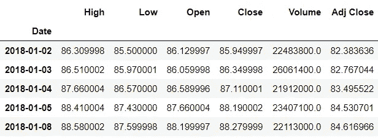
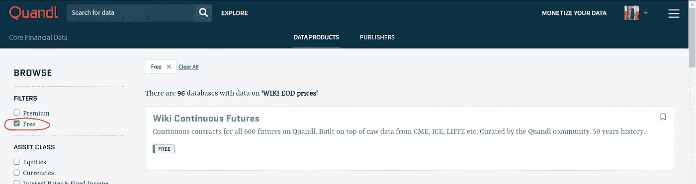
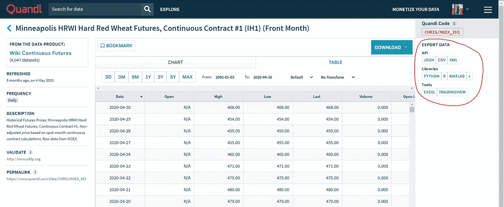
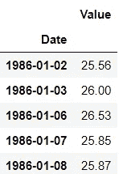
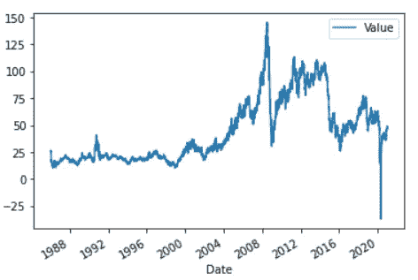
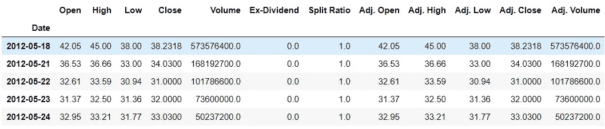
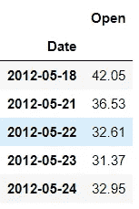

# 如何用 Python 获取财务数据？

> 原文：<https://medium.com/nerd-for-tech/how-to-get-financial-data-using-python-7a508f25fc39?source=collection_archive---------1----------------------->

理解如何获取数据以使用 Python 进行金融分析的指南。


杰森·布里斯科在 [Unsplash](https://unsplash.com/s/photos/finance?utm_source=unsplash&utm_medium=referral&utm_content=creditCopyText) 上的照片

当您计划将 Python 用于金融时，需要一种特定形式的数据。这个数据应该关注财务价值。在本文中，我将介绍两种使用 Python 语言获取财务数据的方法。

# 1)方法 1: Pandas — datareader

我提到的第一种方法是使用 Pandas-datareader 获取数据。Pandas 是一个开源 Python 库，用于执行数据分析，并被用作操作工具。看看下面提到的这篇文章，详细了解熊猫。

[](/ai-in-plain-english/pandas-in-depth-for-data-science-60abbcb2206) [## 将熊猫用于数据科学的综合指南

### 一个详细的代码指南，用于理解和实际实现处理数据时的 Pandas。

medium.com](/ai-in-plain-english/pandas-in-depth-for-data-science-60abbcb2206) 

因此，子包 Pandas-datareader 帮助用户从可用的互联网资源创建数据帧。它允许人们连接到许多来源，如雅虎财经、世界银行、谷歌分析、圣路易斯联邦储备银行和肯尼斯·弗伦奇的数据库。连接后，您可以提取数据并将其作为 dataframe 读入。

现在让我们看看如何使用它！

## 安装 pandas-datareader

可以使用以下命令完成安装:

> pip 安装熊猫-datareader

## 导入包

pandas_datareader 包被导入以供使用。与之一起，日期时间库也被导入。这个库将帮助我们传递日期时间对象。

```
**>>> import** pandas_datareader.data **as** web
**>>> import** datetime
```

## 设置开始和结束日期

现在，我们将设置开始和结束日期，以便从该间隔中提取数据。

```
>>> start **=** datetime.datetime(2018,1,1)
>>> end **=** datetime.datetime(2020,1,1)
```

## 创建股票数据框架

现在我们将声明一个我们想要作为数据帧的变量。然后我们将调用“DataReader”方法。此方法接受值 name、data_source、start date 和 end date。

因此，在这里，我们将考虑微软的数据，名称将写为“MSFT”，来源将是雅虎，开始和结束日期如上所述。

```
>>> data **=** web.DataReader('MSFT','yahoo',start,end)
>>> data.head()
```



# 2)方法二:Quandl

第二种方法是从 Quandl 获取数据。Quandl 是一家公司，也是金融或经济数据集的来源。它提供了一个 Python API，可以自由使用，非常健壮，有助于从各种来源提取数据。

Quandl 规定使用付费的高级服务和免费的基本服务。要免费使用这些服务，请访问 Quandl 网站，点击“核心财务数据”选项。它是免费使用的，每个人都可以使用。在过滤器中，通过点击“免费”选项，您可以查看免费数据源。然后，您可以下载各种格式的数据，如 JSON、CSV 和 XML，也可以使用 Python、R、MATLAB 等不同的 API。我们将直接使用 Python API。



左侧显示免费选项的图片。(来源:作者)



图中显示了导出数据和数据集代码的方法。(来源:作者)

## 安装 Quandl

> *pip 安装 quandl*

## 导入必要的包

quandl 包被导入。

```
**>>> import** quandl
```

## 提取数据

可以使用“get”方法获得数据。此方法提取单个时间序列。还有另一个方法“get_table ”,它提取整个数据库。

Quandl 的数据库使用格式为:DATABASE_CODE/DATASET_CODE。quandl 代码可以在相应数据集的网站上找到。

我们将试着从美国国务院获取石油价格。

```
>>> data1 **=** quandl.get('EIA/PET_RWTC_D')
>>> data1.head()
```



## 绘制数据

```
**>>> import** matplotlib.pyplot **as** plt
**>>> %**matplotlib inline>>> data1.plot()
```



让我们看看其他数据，比如脸书。

```
>>> data2 **=** quandl.get('WIKI/FB')
>>> data2.head()
```



以防您不想要所有这些列。列号可以相应提及。

```
>>> data2 **=** quandl.get('WIKI/FB.1')
>>> data2.head()
```



> 查看熊猫的官方文档-datareader 和 Quandl。

 [## pandas-datareader-pandas-datareader 0 . 9 . 0 rc1+2 . g 427 f 658 文档

### 编辑描述

熊猫-datareader.readthedocs.io](https://pandas-datareader.readthedocs.io/en/latest/) [](https://www.quandl.com/) [## Quandl

### 我们将来自非传统出版商的未被发现的数据带给寻求独特、预测性见解的投资者。我们…

www.quandl.com](https://www.quandl.com/) 

> 此处代码[参见笔记本。](https://github.com/jayashree8/Finance_Trading_In_Python/blob/main/Financial%20sources%20of%20data/Financial_data_sources.ipynb)

> 联系我: [LinkedIn](https://www.linkedin.com/in/jayashree-domala8/)
> 
> 看看我的其他作品: [GitHub](https://github.com/jayashree8)