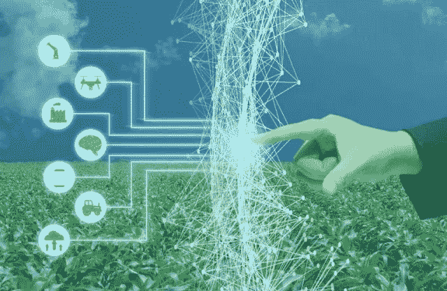
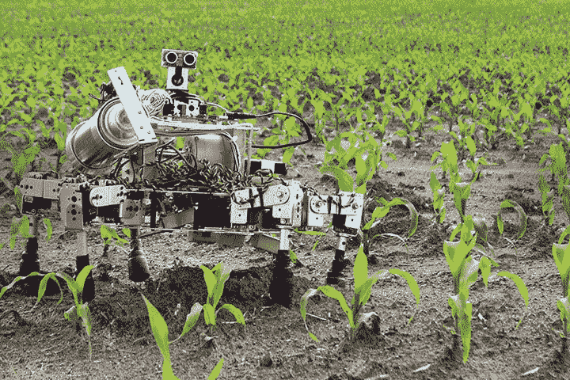
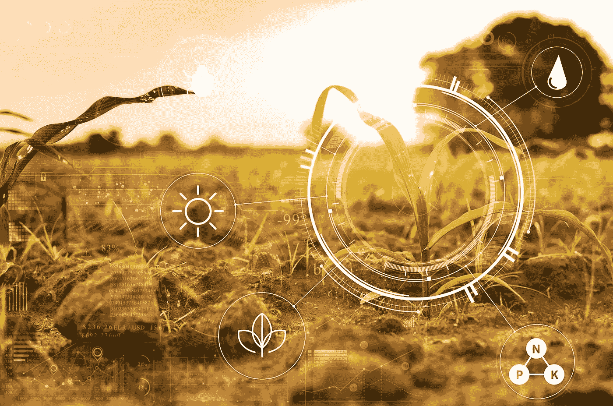

# 如何获得农业的机器学习训练数据集？

> 原文：<https://medium.com/nerd-for-tech/how-to-get-machine-learning-training-datasets-for-agriculture-6e98d090b414?source=collection_archive---------0----------------------->

为了获得农业中机器学习的训练数据，首先你需要决定你正在工作的人工智能模型的类型，或者你的项目需要哪种类型的**农业相关数据集**。事实上，可以为农业和农业部门开发多种类型的基于机器学习的模型，以提高生产力和作物产量。

**机器学习和人工智能的农业数据集**

基本上，大多数农业机器学习模型都是以机器人、无人机或其他自动化机器的形式开发的，这些机器可以通过计算机视觉技术监控作物。为了训练基于计算机视觉的视觉感知模型，您需要训练数据集来帮助这些机器检测或识别图像中的对象。

**获取农作物、水果、植物的注释图像&农田**

为了使图像中感兴趣的对象，如作物、水果、蔬菜、植物(想要的或不想要的)和农业领域中的对象能够被机器识别，应该使用正确的技术对其进行适当的注释。并且有多种类型的图像注释技术用于精确地注释图像，使得不同的农作物或植物能够以额外的精度被识别。

**农业**收获&监测的训练数据集

实际上，农业中的机器学习需要两种类型的训练数据集。 [**AI**](https://www.anolytics.ai/solutions/robotics/) [**可以检测作物或植物并进行自动化收割的机器人**](https://www.blogger.com/null) 的训练数据。类似地，无人驾驶飞机用于监测成熟作物的 Ariel 视图，以及土壤状况监测。用**边界框标注**标注的图像用于创建机器学习的训练数据集。

**用于田间测绘的农业培训数据&地理传感**

需要对农田进行监测，以检查是否可以播种，并检查土壤条件或湿度水平，以决定播种或种植的正确时间。同样，机器学习数据还包括使用无人机对农田进行 3D 测绘，以检查作物的成熟度，并精确确定收割时间，从而提高生产力和作物产量。

**农业中机器学习的训练数据如何获取？**

为了获得正确的农业训练数据集，你需要大量带注释的数据集。数据标注或图像标注是为农业和农业开发的机器学习模型创建此类数据集的最佳流程。Anolytics 是正确的公司，为农业中的 [**机器学习和深度学习**](https://www.anolytics.ai/solutions/agriculture/) **提供最优质的训练数据集。**

另请阅读:[如何提高精准农业人工智能中的计算机视觉](https://www.anolytics.ai/blog/how-to-improve-computer-vision-in-ai-for-precision-agriculture/)

它可以提供农业部门生产的所有类型的作物、水果、蔬菜和其他植物的注释图像。它擅长所有类型的图像注释技术，如**边界框、语义分割、多边形注释、3D 长方体注释**和折线注释，以使农业和其他各种领域的机器学习能够识别不同类型的对象。

参考文献。网址:[https://anolytics-ai . blogspot . com/2020/04/how-to-get-machine-learning-training . html](https://anolytics-ai.blogspot.com/2020/04/how-to-get-machine-learning-training.html)