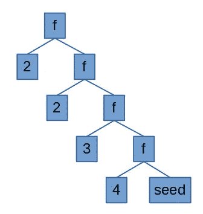

# 如何在 Elm 列表中获得唯一值

> 原文：<https://medium.com/nerd-for-tech/how-to-get-unique-values-in-an-elm-list-d91ec7dfd0e?source=collection_archive---------1----------------------->

你这样做:

```
unique : List a -> List a
unique l = 
    let
        incUnique : a -> List a -> List a
        incUnique elem lst = 
            case List.member elem lst of
                True -> lst
               False -> elem :: lst
    in
        List.foldr incUnique [] l
```

给你。玩得开心！

哦，还在这里？让我们看看这是怎么回事。

所以，你在 Elm 中有一个列表，你想得到其中唯一的值。也没有办法编写一个简单的命令式循环来遍历列表。列表。折叠救援。我们有两种折叠方式可以使用: *foldl* (向左折叠)和 *foldr* (折叠……你可以想出来)。左边和右边是指操作的结合性。

假设你有列表[2，2，3，4]。如果您折叠列表，这意味着您将检查列表中的两个项目，并应用一些功能，例如，使用+操作折叠此列表将得到:

```
( 2 + ( 2 + ( 3 + ( 4 ) ) ) )
```



顺便说一下，这是右结合律，所以我做了一个 foldr。看着图表，我们可以更清楚地看到发生了什么。在那里，我们的函数 *f* 是 *+* 操作，我们的种子是 *0* 。

文件夹将如下所示:

```
( ( ( ( 2 ) + 2 ) + 3 ) + 4 )
```

在 Elm 中，我们有 *List.foldl* 和 *List.foldr* 。除了要应用的函数和列表之外，我们还必须提供一个种子值来应用于列表的第一个元素，例如，如果我们的种子是 0，我们将有一个如下所示的 foldr:

```
( 2 + ( 2 + ( 3 + ( 4 + 0) ) ) )
```

这就是折叠的工作原理。我们可以用它来进行更高级的数据结构遍历，但是在这里我们只使用它来查找唯一值。我们将从一个空列表(我们的种子)开始，检查原始列表中的元素是否在这个新列表中。如果是，我们什么也不做。如果不是，我们将它们添加到那个列表中(或者说，我们用那个列表的元素加上新元素创建一个新列表，因为在 Elm land 中没有可变性)。

让我们定义我们的功能:

```
incUnique : a -> List a -> List a
incUnique elem lst =
 case List.member elem lst of
 True -> lst
 False -> elem :: lst
```

这个函数接收一个列表元素和一个列表。如果该元素是该列表的成员，则返回该列表。如果不是，它返回一个新的列表，包含接收列表的所有元素加上接收的元素。然后我们用这个函数折叠。

```
someList = [ 2, 2, 3, 4]
List.foldr incUnique [] someList
```

事情是这样的

```
( incUnique 2 ( incUnique 2 ( incUnique 3 ( incUnique 4 [] ) ) ) )
( incUnique 2 ( incUnique 2 ( incUnique 3 [4] ) ) )
( incUnique 2 ( incUnique 2 [3, 4] ) )
( incUnique 2 [2, 3, 4] )
( [2, 3, 4] )
```

看，我们从右边开始折叠。如果我们从左边折叠呢？

```
( incUnique 4 ( incUnique 3 ( incUnique 2 ( incUnique 2 [] ) ) ) )
( incUnique 4 ( incUnique 3 ( incUnique 2 [2] ) ) )
( incUnique 4 ( incUnique 3 [2] ) )
( incUnique 4 [3, 2] )
( [4, 3, 2] )
```

不太清楚我们从左边折叠，因为列表元素总是函数的左操作数。这导致列表在表达式中看起来颠倒了。事实证明，我们的最终结果也反转了原始列表，删除了重复的列表。这是因为我们的函数 *incUnique* 在列表的前面添加了新元素。如果它被添加到列表的后面， *foldr* 将反转列表， *foldl* 将保持顺序。回到上图，想象一下左折会是什么样子。

将所有这些放在一起:

```
unique : List a -> List a
unique l = 
    let
        incUnique : a -> List a -> List a
        incUnique elem lst = 
            case List.member elem lst of
                True -> lst
                False -> elem :: lst
    in
        List.foldr incUnique [] l
```