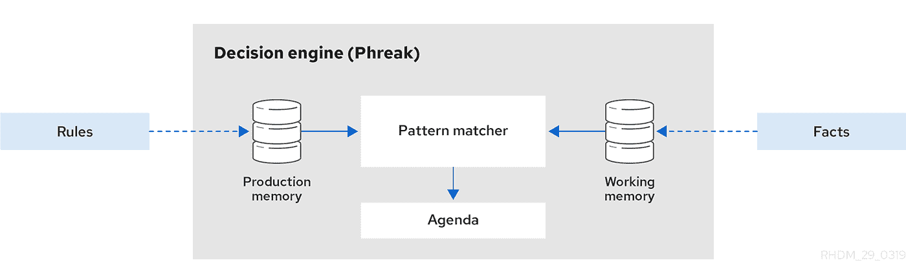

# 如何在 Drools-Part3 中处理 100k 行决策表

> 原文：<https://medium.com/nerd-for-tech/how-to-handle-100k-rows-decision-table-in-drools-part3-a185641a905e?source=collection_archive---------7----------------------->

正如在[上一篇文章](https://ryanzhangcheng.medium.com/how-to-run-100k-rules-in-drools-7b9308e75687)中所描述的，当解决 100k 行决策表时，我们面临着一个非常具有挑战性的性能问题。

要查看之前的讨论，请单击:

解决方案 1: [规则模板+ Xls](https://ryanzhangcheng.medium.com/how-to-run-100k-rules-in-drools-7b9308e75687)

解决方案 2: [预编译电子表格决策表](https://ryanzhangcheng.medium.com/how-to-handle-100k-rows-decision-table-in-drools-part2-2b7fb4de3532)

在本文中，我将改变思维模式，将决策表行数据从规则改为事实。我再次使用 drools 作为我的框架。

# 解决方案 3:将行数据转换为事实，而不是规则

当决策表低于行大小 10k 时，解决方案 2(预编译规则)非常有用。然而，当行数非常大时，如 100k，解决方案 2 的改进可以忽略不计。更糟糕的是编译时间太长，这是因为在一个项目中编译 100k 个 Java 文件不是一个正常的任务。

就其设计本质而言，决策表很受欢迎，因为它允许您在一行中管理一个规则，因此您可以以一种简单的方式管理多行。然而，漂浮在船上的水也可能会把它吞没。

如果规则数量太大，我们能减少规则数量吗？

我们能否以原始格式读取 Excel 文件，将这些行数据作为事实插入，然后在内存中计算它们？然后你在内存中有 100k 个事实而不是 100k 个规则。

对上面的代码做一个简单的测试，就可以了，性能是<50 ms!

However, We don’t throw away the bath water with the child. We don’t want to hardcode the Excel Read and Parser in our generic application code. The business logic needs to be decoupled with generic application.

Could we load Excel data in a DRL file and insert the fact?

The answer is **yes** ！

DRL 是非常动态和灵活的，基本上你可以像写 java 代码一样去做。

然而，为了简化 drl 编辑，通常我们可以提供一个干净的工具来读取 Excel 文件，并将它们转换成定制的事实，以满足您的需要。

我还在我的分支中提供了一个简单的 Excel 工具，参见 KeywordReader.java:

让我们在客户端应用程序中运行这些规则:

太好了，表现非常好。
如您所见，加载规则中的 excel 文件可能需要 2.7 秒。之后，每个规则的执行只需要 70 毫秒。

# 赞成

最大的好处就是性能好。如您所见，考虑到 Excel 文件中的大量输入数据，性能比以前的解决方案快 100 多倍；

更好的是，没有编译开销。

excel 数据仍然可以从应用程序逻辑中分离出来。所有业务规则数据都可以照常打包到规则项目中。

# 欺骗

据我所知，有两个缺点:

1.  原始 Excel 数据不能在 kie-workbench 中处理
2.  规则项目中有一些复杂的 Excel 阅读器逻辑。

对于业务用户来说可能不太舒服，但是，我认为，您可以将 Excel 解析逻辑包装在一个单独的 jar 文件中，这样可以将它从业务规则项目中分离出来。