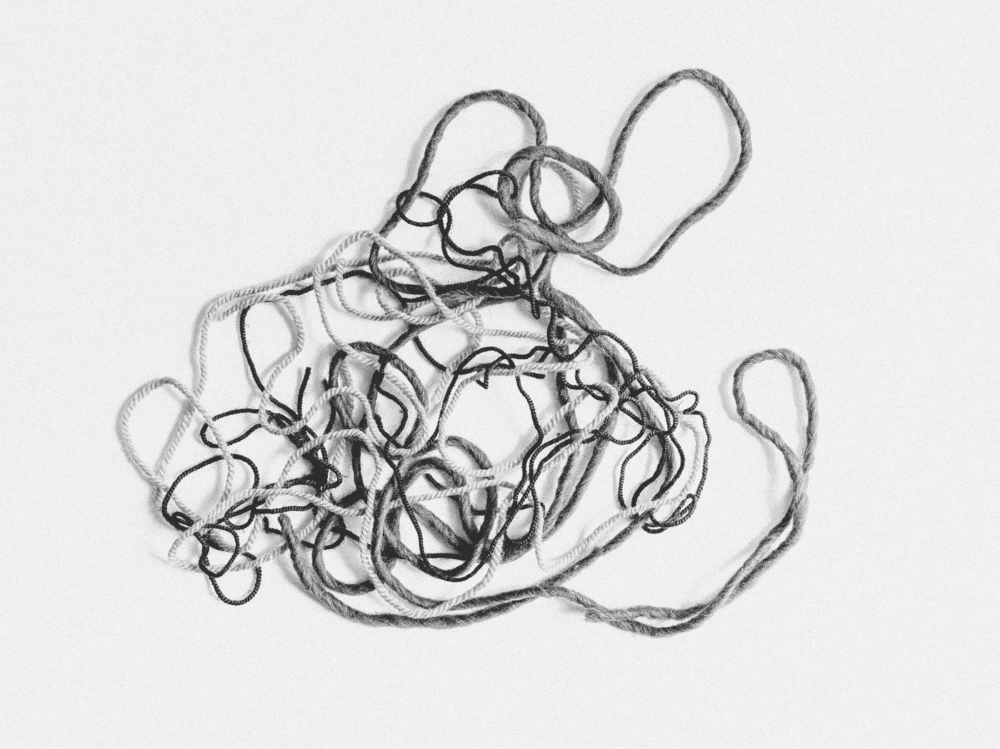

# 当您混淆同步和异步代码时如何处理错误— Dart

> 原文：<https://medium.com/nerd-for-tech/how-to-handle-errors-when-you-mixed-up-synchronous-and-async-code-dart-2e60d55a037f?source=collection_archive---------10----------------------->

Future 是 dart 中使用最广泛的数据类型之一。我们到处都在使用它们来返回网络响应、进行繁重的计算或任何其他异步任务。

同步代码中的错误处理是通过 **try-catch** 块完成的，而在异步代码中，我们借助 **catchError()** 来处理错误

但是当我们混淆了同步和异步代码时会发生什么，我们该如何处理呢？同时使用 try-catch 和 catchError()？是的，我们可以用那种方式来做，但是它会立刻使我们的代码变得混乱。

在本文中，我将告诉您我们如何准确地处理由这种混合代码引起的错误。

由 [Munro 工作室](https://unsplash.com/@universaleye?utm_source=unsplash&utm_medium=referral&utm_content=creditCopyText)在 [Unsplash](https://unsplash.com/s/photos/tangled?utm_source=unsplash&utm_medium=referral&utm_content=creditCopyText) 拍摄的照片

## 混在一起的代码是什么样的？

如果您查看上面的代码，该函数同步抛出一个错误，同时异步调用一个函数(第 5 行)

如果您试图只使用 catchError()来捕捉错误，您很快就会陷入陷阱。

让我们看看主要的。镖

错误未被捕获😱

请看这段 youtube 短片，了解控制流程，

我听起来确实很滑稽🤣😥

即使我们有 catchError()，从`*getPersonNameWithId()*` 引发的错误仍然没有被捕获，因为错误是从同步代码而不是异步代码**引发的。我们知道 catchError()只能捕获异步调用引发的错误。**

## 我们该如何应对？

## **1。使用异步关键字(最首选)**

只要在函数中使用 **async** 关键字(即使它并不需要),你就会觉得它与同步和异步代码混淆了。这将把代码中的所有内容包装成一个异步调用。所以里面所有的错误都可以用 catchError()来处理。

这个函数不一定是“异步”函数，但可以处理它需要的同步错误。

## 2.用 Future.sync()包装代码

这类似于使用 **async** 关键字**。但是比起 Future.sync()，我更喜欢 async 关键字。**

这是老东西了(我觉得)。使用 async 关键字。

## 3.使用区域。

根据[文件](https://api.flutter.dev/flutter/dart-async/Zone-class.html)，

> 区域表示在异步调用中保持稳定的环境。

**目前不常用的**

通常，一个区域用于捕捉代码(你无法控制的，某个第三方库的源代码)抛出的任何**未被接受的错误**(非致命的)，并在不中断其他区域工作的情况下处理它。

未来在幕后使用区域，我们并不总是明确地使用区域，我给出这个例子是为了让你知道我们也可以使用区域来处理异步错误。

## **4。使用 await 和 try-catch 块**

如果您希望您的代码是阻塞的(同步的)，那么您可以使用 await 并将其放入 try-catch 块中来处理这些错误。

通过有意识地编写**(这一点很难)并清楚地理解未来和异步函数是如何工作的，我们可以很容易地避免同步和异步代码中未处理的错误。我只想分享当我混淆了同步和异步代码时发生了什么，以及我是如何纠正的。感谢你阅读这篇文章，希望你对这个话题有所了解。**