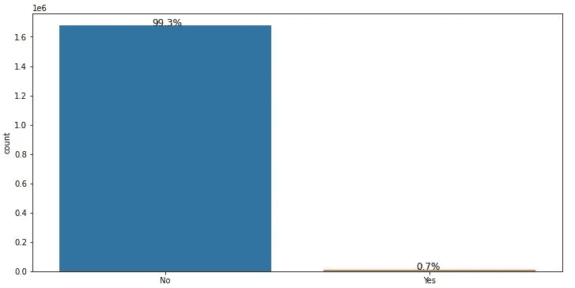
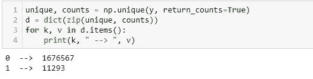
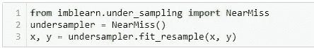
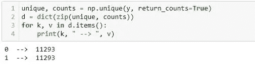
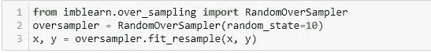
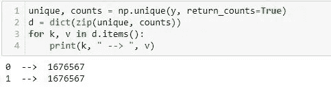

# 处理不平衡数据

> 原文：<https://medium.com/nerd-for-tech/how-to-handle-imbalanced-data-4fdceb8bbe04?source=collection_archive---------4----------------------->

# 介绍

**不平衡**数据是指类别分布不均匀的分类数据集。这意味着类在数据集中的分布是不均匀的。

不平衡数据

例如，您有一个包含 1000 条记录和 2 个类的数据集(是/否)。在 1000 条记录中，只有 50 条属于“是”类，其余 950 条属于“否”类。记录在“是”和“否”两个等级中的分布是不相等的。

# 为什么我们需要处理不平衡数据？

在不平衡数据上训练模型可以使模型**偏向**多数类，而完全忽略少数类。

假设你的老板让你训练一个模型，将产品分类为‘有缺陷’或‘无缺陷’。给你的数据集有 99.3%的记录是“无缺陷”产品，只有 0.7%是“有缺陷”产品。

您以 98%的准确率训练了模型并部署了它。几天后，你的老板找到你，说这个模型不正确，因为它把“有缺陷”的产品归类为“无缺陷”。

现在你很困惑，因为准确度和精度比问题的实际情况要好。

问题是，您根据不平衡数据训练模型，导致模型偏向业务，而您的模型将产品分类到有更多记录的类别。

## 解决方法是什么？

解决方案是你必须**让数据平衡。**

通过使用以下技术，我们可以平衡我们的数据。

1.  对训练集进行重新采样
2.  正确的评估指标
3.  k 倍交叉验证
4.  群集丰富的类

但是这里我们只讨论重采样技术。

# 重采样技术

重采样基本上是一种可以平衡不平衡类的方法，它提供了一种使用标准分类器处理不平衡学习问题的方便有效的方法，因为它改变了原始训练集而不是修改学习算法。

重采样有两种类型。

1.  欠采样
2.  过采样

## 欠采样

欠采样技术降低了多数类的频率。通过这样做，我们丢失了可能对模型准备有用的大部分数据。

在下面的例子中，我们在 0 和 1 类频率之间有很大的差异。

让我们应用欠采样。

结果

我们可以看到它减少了多数类 0 等于 1 的频率。

## 过采样

这种技术增加了少数类的频率。这种方法的缺点是由于它制作少数类的精确副本而导致数据过拟合。此外，训练集的规模增大，从而增加了构建模型的时间。

让我们应用过采样。

结果

我们可以看到，过采样技术增加了少数类 1 的实例。

那是平衡不平衡数据的随机抽样技术。