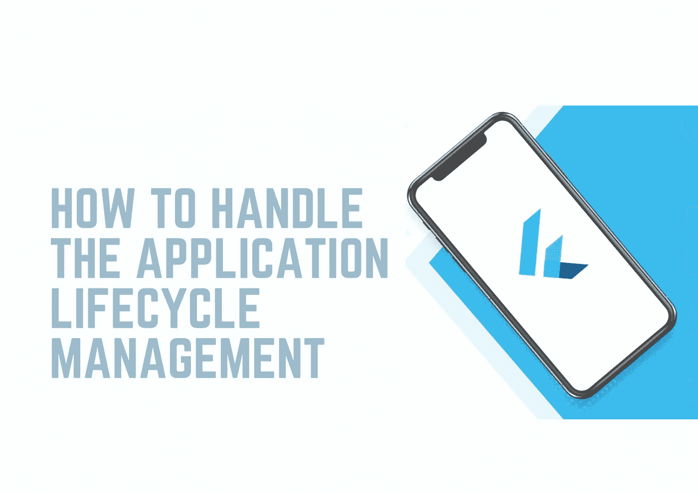

# 如何在混乱中处理应用程序生命周期管理

> 原文：<https://medium.com/nerd-for-tech/how-to-handle-the-application-lifecycle-management-in-the-flutter-fb059c82b19d?source=collection_archive---------2----------------------->

除了小部件的生命周期和小部件的状态，整个应用程序也有生命周期。有几种不同的生命周期状态，当然，重要的问题总是何时达到这种状态，何时可以基于这种状态执行代码，例如，您处于非活动状态。非活动意味着您的应用程序甚至没有运行在…