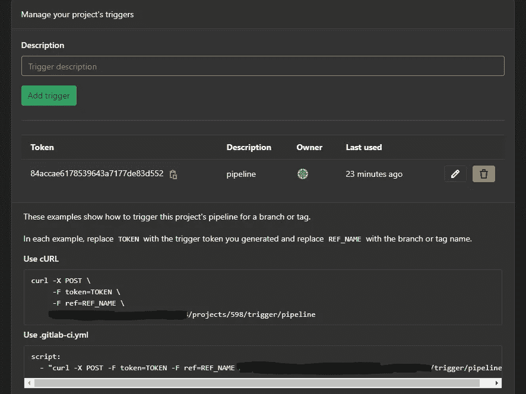

# 如何在 GitLab 上拥有一个镜像库而无需额外费用

> 原文：<https://medium.com/nerd-for-tech/how-to-have-a-mirror-repository-on-gitlab-without-the-premium-ee97cfb0954a?source=collection_archive---------2----------------------->

> 在这篇文章中，我将解释一个想法，即有一个半镜像历史功能，而没有 GitLab 的高级版本，因为具有拉模式的镜像是高级的

首先，什么是镜像存储库功能？

例如，如果您在 GitHub 或 azure-DevOps 上有一个库，并且您希望在 GitLab 上有一个镜像，以使用 GitLab CI/CD 特性或有一个备份库等等。GitLab 提供了带有拉/推模式的镜像库特性，但只有推是免费的，CI/CD 库也是收费的。

我们可以做一个非常简单的步骤，通过使用以下步骤编写 GitLab 管道来模拟该功能

*   创建一个新的空 GitLab 项目
*   添加新的。gitlab-ci.yml (GitLab CI)包含以下内容

```
stages:
- mirror-from-external
mirror-from-external:
stage: mirror-from-external
image: ubuntu:18.04
before_script:
- apt-get update -y && apt-get install openssh-client -y
- apt install git -y
- eval $(ssh-agent -s)
- echo "$GIT_SSH_PRIVATE_KEY" | tr -d '\r' | ssh-add -
- mkdir -p ~/.ssh
- chmod 700 ~/.ssh
- ssh-keyscan $GIT_LAB_HOST >> ~/.ssh/known_hosts
- chmod 644 ~/.ssh/known_hosts
- git config --global user.name "${GIT_USER_NAME}"
- git config --global user.email "${GIT_USER_EMAIL}"
- ssh "git@$GIT_LAB_HOST"
script:
- echo $SOURCE_REPOSITORY
- git clone --mirror $SOURCE_REPOSITORY Your_Repo_folder_name
- cd Your_Repo_folder_name
- git remote remove origin
- git remote add origin $DESTINATION_REPOSITORY
- git push --prune --all
- git push --prune --tags
only:
- branches
```

解释:

我们只需使用带有 ssh 和 git 的 ubuntu 映像，然后从源库克隆并删除远程源，然后添加 GitLab 库作为远程源，然后使用 prune 推送所有和标签，以删除已删除的分支和标签

现在我们有了自己的管道，每次触发时，这个管道都会从源代码库到 GitLab 库获取一个快照。

您可以添加一个 CI 计划程序来自动触发管道，只需转到 CI/CD 并选择 schedule 选项，然后创建一个新的计划。

此外，您可以在本地机器的源存储库中添加一个 git 挂钩，通过使用 GitLab API 来触发源存储库上的每次推送

*   转到设置> > CI/CD，并在最后展开管道触发器折叠，然后单击添加触发器



然后我们有一个 API 来触发我们的管道

*   去你的。git\hooks 在您的开发机器上的源存储库路径上，创建一个名为“pre-push”的新钩子文件，其内容如下

```
#!/bin/sh
curl -X POST -F token=84accae6178539643a7177de83d552 -F ref=master [https://your-git-lab-url/api/v4/projects/{projectID}/trigger/pipeline](https://your-git-lab-url/api/v4/projects/{projectID}/trigger/pipeline)
```

就像触发器上解释的那样，用您的 API URL 替换 URL

之后，每个 git push 命令将触发镜像管道工作，从源存储库到 GitLab 存储库获取快照，如此而已。

我希望我帮助了你，谢谢。