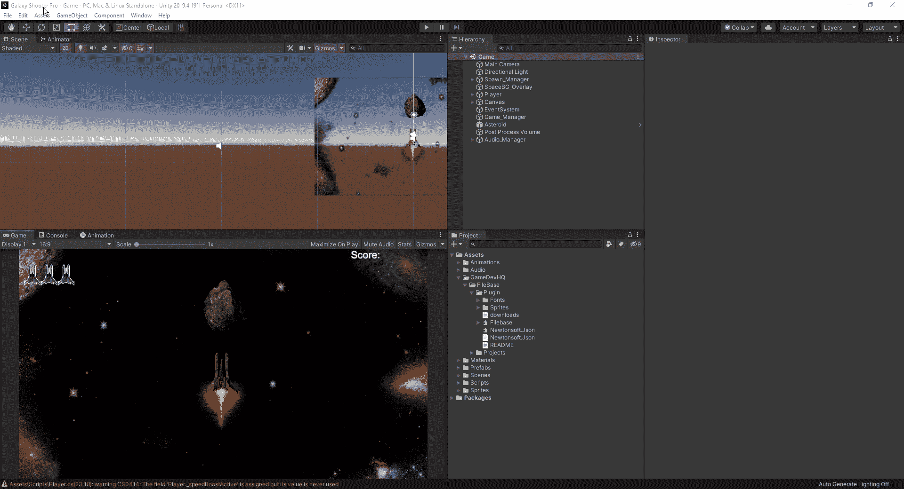
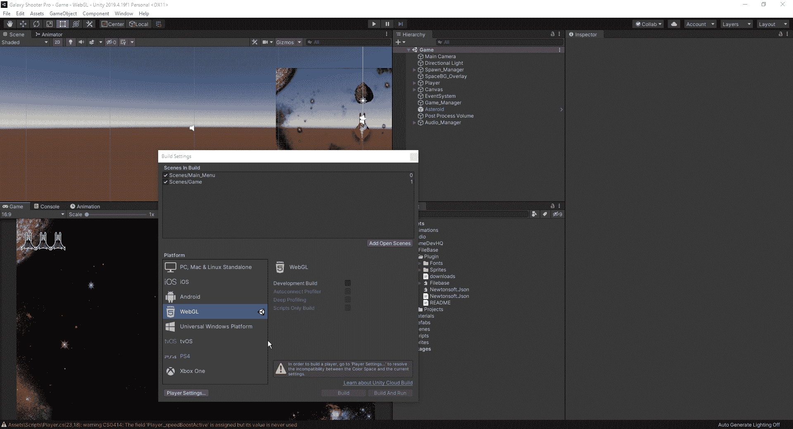
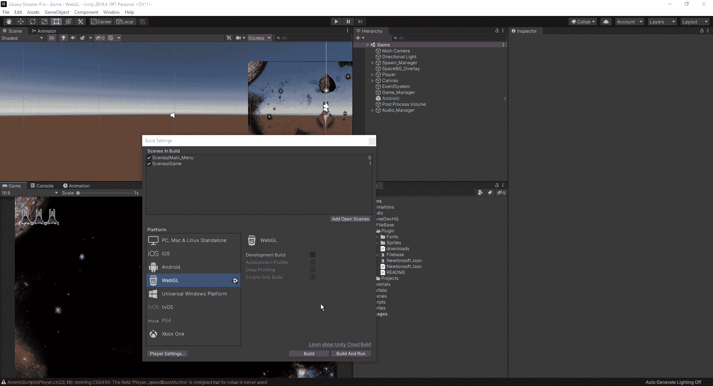

# 如何在网络上运行 Unity 游戏

> 原文：<https://medium.com/nerd-for-tech/how-to-host-unity-games-on-the-web-45cee065eb9?source=collection_archive---------17----------------------->

现在我们知道了如何创建一个 build，让我们看看如何创建一个 Web GL 链接到我们的游戏，这样我们就可以在线托管它供其他人尝试。首先，我们回到构建设置，然后这次我们选择 Web GL:

正如我们所看到的，弹出一个错误，指出我们必须解决色彩空间和当前设置之间的兼容性问题。这意味着我们必须进入设置，将我们的颜色空间从线性改为伽玛:

不，我们可以关闭设置并创建我们的 web GL 代码。就像我们之前创建构建一样，我们希望将它保存到游戏文件中它自己的文件夹中:

一旦它完成编译，它将打开文件位置，你可以在你的托管网站上使用它。