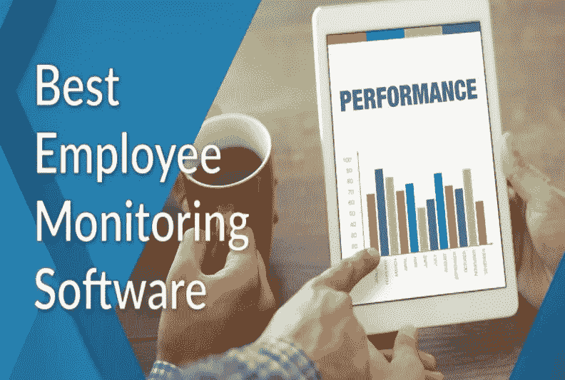
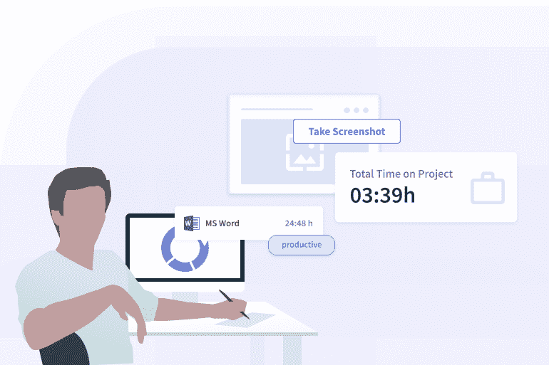
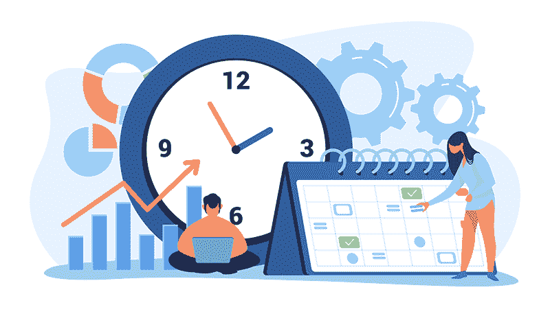
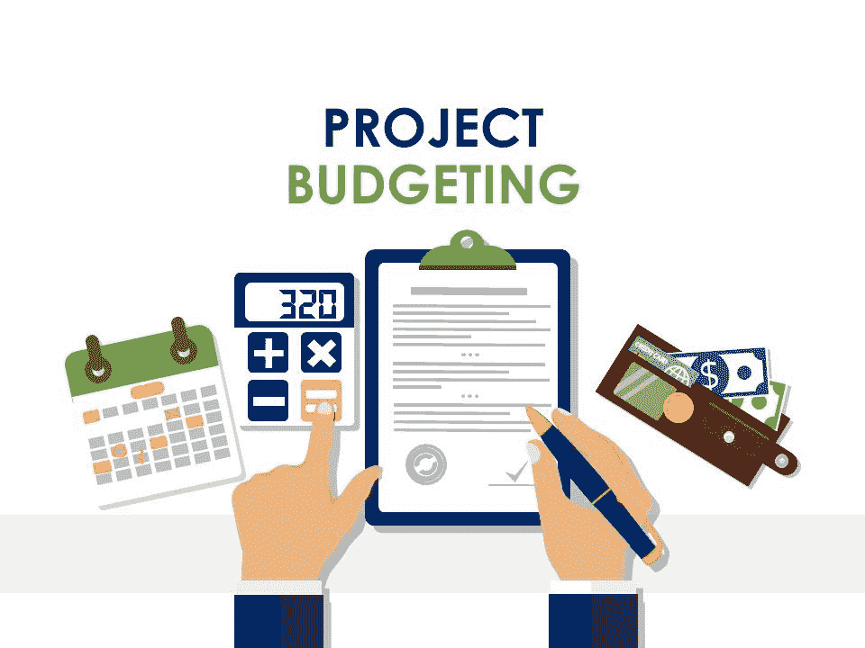
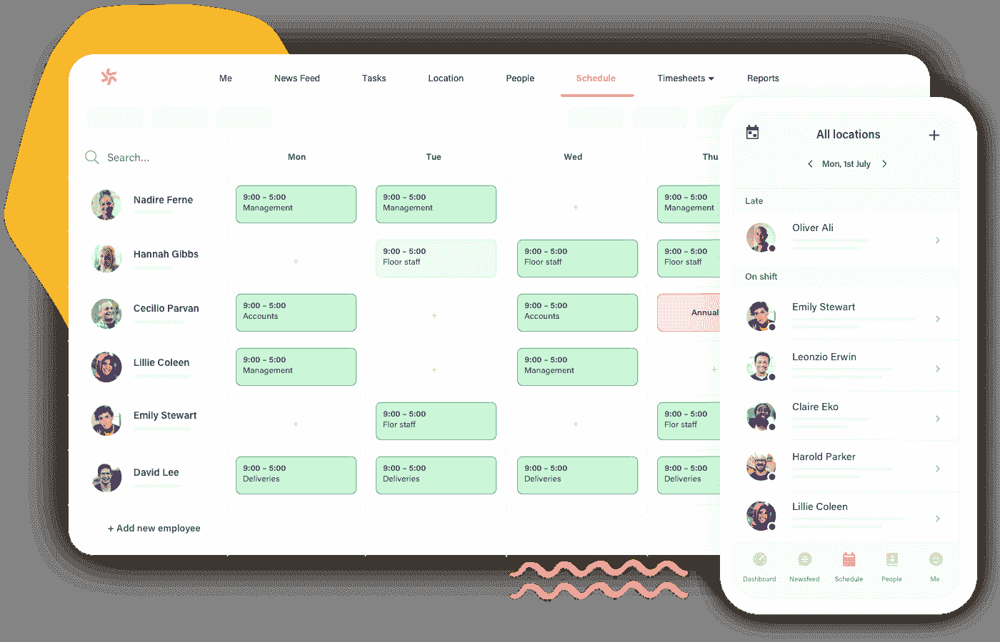
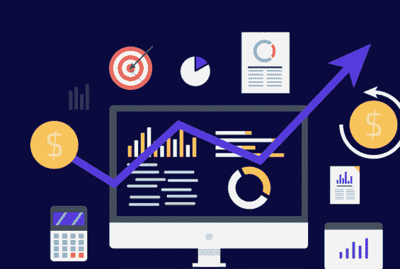
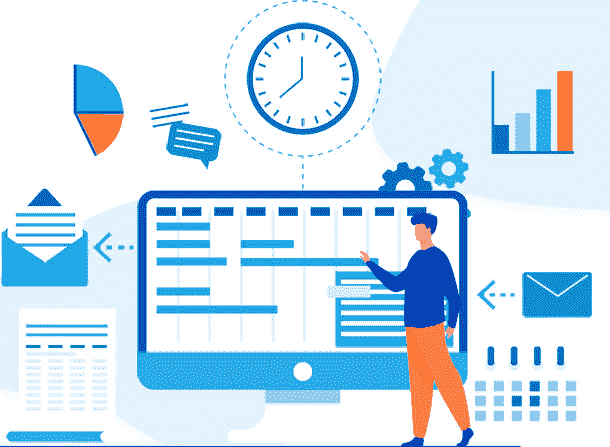

# 如何识别最好的员工监控工具？

> 原文：<https://medium.com/nerd-for-tech/how-to-identify-the-best-employee-monitoring-tool-f4e9012e935b?source=collection_archive---------6----------------------->

**员工监控**是雇主在员工工作时对其进行监控的方法。当员工担任经理或主管时，有必要制定适当的政策和做法，以确保员工勤奋工作并遵守公司的规章制度。

高效管理的理念还包括确保员工不玩忽职守、保证生产力的高效方法。员工监督是确保这一点的合法方式。根据组织的需要和要求，可以用不同的方式进行员工监控。

例如，当员工在办公室或在家工作时，有必要监控他们正在做什么，以了解他们是否正在执行分配给他们的任务。了解员工是否准时上班也很重要。

今天，我们将学习如何识别最好的**员工监控工具**。市面上的选择很多，选择符合自己需求的才是根本。我们开始吧！我们将首先了解员工监控软件。接下来，为什么它们变得如此受欢迎，最后，我们将通过谈论**员工监控软件**的一些顶级功能来帮助您缩小搜索范围。

# **什么是员工监控软件？**

**员工监控软件**是一种监控和记录员工电脑活动的软件程序或应用程序，包括访问的网站、使用的搜索次数、键入的单词、在分配的任务上花费的时间等。

该计划通常记录所有的活动，并记录他们不同的时期。这对雇主来说是一个优势，因为他们可以确定员工的粗心是否危及了任何机密数据或商业秘密。

它通过捕捉员工活动和数据来工作，包括按键、互联网使用、聊天对话、通过公司的消息系统收发的电子邮件、社交媒体 URL(如脸书和 Twitter 的使用)。用户活动被捕获到日志文件中，并存储起来供以后分析。

## **为什么需要员工监控工具？**

**资料来源:工作报告**

监控软件使雇主能够跟踪和分析员工的生产力，以及计算机的总体使用情况。用户监控软件允许雇主检查恶意行为，如病毒攻击、黑客攻击、数据窃取等。它确保员工不会滥用公司资源或参与可能不符合公司最佳利益的活动。

**用户活动监控**软件还可以通过跟踪时间和出勤数据、捕捉屏幕截图和记录计算机系统上的击键来帮助雇主确保员工的工作效率。

**员工监控软件**工具的以下优势正成为其在企业主中广受欢迎的原因-

*   合规和监管问题
*   确保公司信息的安全
*   员工生产力跟踪
*   用户活动审计
*   用户行为分析
*   用户策略实施
*   用户取证
*   病毒/间谍软件防御

## **识别最佳员工监控工具的顶级功能**

以下是最佳员工监控工具的一些特性-

**1。考勤管理**

**资料来源:印度 Talentpro】**

考勤管理软件是计划、跟踪和交流休假政策的一个很好的方式。最好的考勤管理软件将无缝自动化传统上占用大量人力资源时间的流程。

这种自动化、可定制的好处包括奖励任期最长的员工更忙的轮班，计算多地点或复杂企业结构的应计比率，等等。

**2。项目预算**

**来源:幻灯片团队**

预算在任何规模的项目中扮演着更重要的角色。从事项目工作的员工将需要报告他们一直在做的事情，确保成本预测仍然准确，并确保资金可用于未来的开支。

预算软件通过让你知道人们在他们的项目上花了多少钱来帮助你做预算。预算监控工具测量项目期间花费的时间、与小时工资率相关的成本以及任何加班费。这种类型的系统可以为经理提供指示，帮助他们决定费用是否合理，或者是否需要在批准前进一步审查。

**3。员工排班**

**资料来源:副手**

最好的员工监控工具有助于管理员工的轮班时间表、假期和休假。员工排班很重要，原因有几个，但主要原因是它考虑到了员工的责任。企业通常想知道在某一天谁是他们的员工，他们那天应该做什么。

排班软件工具能够使软件解决方案平衡人员配备需求—排班可以快速检测出覆盖范围中出现的缺口，并根据可用性智能地做出更改以适当填补职位。这使得人力资源经理可以更顺利地开展工作，节省时间完成繁琐的日常任务，如跟踪工作时间和在冲突发生时手动调整约会。

你在找**员工排班软件**？你可以在这里-【https://bit.ly/3pyhgjj】索取最好的**员工排班软件**的免费演示

**4。GPS 跟踪**

**资料来源:FiduciaSoft**

GPS 跟踪是优秀的**员工监控软件**的另一个重要特征。当发生紧急情况或员工失踪时，GPS 跟踪对于定位员工至关重要。它在许多其他情况下也很有价值，例如，你需要随时知道准确的位置。这将有助于车队管理公司获得这些信息。

通过密切监视所有员工的位置，经理可以确保向员工分配高优先级任务，即使他们无法立即得到任务通知。

**5。生产率计算器**

**来源:Walkme 博客**

**带有生产力计算器的员工监控软件**有助于跟踪员工的生产力水平，这对经理来说是极好的。了解你的团队有多大的生产力才能让你得到你想要的结果是很重要的。

它捕获的不仅仅是您的员工在任何特定任务上花费的时间截图。它记录鼠标移动、击键、滚动速度和窗口位置，这意味着您可以比较每个员工执行任务所用的时间，而他们不会怀疑这些元数据正在被收集。

只需浏览一下这些细微的细节，你就会很快明白为什么一个人成功了，而其他人却失败了——只需一点点观察，你就能建立全面的生产力标准。

**6。在线时间表**

来源:Bitscape

员工监控或**时间跟踪软件**也可用于管理在线时间表。它提供时间跟踪，这有助于促进准确的劳动力指标，从而生成现实的数据驱动的洞察力，了解您的员工在为您工作时到底在做什么。

此外，将在线时间表与员工绩效评估结合起来，可以让你有效地管理人力资源流程，随时了解办公室里发生的一切。

这还不是全部。它还提供了对关键公司 KPI 的实时可见性，从而有效地实现目标，并在新机会出现时抓住它们。

**收尾思路**

我们都知道，任何公司的支柱都是员工。但随着越来越多的公司转向远程工作，雇主跟踪员工并随时了解他们的工作变得更具挑战性。幸运的是，有专门为此设计的工具——劳动力管理软件！

您一定在想哪个软件具有所有列出的功能？**工作状态**

[**WorkStatus**](https://www.workstatus.io/) 是一款功能强大的劳动力管理软件，为您提供管理劳动力的最佳功能。使用**工作状态**，您可以轻松跟踪出勤和项目预算，同时还可以访问员工车辆的 GPS 跟踪。借助我们的生产力计算器，您可以随时确定哪些员工在工作。

如果你想更多地了解工作状态能为你的组织做些什么， [**不要犹豫，今天就联系我们**](https://app.workstatus.io/auth/register) ！