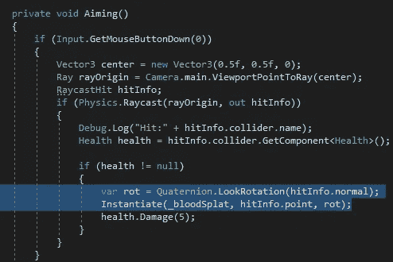
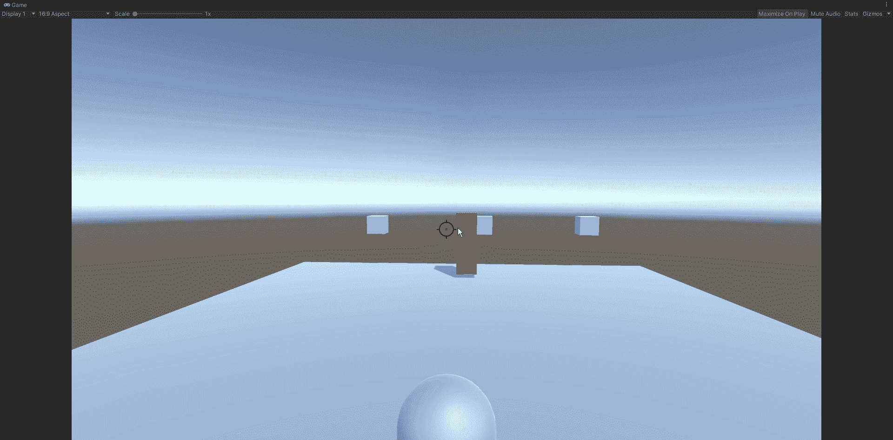
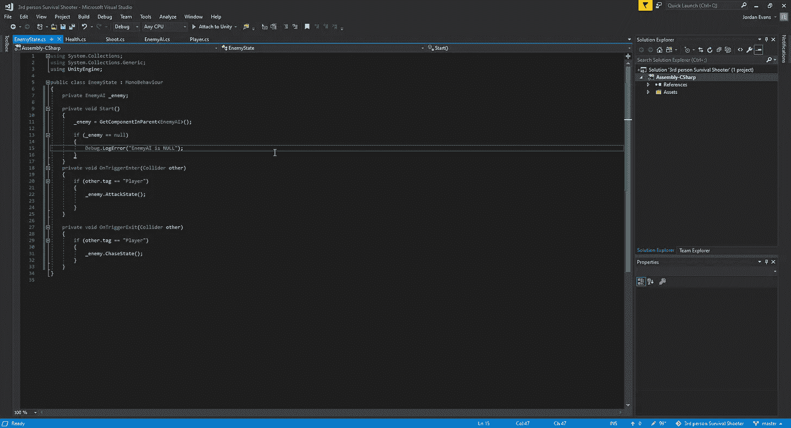
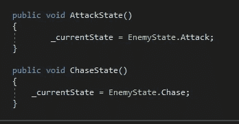
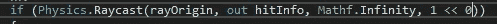
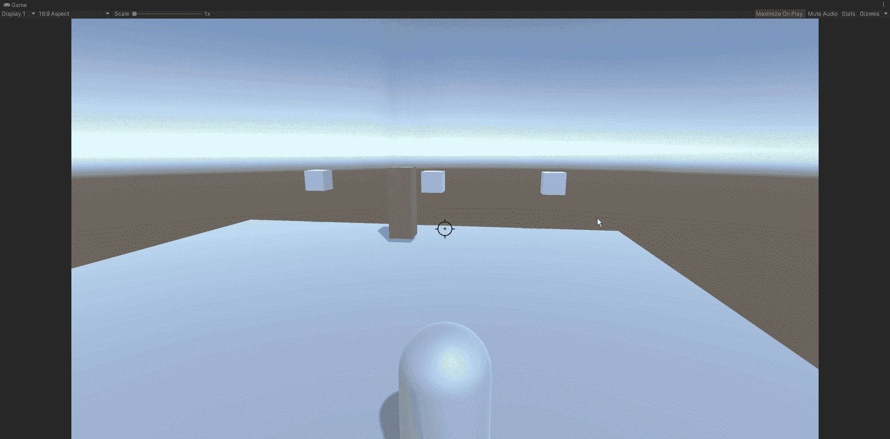

# 如何忽略游戏对象上的碰撞器

> 原文：<https://medium.com/nerd-for-tech/how-to-ignore-a-collider-on-a-gameobject-eeb1ed6a6acb?source=collection_archive---------3----------------------->

现在让我们来看看如何为我们的射手实现一个血液飞溅系统。首先，我们只需要找到一个好的飞溅来工作，并附上它的预置作为我们拍摄脚本的游戏对象:

为了使我们的飞溅不总是以相同的旋转值产生，无论我们是正面拍摄还是从侧面拍摄，我们都需要将 lookrotation 逻辑应用于实例化方法，以便它可以很好地围绕我们的对象旋转:

现在我们有了一个漂亮的飞溅，它将根据我们撞击物体的位置来改变它的旋转，我们可以看到一个小问题。如上所述，我们正在攻击敌人周围的一个隐形球。这是因为我们的镜头被攻击状态碰撞器阻止了，我们之前在处理实现各种攻击状态时应用于敌人。为了解决这个问题，我们将不得不对我们的脚本做一些调整，因为我们想让这个碰撞器成为敌人的子物体。首先，我们将把状态变化的逻辑转换到一个新的脚本中，并对其进行一些小的调整:

这些改变只是召唤我们必须在敌人剧本中设置的特定空白，将敌人的状态改变成我们想要的状态:

现在我们已经有了这个部分，并且已经在游戏中测试过，以确保敌人有相同类型的行为，让我们看看我们现在如何能够忽略状态碰撞器，只击中敌人:

通过对光线投射游戏代码的调整，我们告诉 Unity 我们想让第 0 层的所有东西都被击中。如果我们决定添加额外的目标层，我们只需在该行代码的最后一部分添加“| 1 << x”。现在我们已经准备好了，让我们看看它在游戏中的样子:

现在我们有了一个正常工作的飞溅系统，我们可以开始游戏的下一部分了。