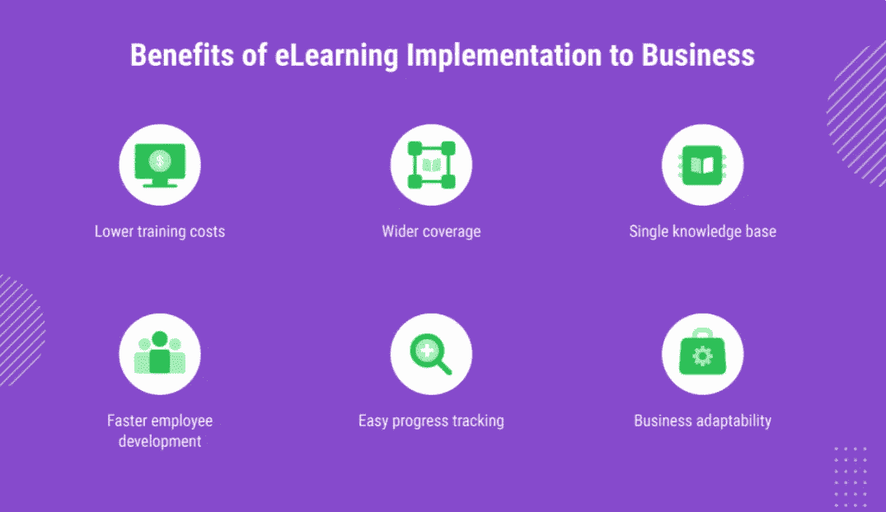
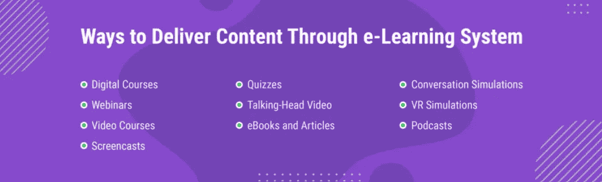
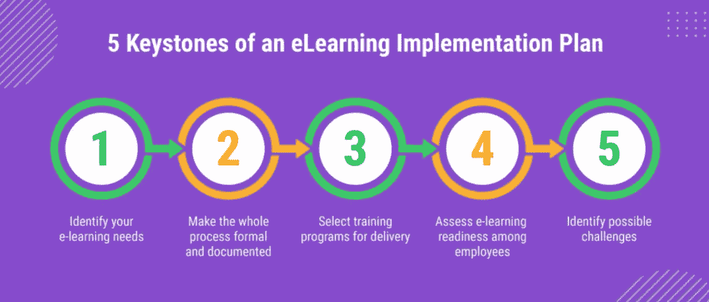

# 如何在组织中实施电子学习

> 原文：<https://medium.com/nerd-for-tech/how-to-implement-e-learning-in-the-organization-8c8a0594cb1a?source=collection_archive---------4----------------------->

电子学习系统对组织来说并不陌生。多年来，它们一直用于提供一致的培训、降低员工因教育目的出差的相关成本，以及随时随地提供对培训材料的访问。不过，为了澄清事情，让您更好地了解电子学习可以为企业带来什么，以及如何实施电子学习以取得成功，让我们来看一下要点。

在本文中，您将找到以下问题的答案:什么是电子学习，电子学习可以通过哪些方式为您的组织服务，电子学习交付最成功的方法是什么，现有的系统类型是什么，为什么要投资电子学习系统开发，如何在组织中顺利实施电子学习，以及需要解决哪些可能的挑战。

# 什么是数字化学习？从优势到现有系统类型和电子学习交付方法

无论谈话是关于观看教育视频、阅读有趣的文章，还是在线或在一些数字设备上进行测验，所有这些都是电子学习。虽然电子学习确实无法取代全面的教育，但用虚拟现实、人工智能或其他将学习提升到更高水平的创新来定制更方便、更容易。

但是，在组织中实施电子学习系统的关键优势是什么？让我们通过指出这些系统带来的好处来找出答案。

## 电子学习给企业带来的好处

电子学习是一个很好的商业工具，因为它提供了:

## **降低培训成本**

借助电子学习，企业只需开发一个在线课程并与员工分享，就可以削减与支付差旅费和租赁酒店房间相关的培训成本。

## **覆盖面更广**

远程学习没有障碍。它允许以统一的格式培训全球数十个办事处的数百名员工。

## **单一知识库**

所有的学习资料都存储在一个地方，一个学习管理系统(LMS)。员工可以在方便的时候从任何设备登录 LMS，找到他们需要的课程，并学习材料。

## **更快的员工发展**

传统的培训可能会相当慢，因为它取决于业务培训师的工作时间。LMS 随时可用，使员工可以随时学习，无论是在午休时间还是在家。

## **轻松进度跟踪**

大多数 LMS 都嵌入了分析工具，以图表和报告的形式显示每个学生的进步。

## **业务适应性**

电子学习帮助员工跟上公司的节奏，实时解决问题。因此，如果有必要，例如，向销售团队介绍一种新产品，就有可能创建一个数字课程，并立即交付给数千名员工。

但是，电子学习系统也可以通过其他方式传递内容。下面我们来看看。

## 电子学习培训的类型

你的课程越相关、越吸引人、越互动，它的价值就越高，学习效果也越好。电子学习系统允许使用不同类型的内容交付。那么这些类型是什么呢？

虽然可以选择这些类型中的任何一种，但员工培训的效率取决于许多因素。

# 高效交付电子学习的步骤

企业可以采取一些必要的步骤，以尽可能最好的方式提供电子学习。他们在这里:

## **设定目标**

这可能是员工的软技能培训或资格升级。

## **选择合适的工具**

根据教育的复杂性，你可以选择简单的工具，如邮件，也可以选择更复杂的工具，如人工智能算法。

## **准备一份计划**

分阶段写下计划，并为每个阶段分配预算。

## **创建内容**

为你的员工开发教育材料，最好从简单开始。

## **准备好您的 LMS**

一旦你的内容准备好了，把它上传到 LMS 并正确地组织它。

## **做一次试运行**

当系统准备就绪时，邀请一些员工进行试运行，以监控一切并获得反馈，这样您就可以在最终发布之前完善培训计划。

## **开始训练**

邀请您的员工参加 LMS 并分配课程。

## **估算效率**

使用内置统计数据并收集员工反馈来评估电子学习效率。

# 电子学习实施的最佳实践

但是，在利用上述所有优势之前，还有其他重要的事情需要考虑，包括建立电子学习实施计划，以确保您将要开发的系统符合您的需求，分析可能的挑战，以及建立成功的电子学习实施流程。

## 电子学习实施计划:如何使其正确？

当你决定[在你的组织中实施电子学习](https://emerline.com/solutions/lms)时，你必须从建立一个满足你业务需求的实施计划开始。所以这里有一个善意的提醒，需要考虑什么。

# 企业在实施电子学习时可能会面临哪些挑战？

在识别挑战时，它们可能会有很大差异。不过，这里有一些适用于任何业务。它们是:

## **枯燥无味的题材**

任何 LMS 系统，即使是最熟练的系统，如果没有吸引力，也无法提供有效的学习。所以要确保你的内容交付方式给用户带来了满足感。如今，这可以通过使用 AR 等创新技术轻松实现，但游戏化等其他方式也可以很好地实现。

## **缺乏学习动机**

动机是学习成功的关键因素之一，幸运的是，有一些行之有效的方法可以帮助企业提高它。这可能是关于学习者进步的信息的传递，对成功完成任务的某些奖励，甚至是激励邮件。

## **不切实际的最后期限**

确保负责设定截止日期的人了解电子学习过程中的每一步。

## **与现代科技保持同步**

每年都会有新的技术工具、小工具和软件问世，您可以用它们来改进电子学习的交付方式。但是，随着如此多的数字化转型，很难说哪种新的学习技术值得投资。为了应对这一挑战，你可以参加科技会议、活动、商展，也可以阅读科技博客、案例研究和评论。

## **没有经验的伙伴**

如果为您提供电子学习解决方案的公司不熟悉电子学习计划，那么开发过程对您和开发团队来说都将是一个真正令人头疼的问题。

这就是为什么详细解释你期望得到什么样的解决方案，你的成功标准是什么，以及你将如何实现你的目标是如此重要。

# 分步骤的电子学习实施流程

现在我们到了最后阶段，这将使您的公司能够确保您的系统得到正确实施。

## **定义范围**

仔细定义范围，以便它符合您的组织目标，不会在开发过程开始时偏离轨道。

## **选择技术合作伙伴**

最好是选择一个能够为您提供团队的技术合作伙伴，该团队包括适合差距分析专家、项目经理、实施团队等等。此外，如果您没有内部 IT 部门，您将需要有人帮助您保持系统最新，并尽快对任何问题做出反应，技术合作伙伴可以为您提供此类服务。

## **选择一个平台**

你必须决定你将使用什么机制来提供你的电子学习，以及你将使用什么工具来实现它。这些是需要回答的关键问题，以便您可以有效地估计和管理项目预算。

## **定义预算**

在项目开始之前，如果你不想看到成本快速增加，你需要确定预算，并与你的合作伙伴达成一致。

## **心灵品质保证**

在整个项目中，甚至在实施之后，你需要有一个质量保证的方法。这包括安装和运行 LMS 以及未来的更新(包括技术和结构更新)。您应该在项目的不同阶段建立质量保证阶段，这样您就可以保持高标准，保持在范围内和预算内。

这里还要澄清的一点是，所有的项目都是不同的，没有统一的成功秘诀。尽管如此，与像您的同事 Emerline 这样值得信赖的技术合作伙伴合作，可以让您摆脱与项目规划、开发和实施相关的所有难题。

我们在[为教育机构、培训中心和其他教育技术组织提供电子学习解决方案](https://emerline.com/industries/elearning)方面经验丰富，确保全程参与和以结果为导向的学习体验。因此，如果您有在您的企业中实施电子学习的想法，有一些问题，或者想要澄清一些细节，随时欢迎您通过[联系我们](https://emerline.com/contact-us)。

最初发表于[https://emerline.com](https://emerline.com)。