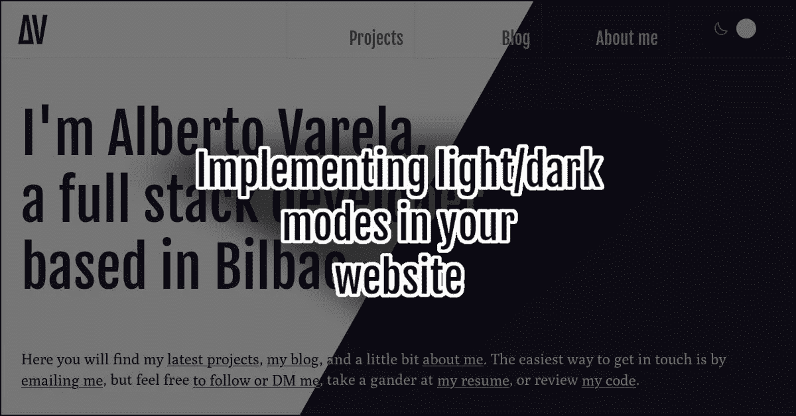

# 如何在你的网站上用拨动开关实现亮暗模式

> 原文：<https://medium.com/nerd-for-tech/how-to-implement-light-and-dark-modes-with-a-toggle-switch-on-your-website-3f2426bc4717?source=collection_archive---------3----------------------->



我最近重新设计了我的网站的外观和感觉。作为重新设计的一部分，我实现了一个亮和一个暗的主题，可以根据用户的偏好自动选择；它还包括一个拨动开关，允许用户改变这个网站的偏好。在这篇文章中，我将向你展示我是如何做到的。

如今，在明亮或黑暗主题之间切换的能力在互联网上变得非常流行。从我们开始在桌面应用上看到它已经有一段时间了，但是现在，在我们使用的大多数网站上，我们也可以每天看到它:Github、Stackoverflow、Twitter 等。有多种方法来实现它，我会告诉你我的。

# 写主题

现在是 2022 年，我们躲过了冠状病毒，Internet Explorer 终于死了。如果你还没有开始使用 CSS 自定义属性，我认为这是一个很好的时机(如果你不熟悉或者不知道我在说什么，你可以阅读来自克里斯·科伊尔的这篇精彩的文章[)。](https://css-tricks.com/a-complete-guide-to-custom-properties/)

即使我已经开始谈论两个主题，我显然是在谈论让**一个 CSS 代码有两个变体**。创建这些变体的关键是在自定义属性中编写出现在主题上的每一种颜色。在我的例子中，我已经开始定义灯光主题中使用的所有颜色，这是我在不知道用户偏好的情况下选择的默认颜色:

```
body {
  --bg-color: #fff;
  --bg-color-secondary: #eee;
  --text-color: #303030;
  --text-color-secondary: #707070;
  --border-color: #eeeeee;
}
```

一旦我们有了浅色变体的值，我们需要为深色变体定义相同的属性，我们将把它们添加到媒体查询中。

```
@media (prefers-color-scheme: dark) {
  body {
    --bg-color: #292639;
    --bg-color-secondary: #1b1928;
    --text-color: #ebeaf7;
    --text-color-secondary: #bebbd2;
    --border-color: #3a3650;
  }
}
```

现在，我们可以在 CSS 中使用这些属性。

```
body {
  background: var(--bg-color);
  color: var(--text-color);
  /* ... */ 
}

.header {
  border-bottom: 1px solid var(--border-color);
  /* ... */ 
}

.menu-item {
  color: var(--text-color-secondary);
  /* ... */ 
}

.button {
  background: var(--bg-color-secondary);
  border: 1px solid var(--border-color);
  /* ... */ 
}

/* ... */
```

# UX 的一些考虑

不要误会我；我不是 UX 设计师。无论如何，我很乐意给你一些关于 UX 光明/黑暗主题的建议:

**暗不黑**。除了`#000000`还有很多深色，事实上，你可以看到我在这个网站没有使用黑色作为背景色。光也不一定是白色的。有很多地方可以从中获得灵感；如果你也不是色彩理论方面的专家，回顾一下其他网站的做法，或者从 IDE 主题中获取一些想法。

**没有必要每种颜色都切换**。我可能错了，但阴影总是黑暗的。考虑颜色被使用的地方。你可以为每个变体使用不同种类的阴影，也许你会需要它们在黑暗主题中更强烈(或透明度更低)，但它们应该是黑暗的。

**根据内容确定 SVG 图标的颜色**。确保不要在 SVG 图标的`stroke`或`fill`属性中硬编码颜色代码。在那些属性中使用`currentColor`,让 CSS 级联完成它的工作。

**关注内容图片**。并不是每一张照片都能很好地配合这两个主题。测试您为内容选择的图像，选择那些在深色和浅色背景下看起来不错的图像。有时这是不可能的，不要担心，有不同的方式向您的用户显示多个图像，例如:

```
<picture>
  <source srcset="image-dark.png" media="(prefers-color-scheme: dark)" />
  <source srcset="image-light.png" media="(prefers-color-scheme: light)" />
  
</picture>
```

另一个选项，也是我选择的，是在黑暗模式下对图片应用滤镜，使它们更暗，对比度更高:

```
@media (prefers-color-scheme: dark) {
  img {
    filter: brightness(0.9) contrast(1.1);
  }
}
```

如果您遵循这些步骤，您现在将有两个版本的主题。我知道这并不总是像我在这里描述的那样简单，特别是如果你不是从零开始创建你的主题，而是在现有的基础上增加一个新的变体。**根据你的情况调整这些建议**，不要放弃。

# 让用户切换

在这一点上，我们已经假设用户总是希望看到您的网站，并使用我们在`prefers-color-scheme`媒体功能中读到的颜色模式偏好。这是一个很大的假设。在我看来，这是一个很好的起点，但是**我们总是会让用户从亮到暗切换，反之亦然**。

最常见的方法是创建一个奇特的开关，但任何类型的按钮也可以。本文旨在向您展示如何实现该功能，我们不会关注交换机的设计。无论如何，你可以[在这里](https://codepen.io/search/pens?q=dark+mode+switch)寻找灵感或者看看我自己在这个 Codepen 上的开关代码:

一旦我们设计了开关或按钮，我们应该做的就是用 javascript 实现功能。我们将能够用这个简单的代码来完成它:

```
// Get the button element
const btn = document.querySelector(".your-button-or-switch-class");
// Detect if user preference is dark
const prefersDarkScheme = window.matchMedia("(prefers-color-scheme: dark)");
// On button click
btn.addEventListener("click", function() {
  // Get users preference
  const userSystemPreference = prefersDarkScheme.matches ? "dark" : "light";
  // Choose the class that will be added or removed
  const toggleClass = userSystemPreference === "dark" ? "light" : "dark";
  // Add or remove the class on the <html> element
  document.documentElement.classList.toggle(toggleClass);
});
```

如你所见，如果用户喜欢浅色主题，我们将添加或删除`dark`类到`html`元素，如果他们喜欢深色，我们将切换`light`类。这暂时不会触发任何效果，但是在我们的 CSS 中添加这个简单的内容后，它会触发任何效果:

```
.dark body {
  --bg-color: #292639;
  --bg-color-secondary: #1b1928;
  --text-color: #ebeaf7;
  --text-color-secondary: #bebbd2;
  --border-color: #3a3650;
}

@media (prefers-color-scheme: dark) {
  .light body {
    --bg-color: #fff;
    --bg-color-secondary: #eee;
    --text-color: #303030;
    --text-color-secondary: #707070;
    --border-color: #eeeeee;
  }
}
```

有了这一切，我们的网站将加载用户的首选主题，它将允许他们切换，如果他们想要的。那么，我们谈完了吗？还没有。

# 存储用户偏好

我们只缺少一样东西；**我们需要存储用户的偏好，以便在会话或页面导航之间保存它们**。我认为最简单的方法是将其保存在浏览器的本地存储中，为此，我们需要修改我之前向您展示的 Javascript 代码。

```
const btn = document.querySelector(".your-button-or-switch-class");
const prefersDarkScheme = window.matchMedia("(prefers-color-scheme: dark)");
btn.addEventListener("click", function() {
  const userSystemPreference = prefersDarkScheme.matches ? "dark" : "light";
  const toggleClass = userSystemPreference === "dark" ? "light" : "dark";
  document.documentElement.classList.toggle(toggleClass);

  // Obtain which is the user's current preference for our website
  const userCurrentPreference = document.documentElement.classList.contains(toggleClass)
    ? toggleClass
    : userSystemPreference;
  // Save it in local storage
  localStorage.setItem("mode", mode);
});
```

这个小小的修改将基于`html`文档的类(或其不存在)获得当前模式，并将其保存在本地存储上。一旦保存了设置，我们需要确保在每次页面加载时都使用它，我们将在加载任何 CSS 之前通过在网页的`<head>`中执行以下代码来做到这一点:

```
<script type="text/javascript">
  (function () {
      var userCurrentPreference = localStorage.getItem("mode");
      if (userCurrentPreference === "dark") document.documentElement.classList.toggle("dark");
      else if (userCurrentPreference === "light") document.documentElement.classList.toggle("light");
  })();
</script>
```

想知道为什么我要求你直接在你的 HTML 的`head`中添加一些同步的 Javascript 代码吗？通过异步添加这个代码片段，或者在 HTML 和 CSS 加载后添加，您将面临出现不正确主题颜色的风险(这意味着在几毫秒内可能会显示错误的主题)。这段代码的过载在我看来是值得的。有些人使用基于 cookie 的解决方案来避免这些代码，但它需要在服务器端实现，如果您像我一样有一个静态生成的站点，这是不可能的。

我希望你喜欢阅读；如果你这样做了，不要忘记在你喜欢的社交网络上分享它。你也可以给我你对整个网站重新设计和品牌重塑的想法。

*本文以* [*知识共享署名 4.0 国际许可*](http://creativecommons.org/licenses/by/4.0/) *进行许可。*

*原载于 2022 年 7 月 12 日 https://www.albertovarela.net*[](https://www.albertovarela.net/blog/2022/07/implementing-light-dark-mode/)**。**