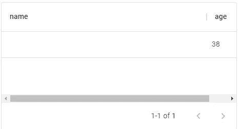
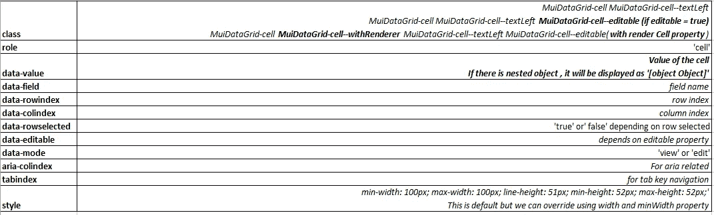

# 如何在您的项目中实现材质 UI 数据网格—第二部分

> 原文：<https://medium.com/nerd-for-tech/how-to-implement-material-ui-data-grid-in-your-project-part-ii-e94d91bfea36?source=collection_archive---------2----------------------->

# 列定义

在 Datagrid 中，**列**道具是静态的，这意味着它不能在渲染之间改变。一旦安装了组件，就不能更改。

关于**头** —它有类似**头名**和**描述** [**(前文中解释的**)](https://arjunvaidy.medium.com/how-to-implement-material-ui-data-grid-in-your-project-part-i-7a40be743a6e)的属性

# 大小

关于列的**大小，其默认宽度为**100 像素。**这是固定的，这意味着无论整个网格大小(表格大小)是多少，它都会保持**100 像素。**我们可以通过使用属性**‘宽度’**来改变这个值**

`Const columns = [{field:'name',width:150}]`

如果网格尺寸小于列宽，它将显示一个水平滚动条



底部的水平滚动条

我们还可以将 **minWidth** 属性设置为某个值。这将是列的最小宽度。这在像 flex 这样的响应式设计中非常有用。

**flex** 属性改变了流体宽度的绝对值。整列表现为 flex——与 CSS 中的 flex 相同

例如，假设网格的总宽度为 500 像素，每列的伸缩度为 1。所以每列将占用 **250px** 每列 **(1:1)** 。如果第一列的弯曲度为 **1.5** ，第二列的弯曲度为 **1** 。第一个会占用**300 像素**，第二个会占用**200 像素(1.5:1)** 。这都归结为简单的比率计算。

注意**:宽度**和**伸缩**不会一起工作。在这种情况下， **flex 覆盖宽度**，但是 **flex** 可以有 **minWidth** 值，低于该值它不能移动

# 价值获取者

简单地说， **valueGetter** 使您能够使用不同列的值。我们可以从不同的列中获取值，并进行类似连接的操作。这个结果值可以显示在单独的列中。

**valueGetter** 需要一个接受单元格参数的函数。有关电池参数[的详细信息，请参见此处](https://material-ui.com/api/data-grid/grid-cell-params/)。它有许多内置且易于访问的方法和属性。好了，让我们看一个例子

```
import * as React from 'react';
import { DataGrid } from '@mui/x-data-grid';// params has method called **getValue**(**what id,which field**) and returns the **value** of the particulat cellconst **getTotal** = (params) => params.**getValue(params.id, 'maths')**  + params.**getValue(params.id, 'science')**const columns = [
{ field: 'maths', headerName: 'Maths', width: 130 },
{ field: 'science', headerName: 'Science', width: 130 },
**{
field: 'Total',
headerName: 'Total marks',
width: 160,
valueGetter: getTotal,
},**
];
const rows = [
{ id: 1, maths: 75, science: 60 },
{ id: 2, maths: 80, science: 70 },
{ id: 3, maths: 50, science: 80 },
{ id: 4, maths: 80, science: 60 },
{ id: 5, maths: 100, science: 90 },
];export default function ValueGetterGrid() {return (<div style={{ height: 400, width: '100%' }}>
<DataGrid rows={rows} columns={columns} />
</div>);
}
```

显示 valueGetter 属性演示的数据网格示例

我们有三个栏目数学、科学和总分。

这里，前两个字段是独立的，第三个字段依赖于前两个字段。

因此，我在第三列上使用了 **valueGetter** 属性来使用前两列，并定义了 **getTotal** 函数来显示结果。

# 值格式化程序

当 rows 数组中有嵌套对象时，这个属性特别有用(我个人的用例)。它格式化单个列中的值。

```
import * as React from 'react';
import { DataGrid } from '@mui/x-data-grid';const rows = [
{
id:1,**// nested objects**
**place:{
pincode:613007,
name:'Thanjavur'
}**
},
{
id: 2,**// nested objects
place:{
pincode:600028,
name:'Chennai'
}**
},
{
id: 3,**// nested objects
place:{
pincode:641001,
name:'Coimbatore'
}**
},
];export default function ValueFormatterGrid() {
return (
<div style={{ height: 300, width: '100%' }}><DataGrid
rows={rows}
columns={[
{
field: 'place',
headerName: 'Place',
width: 150,// Takes the value from nested object
**valueFormatter: (params) => params.value.name**},
]}/>
</div>);}
```

这里 **valueFormatter** 从 rows 数组中的 **place** 属性中提取 **name** 值。

# 值分析器

它与 valueFormatter 相反。用户输入的任何值都将被解析为某种格式。

```
import * as React from 'react';
import { DataGrid } from '@mui/x-data-grid';const rows = [
{
id: 1,
taxRate: 0.1,
},
{
id: 2,
taxRate: 0.2,
},
{
id: 3,
taxRate: 0.3,
},
];export default function ValueParserGrid() {return (
<div style={{ height: 300, width: '100%' }}>
<DataGrid
rows={rows}
columns={[
{
type: 'number',
field: 'taxRate',
editable:true,
headerName: 'Tax Rate',
width: 150,
valueFormatter: (params) => {
const valueFormatted = Number(params.value * 100).toLocaleString();
return `${valueFormatted} %`;
},
// Whatever value you enter will be divided by 100 simultaneously
**valueParser: (value) => Number(value) / 100,**
},
]}
/>
</div>
);
}
```

打开沙盒并键入

本质上，valueFormater 在显示之前格式化值，而 valueParser 实时格式化值(随着用户键入)

# 渲染单元

默认情况下，单元格中显示的值将是一个字符串。值包含在 DOM 中的

中。这些有许多属性

数据网格单元的属性

对于 renderCell 属性，它可以使用单元格参数方法和属性完成 valueFormatter 和 valueGetter 的所有工作。但是它有额外的访问和操作 DOM 节点的能力。例如，在单元格内添加按钮或图标，将单元格更改为不同的组件。

renderCell 属性需要一个接受 GridCellParams 并返回预期结果的函数

```
import * as React from "react";
import { DataGrid } from "@material-ui/data-grid";
import { TextField } from "@material-ui/core";const rows = [
{
id: 1,
taxRate: 0.1
},
{
id: 2,
taxRate: 0.2
},
{
id: 3,
taxRate: 0.3
}
];export default function RenderCell() {return (<div style={{ height: 300, width: "100%" }}><DataGrid
rows={rows}
columns={[
{
field: "taxRate",
headerName: "Tax Rate",**// renders default cell into TextField component****renderCell: (params) => (
<>
<TextField value={params.value} />
</>
),**
Width: 150,
editable: true
}
]}
/>
</div>
);
}
```

上述示例将普通单元格呈现到 TextField 组件中